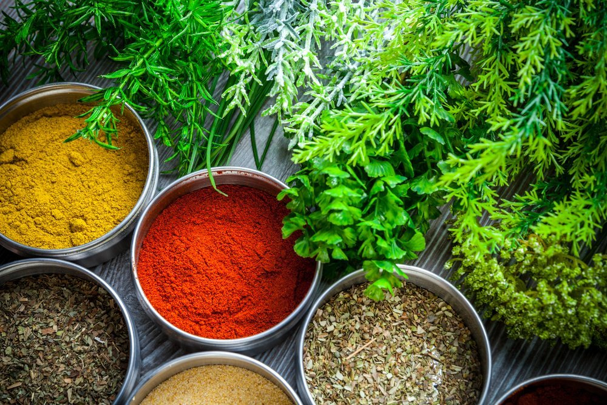

# Types of Spice

*A spice can be the seed of an annual herb, the bark of a tropical tree, the dried bud of an evergreen, the underground rhizome of a swamp plant, or the dried stigma of a crocus. The part of the plant a spice comes from shapes how you should treat it in the pan.*

## Overview
Spices are not one thing. The umbrella covers every dried plant material we cook with for aroma rather than bulk, and the underlying parts of the plant differ enormously. A clove (a flower bud) behaves nothing like a cinnamon stick (a bark) which behaves nothing like a coriander seed (a fruit-with-seed-inside) which behaves nothing like turmeric (a rhizome). Lumping them together as "spices" hides as much as it explains.

The taxonomy that matters in the kitchen is not botanical (Apiaceae versus Lauraceae); it is practical: how hard is this thing, how long does it take to release its aroma, can it survive long simmering, can it be ground at home. Sorting your rack by part-of-plant pays back fast: you stop overcooking the delicate stuff and undercooking the tough stuff.

## Seeds

The largest family. Cumin, coriander, fennel, fenugreek, nigella, ajwain, mustard, caraway, dill seed, celery seed, poppy, sesame, anise, cardamom (technically a pod, but the seeds inside are the active part). Seeds keep their volatile oils well because the hard outer husk shields them from oxygen.

Buy seeds whole. Toast or temper in oil before grinding, or grind into the dish off the heat. A spice mill or mortar lets you grind in batches small enough that the powder stays alive. Ground supermarket cumin loses most of its aroma in three to six months; whole seed in a sealed jar holds for two years easily.

## Berries (and Other Fruit)

Peppercorns (black, white, green, Sichuan, pink), allspice, juniper, paprika (dried ground sweet pepper). Berries are technically fruit; the dried pepper berry behaves like a seed in the kitchen but contains a fruit layer (the black part of black pepper) that holds its own compounds. Sichuan pepper is not the same plant as black pepper; it is a husk of the prickly ash, and its tingling sensation comes from a completely different chemistry (hydroxy-alpha-sanshool, not piperine).

Buy whole, grind fresh. Ground pepper from a tub is closer to brown dust than to spice.

## Barks

Cinnamon (Ceylon, also called true cinnamon, soft and fragrant) and cassia (the cheaper stand-in sold as "cinnamon" in most supermarkets, harder and more pungent). The bark of evergreen trees in the Lauraceae family.

Sticks survive long simmers in stews, curries and rice. Ground cinnamon is the right answer for baking; sticks are the right answer for braises. Cassia bark is what most curry recipes assume by "cinnamon stick" when the recipe comes from India or south-east Asia, because true Ceylon cinnamon is too delicate to withstand a 90-minute simmer.

## Flower Buds

Cloves are the most important spice in this category: the dried unopened flower buds of an evergreen tree. Saffron is the dried stigma of a crocus flower (not a bud, but a flower part).

Cloves are powerful enough to dominate a dish if mishandled; use 2-3 cloves where a recipe says "a few", not 10. Whole cloves can be fished out of a stew; ground clove cannot. Saffron needs to be bloomed in warm liquid (water, milk, stock) for 10-20 minutes before going into the dish; throwing the threads in dry wastes most of the colour and aroma.

## Resins

Asafoetida (hing), mastic, frankincense, myrrh. Dried plant resin. Asafoetida is the only one most kitchens will use: a small piece of resin (or a fingertip of the powder, which is cut with flour or fenugreek for handling) tempered in hot oil at the start of an Indian dal lends a savoury, onion-garlic quality that is almost impossible to identify but immediately notable when missing.

Use small amounts. A pinch is the dose. Powder is the practical form; the lump form is harder to find but lasts indefinitely.

## Roots and Rhizomes

Turmeric, ginger, galangal, horseradish, wasabi (true wasabi is rare and expensive; the green paste in most sushi restaurants is usually horseradish dyed green). The underground stems of plants that grow in damp soil.

These come in two forms: fresh and dried-ground. The two are not the same ingredient. Fresh ginger has a bright, citrussy heat that fades on drying; dried ginger is rounder, sweeter and more like the spice in gingerbread. Fresh turmeric is mild and earthy; dried turmeric is sharper. Fresh galangal is bright and piney; dried galangal slices in Thai soups give the long-cook backbone but not the brightness. See [Fresh vs Dried](fresh-vs-dried.md) for which to reach for when.

## Dried Fruit and Stigmata

Saffron threads (covered above), sumac (the dried ground berries of the sumac bush, used in Levantine cooking for tartness), dried chillies (a whole world of its own: ancho, guajillo, chipotle, chiles de arbol, Kashmiri, Korean gochugaru), paprika (sweet, smoked, hot). 

The dried-chilli question is its own subject. Each named variety has a different heat-to-fruitiness ratio; learning four or five gives access to Mexican, Korean, Hungarian and Spanish cooking in turn.

## Whole vs Ground: The Single Rule

**Whole, almost always.** Whole spices hold their volatile oils for years; ground spices lose them in months. Buying whole and grinding fresh (in a dedicated coffee grinder, a mortar, or a small spice mill) is the single biggest upgrade you can make to your spice rack.

The exceptions:

1. **Things you cannot grind well at home.** Cinnamon sticks (too hard for a mortar; a dedicated coffee grinder can do it), nutmeg (rasp on a microplane instead, lasts for years whole), bay leaves (use whole and discard).
2. **Heavy bakers.** If you bake quick breads and cakes constantly, you go through ground cinnamon fast enough that a sealed jar from a good source is fine.
3. **The dried chillies and the paprikas.** Buying a paprika or a chilli powder pre-ground from a good source is sensible; grinding dried chillies at home is hard work and the result is often dustier than buying it ready.

## Where Next
- [Aroma and Science](aroma-and-science.md): now that you know what a spice is, what makes it smell.
- [Blooming and Toasting](blooming-and-toasting.md): how to release the volatile oils in a whole spice once you have one.
- [Storage](storage.md): how to keep what you have bought from fading.
