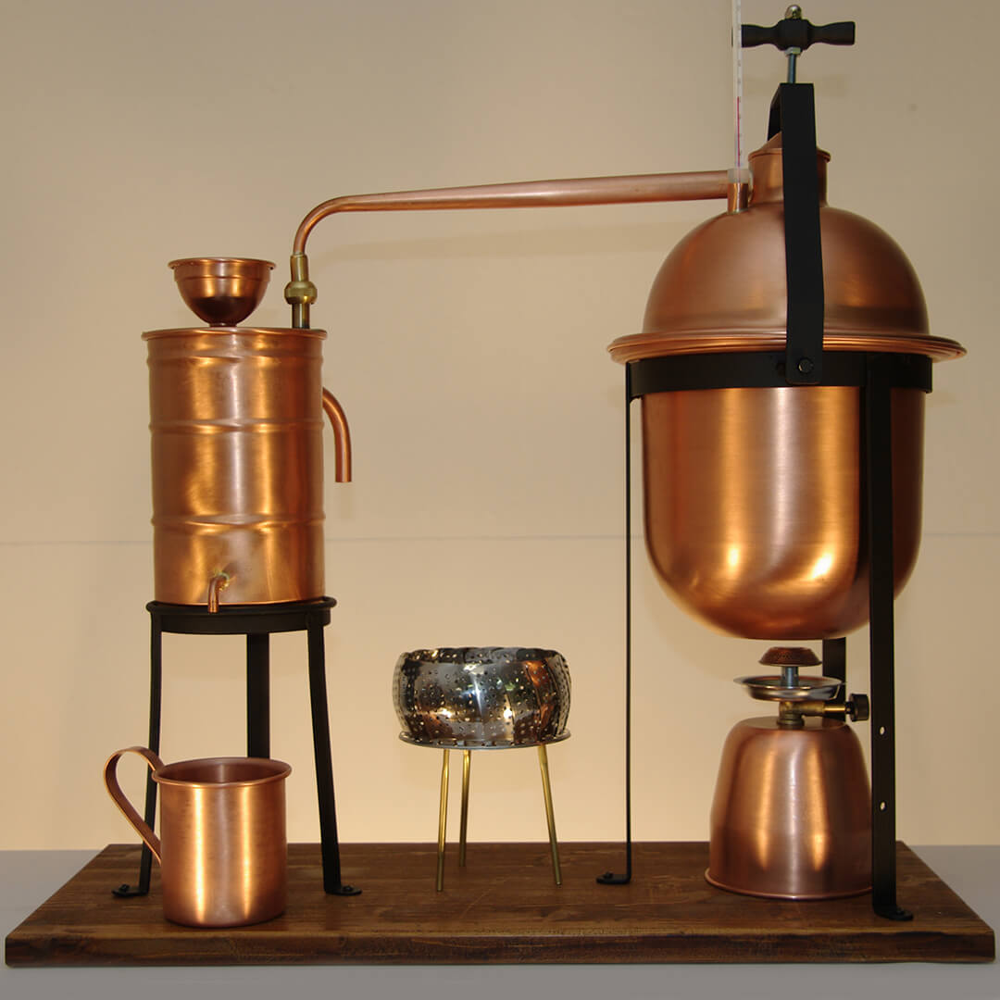

# The Distillation Process

*A closer look at the four stages every commercial distillery follows: mash, ferment, distil, age. The chemistry, the equipment and what each step actually does to turn grain into a glass of whisky or vodka.*

## Overview
The transformation from raw grain to a clear high-proof spirit happens through four distinct phases, each handled by specialist equipment in any working distillery. This page walks through what each phase does at industrial scale, useful background for tasting and understanding spirits, but explicitly not instructions to do this at home (see the [Spirits Overview](spirits.md) for the legal context).

## Stage 1: Mash

### Goal
Convert starches in grain into fermentable sugars.

### Process
Whole grain (usually barley, rye, wheat or corn, depending on the spirit being made) is first malted, soaked in water to germinate, then kiln-dried to halt germination at the stage where the grain has developed enzymes (specifically alpha-amylase and beta-amylase) but hasn't actually grown a plant.

The malted grain is milled to crack the husks and expose the starchy interior, then combined with hot water (around 65°C) in a large vessel called a mash tun. The enzymes from the malted grain dissolve into the water and break the starches in the grain into simple sugars, primarily maltose. After about an hour, the resulting sweet liquid (called "wort" in beer-making, "mash" or "wash" in spirit-making) is drained off and the grain residue is discarded or used as cattle feed.

### Equipment
- **Mash tun**: a large insulated vessel (typically 1,000-30,000 litres at distillery scale) with a false floor that lets the liquid drain off the grain bed.
- **Mill / grinder**: cracks the grain.

### What varies
- **Grain choice**: barley for Scotch, corn (maize) for bourbon, rye for rye whisky, wheat for some vodkas, mixed grains ("mash bill") for blended whiskies.
- **Mash temperature**: lower mash favours fermentable sugars; higher mash leaves residual sugars that affect the final spirit's body. Scotch tradition uses around 64°C.
- **Diastatic power**: some grains have their own enzymes (malted barley, especially); others (corn, unmalted rye) need additional enzyme sources to convert their starches. This affects the recipe of any mixed-grain spirit.

## Stage 2: Ferment

### Goal
Yeast eats the sugars in the mash and produces ethanol and CO2.

### Process
The mash is cooled to around 20-25°C (yeast can't survive above 35°C). Distillery yeast, typically Saccharomyces cerevisiae, sometimes a specific strain selected by the distillery for the flavour compounds it produces, is added to the mash in large vessels called washbacks.

Over 3-7 days the yeast ferments the sugars, dropping the specific gravity from around 1.060 to about 1.000. The wash at the end of fermentation is roughly 7-12% ABV, essentially a strong, sour, unhopped beer. The yeast also produces a range of secondary flavour compounds (esters, higher alcohols, aldehydes) which carry through to the finished spirit and contribute to its character. This is why distilleries jealously guard their yeast strains; the same mash fermented with different yeasts produces noticeably different spirits.

### Equipment
- **Washbacks**: large fermentation vessels (traditionally wooden, Oregon pine or Douglas fir is classic for Scotch, but increasingly stainless steel for ease of cleaning). Typical capacity 5,000-50,000 litres.

### What varies
- **Yeast strain**: each distillery's choice. Some use multiple strains in combination.
- **Fermentation length**: short (48 hours) gives a cleaner spirit; long (96+ hours) gives more secondary flavour compounds.
- **Temperature control**: tightly controlled in modern distilleries; less so in traditional ones, which contributes to seasonal flavour variation.

## Stage 3: Distil

### Goal
Separate the alcohol (and certain desirable flavour compounds) from the water and undesirable compounds in the fermented wash.

### Process
The fermented wash is heated in a still. Ethanol boils at 78.3°C, lower than water (100°C): so by holding the wash at a temperature in between, alcohol vapours rise off the top while most of the water stays behind. The alcohol vapour is captured, passed through a cooling condenser, and collected as a liquid at a higher ABV than the wash.

A single distillation typically takes the spirit from 7-12% ABV to around 25-30%. A second distillation can raise it to 65-70% ABV. Industrial column stills can produce neutral grain spirit at 95-96% ABV in a continuous process.

### The cuts: heads, hearts, tails

During distillation, different compounds vaporise at different temperatures. The distiller (or modern automated systems) separates the output into three streams:

- **Heads** (also "foreshots"): the first about 5% of output. Contains methanol (the toxic alcohol), acetaldehyde and other volatile compounds with lower boiling points than ethanol. Discarded or reused as next batch's heads.
- **Hearts**: the middle 70-80% of output. This is the desirable, drinkable spirit, ethanol with a clean balance of flavour-bearing congeners.
- **Tails**: the last about 15-20% of output. Contains heavier alcohols, water, and unpleasant compounds (fusel oils, propanol). Discarded or saved and added back to the next batch.

Knowing exactly when to make these "cuts" is the most important skill in distillation. Too early on the heads cut means the spirit contains methanol; too late on the tails cut means harsh fusel oils carry through.

### Pot still vs column still

There are two main still designs:

**Pot stills** are batch-processed copper vessels shaped like a kettle. Wash is loaded in, heated, distilled, and the still emptied between batches. Pot stills produce spirit at moderate ABV (60-70%) and retain a lot of flavour-bearing congeners from the wash. They're used for Scotch single malt, Irish whisky, cognac, some gins, rums and tequilas, wherever character and complexity are valued.

**Column stills** (also called continuous stills, patent stills or Coffey stills, after their 1830 inventor Aeneas Coffey) are tall vertical columns of multiple trays through which the wash trickles down while heat rises up. Each tray operates at a slightly different temperature, achieving multiple distillations in one pass. Column stills produce very high-proof, very pure neutral spirit (up to 96% ABV): used for vodka, light rums, neutral grain spirit and most gin bases. The trade-off: column-distilled spirits have far less character because most of the congeners are stripped.

### Equipment
- **Pot stills**: copper, traditional, batch-processed. Capacity typically 1,000-20,000 litres per batch.
- **Column stills**: copper or stainless steel, continuous, very large capacity.
- **Condensers**: traditionally copper "worm tubs" (a long copper coil immersed in cold water); modern shell-and-tube condensers.

### What varies
- **Number of distillations**: Scotch is double-distilled (most regions) or triple-distilled (Lowland tradition). Irish whisky is traditionally triple-distilled. Vodka is multiply distilled (6+ times for premium vodkas).
- **Strength at end of distillation**: 65-70% for pot-still spirit, 90-95% for column-still neutral.
- **Still design**: tall narrow stills make lighter spirits; short wide stills make heavier spirits with more congeners.

## Stage 4: Age (sometimes)

### Goal
Soften, mature and flavour the spirit through prolonged contact with wood, primarily oak.

### Process
The new-make spirit fresh from the still (75-95% ABV depending on type) is typically reduced to around 60-65% ABV with pure water, then loaded into wooden barrels, almost always white oak (American Quercus alba or European Quercus robur). The barrel is sealed and stored in a warehouse for years.

During ageing, three things happen:
1. **Extraction**: compounds in the oak (vanillin, tannins, lactones, sugars) dissolve into the spirit, adding colour, flavour and aroma.
2. **Oxidation**: small amounts of air enter through the barrel pores, slowly oxidising harsh-tasting compounds in the new-make spirit into smoother ones.
3. **Evaporation**: some alcohol and water escape through the pores (called the "angel's share", typically 2% per year). The proportion of each that evaporates depends on warehouse humidity, which is why Scottish whiskies (humid climate) lose more ABV than Bourbons (drier climate).

### Equipment
- **Oak barrels**: 200-250 litre capacity typically. Often pre-used: Scotch whisky is traditionally aged in ex-bourbon barrels (charred white American oak) and/or ex-sherry casks (European oak). Bourbon must be aged in new charred American oak.
- **Warehouses**: huge climate-controlled or naturally-ventilated stone or wooden buildings storing tens of thousands of barrels.

### What varies
- **Wood type**: American oak (vanilla, coconut notes), European oak (spicy, drier), Japanese mizunara oak (sandalwood, incense), French oak (cognac influence).
- **Wood history**: new charred (used by bourbon producers), ex-bourbon, ex-sherry, ex-port, ex-wine, ex-rum. Each adds different character.
- **Ageing duration**: legally 3+ years for Scotch whisky, 2+ years for bourbon. In practice, premium whiskies are aged 12, 18, 25+ years.
- **Climate**: hot, humid climates accelerate ageing.

### What doesn't age

Vodka and most gins are bottled directly after distillation, with no oak ageing. Some "barrel-aged gins" exist as a modern category but they're rare. The point of vodka is its purity and lack of barrel character; the point of gin is its botanicals, which would be muddied by oak.

## Summary table

| Spirit | Mash from | Distillation | Ageing |
|---|---|---|---|
| **Grain alcohol / neutral spirit** | grain (mostly corn or wheat) | column, multi-distilled to 95%+ | none |
| **Vodka** | grain or potato | column, multi-distilled to 95%+, sometimes charcoal-filtered | none |
| **Gin (London Dry)** | grain (neutral base) | column (for base) + redistillation with botanicals | none |
| **Whisky (Scotch single malt)** | malted barley | pot, double-distilled to 70% | 3+ years (typically 12-25) in oak |
| **Bourbon whisky** | corn (51%+) + rye/wheat/barley | column + doubler, to 80% | 2+ years in new charred American oak |
| **Rye whisky** | rye (51%+) | column or pot | 2+ years in oak |
| **Brandy / cognac** | grape wine | pot, double-distilled | 2+ years in oak |
| **Rum** | sugarcane molasses | column or pot | 0 (white) to 20+ years (aged) in oak |

For the specifics on each of the spirits in this list, see [Spirit Types](spirit-types.md).
