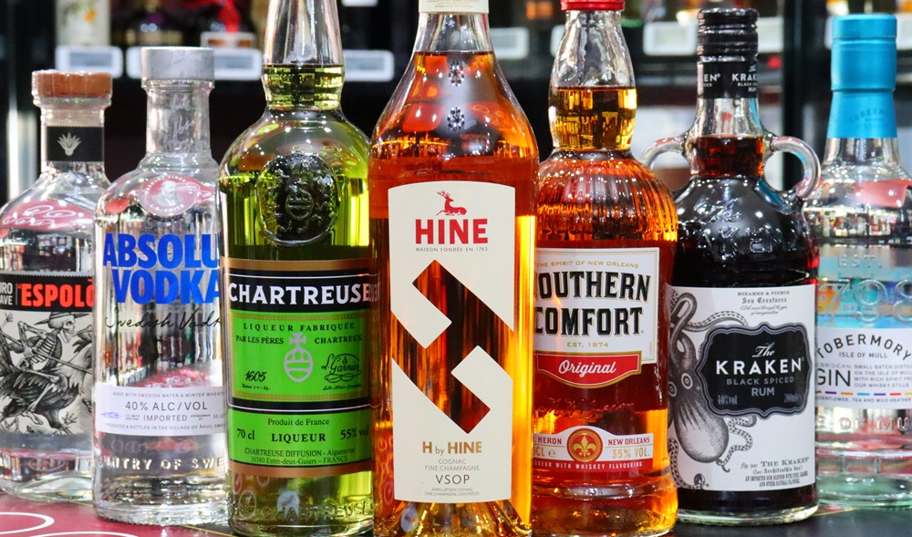

# Spirit Types: What Makes Each Distinct

*The actual differentiation between grain alcohol, vodka, gin, whisky and rye. The legal definitions, the typical processes, the regional traditions, and the flavour profiles. A reference page for anyone who wants to know what's actually in the bottle.*

## Overview
The spirits on a typical UK shelf — vodka, gin, whisky, rye, rum, brandy — are all distilled from fermented sugar, water and yeast. So why do they taste so different? The answer is in the choices at each of the four stages described in [The Distillation Process](distillation-process.md): different starting grain, different fermentation, different still, different ageing. This page works through each major spirit category in turn, covering what defines it legally, what process produces it, and what to expect in the glass.

## Grain alcohol (neutral spirit)

### What it is
Grain alcohol — also called neutral grain spirit, rectified spirit, ethanol, or just "alcohol" in some commercial contexts — is the highest-proof, most flavourless spirit produced commercially. Distilled to 95-96% ABV in column stills, with the goal of removing essentially all flavour-bearing compounds. It's the foundational ingredient that vodka, gin and most other neutral spirits are built from.

### How it's made
- **Mash**: typically corn (US), wheat (Europe), rye or potato.
- **Ferment**: standard yeast fermentation.
- **Distil**: column still, multi-pass, to 95-96% ABV. The aim is maximum stripping of congeners.
- **Age**: none. Filtered through activated charcoal to further strip impurities, then bottled or sold to other producers.

### What it tastes like
Nothing, really. Slightly sweet on the palate (from residual ethanol-related smoothness), with a strong alcohol burn. The point is flavourlessness — to be a neutral canvas.

### Where you encounter it
- Bottled as "Everclear" (95% in the US) or "Spirytus Rektyfikowany" (95% in Poland) — drunk diluted or used to make infusions and liqueurs.
- The base ingredient in almost every vodka and most gins. Distillers buy neutral grain spirit by the tanker truck from agricultural alcohol producers and then either bottle it (vodka) or redistill with botanicals (gin).
- Used in extracts (vanilla, almond), tinctures, and pharmaceutical preparations.

### Strength
- Commercially produced: 95-96% ABV.
- Diluted for retail sale: typically 60-95% ABV.
- Almost never drunk neat at full strength.

## Vodka

### What it is
Vodka is neutral grain spirit (or neutral spirit from potato, grape, or other source) reduced with water to around 40% ABV and bottled. Legally in the UK and EU, vodka must be distilled to "such a strength that the qualities of the raw materials used cannot be perceived" — in other words, near-tastelessness is the legal requirement.

### How it's made
- **Mash**: grain (wheat, rye, corn, barley) or potato. Premium vodkas are often single-grain (Stolichnaya: wheat and rye; Belvedere: rye; Grey Goose: wheat); cheaper vodkas use mixed grains for cost.
- **Ferment**: standard.
- **Distil**: column still, multiple distillations (premium vodkas advertise 4-7 distillations).
- **Filter**: activated charcoal filtration removes any residual congeners. Some vodkas filter through quartz, silver or even diamond — mostly marketing, but they do add purification.
- **Age**: none. Bottled at 40% (sometimes higher) after dilution with pure water.

### What it tastes like
Premium vodka is almost flavourless — clean, slightly sweet, with a smooth burn. The differences between premium vodkas are subtle: a wheat vodka tends to taste slightly creamy and round; a rye vodka has more peppery edge; a potato vodka is sometimes slightly fuller-bodied.

Cheap vodka has off-flavours from less rigorous filtration and lower-quality grain — solvent-like, sometimes faintly oily, with a harsher burn. The premium / cheap distinction in vodka is genuinely meaningful.

### Where you encounter it
- Neat (chilled, often as a "shot") in Russian, Polish, Ukrainian and other Slavic traditions.
- In cocktails: Bloody Mary, Vodka Martini, Moscow Mule, Cosmopolitan, Espresso Martini.
- As a base for flavoured spirits (limoncello, sloe gin, flavoured vodkas).

### Notable producers
- Stolichnaya (Russia), Beluga (Russia), Belvedere (Poland), Russian Standard (Russia), Grey Goose (France), Ketel One (Netherlands), Absolut (Sweden).

## Gin

### What it is
Gin is neutral grain spirit redistilled with juniper and other botanicals. The legal requirement (EU and UK): juniper must be the predominant flavour. Beyond that, the production method and the choice of botanicals are open to the distiller.

### How it's made
- **Mash**: typically grain (the gin distiller usually buys neutral grain spirit from another producer rather than mashing themselves).
- **Ferment**: standard, by the upstream producer.
- **Distil base**: column-stilled to near-pure neutral spirit (95%+).
- **Redistil with botanicals**: this is where gin happens. The neutral spirit is reduced to about 40-50% with water, juniper and chosen botanicals are added (either steeped in the spirit before distillation, or placed in a basket above the still so the alcohol vapour passes through them), and the whole lot is redistilled in a pot still. The resulting spirit picks up the juniper character and the botanical profile.
- **Age**: usually none. Some modern "barrel-aged gins" exist but are rare.
- **Reduce and bottle**: diluted with water to 37.5-47% ABV typical bottle strength.

### Three styles of gin

**London Dry**: the dominant style. No flavourings or sweeteners added after distillation. Juniper-led. Crisp and dry. Examples: Tanqueray, Beefeater, Bombay Sapphire, Sipsmith.

**Plymouth**: legally protected to be made only in Plymouth. Earthy, slightly sweeter than London Dry. Only one producer remains (Plymouth Gin Distillery).

**Old Tom**: a sweeter, slightly more rounded gin that pre-dates London Dry. Common in pre-Prohibition cocktails. Examples: Hayman's Old Tom, Ransom Old Tom.

There's also **compound gin** (steeped not redistilled, see the [Compound Gin](../compound-gin/compound-gin.md) tutorial) and **flavoured gins** (modern category, often pink-coloured, with added fruit / botanical essences after distillation).

### What it tastes like
Juniper-led, with citrus and warm-spice support depending on the botanical bill. A London Dry is clean, crisp and herbal; a Plymouth is rounded; a Hendricks-style is floral with cucumber. The character of gin is the most consciously designed of any spirit category — each distiller chooses their botanicals to create their signature.

### Where you encounter it
- Gin and tonic (the British classic), Martini, Negroni, Gimlet, Tom Collins, Aviation, Last Word, French 75.

### Notable producers
Hundreds of small UK distilleries since the 2010s gin boom. The classics: Tanqueray, Beefeater, Bombay Sapphire, Hendricks, Sipsmith, Plymouth, Monkey 47, The Botanist.

## Whisky

### What it is
Spirit distilled from grain mash, aged in oak barrels for a minimum legal period. Different countries have different rules for what counts as whisky:

### Scotch whisky
- **Legal**: made in Scotland, aged minimum 3 years in oak barrels, bottled at 40%+ ABV. Single malt = single distillery, malted barley only. Single grain = single distillery, mixed grains. Blended = combination of single malts and/or grain whiskies.
- **Made**: malted barley mash, double-distilled (sometimes triple in Lowland) in copper pot stills to ~70%, aged 3-25+ years in oak barrels (typically ex-bourbon or ex-sherry).
- **Regions**: Speyside (sweet, fruity), Highlands (varied, often peat-tinged), Islay (peaty, smoky, maritime), Lowlands (light, delicate), Campbeltown (briny, complex), Islands (varied).
- **Tastes like**: depends entirely on region and producer. Speysiders taste of honey, dried fruit and oak; Islays taste of bonfire smoke, iodine and salt; etc.

### Irish whiskey
- **Legal**: made in Ireland, aged minimum 3 years in oak. Traditionally triple-distilled (lighter than Scotch).
- **Tastes like**: smoother, lighter, less peaty than most Scotches. Examples: Jameson, Bushmills, Redbreast.

### Bourbon whisky (American)
- **Legal**: made in the US, mash bill must be at least 51% corn, aged in new charred American oak barrels (key — bourbon barrels are not reused), no minimum age (most bourbon is 4+ years), 80% maximum distillation strength.
- **Tastes like**: vanilla, caramel, oak, sweet corn. Examples: Maker's Mark, Buffalo Trace, Bulleit, Knob Creek, Woodford Reserve.

### Tennessee whiskey
- Essentially bourbon (51%+ corn, new charred oak) but additionally filtered through sugar maple charcoal before barrelling ("Lincoln County Process"). Examples: Jack Daniel's, George Dickel.

### Japanese whisky
- Modelled on Scotch (same techniques, malted barley, pot stills, oak ageing). Some now using local mizunara oak which gives a unique sandalwood / temple-incense character.
- **Tastes like**: closer to Scotch than American whiskey; some have unique mizunara notes. Examples: Yamazaki, Hibiki, Nikka.

### What "single malt" vs "blended" means
**Single malt**: 100% malted barley, from a single distillery. Bottled either as a "single cask" expression (one specific barrel) or, more commonly, as a blend of barrels from that single distillery. Examples: Glenfiddich, Macallan, Laphroaig.

**Blended whisky**: a mix of single malts (from several distilleries) and grain whiskies. Most of the world's whisky sold by volume is blended. Examples: Johnnie Walker, Famous Grouse, Chivas Regal, Bell's.

**Blended malt** (formerly "vatted malt"): a blend of single malts from multiple distilleries, with no grain whisky added. Less common. Examples: Monkey Shoulder, Compass Box.

## Rye whisky

### What it is
A specific subcategory of whisky in which rye grain dominates the mash bill. The legal definition varies by country.

### Canadian rye
Historically, Canadian whisky was distilled mostly from corn with a small amount of rye added to the mash bill — the rye was used because it ferments aggressively and produces a particular spicy flavour. Canadian "rye" labels survived even when actual rye content dropped over the 20th century, so a Canadian whisky labelled "rye" may have less rye than US rye. Examples: Crown Royal, Canadian Club.

### American rye
- **Legal**: mash bill must be 51%+ rye, aged in new charred oak.
- **Tastes like**: spicy, peppery, drier than bourbon. The "spice" comes from the rye grain. Examples: Rittenhouse, Bulleit Rye, Sazerac Rye, WhistlePig.

### Why rye stands apart
Rye produces particularly aromatic and spicy congeners during fermentation. The result is a whisky that's drier and more savoury than bourbon (which is corn-heavy and sweet) and more peppery than Scotch (which is barley). Rye is the traditional base for the Manhattan cocktail and the Old Fashioned.

### Production notes
Rye is sticky and tough to mash compared to corn or barley — it's why pure 100% rye whiskies are rarer and more expensive (the high-rye-content mash is technically challenging to ferment). Most "rye" labels are 51-65% rye by mash.

## A note on labels and confusion

The whisky / whiskey spelling: "whisky" is used by Scotland, Canada, Japan and most non-US countries. "Whiskey" is used by Ireland and the US (with rare exceptions like Maker's Mark, which uses "whisky" intentionally). The "e" or no-"e" doesn't affect what's in the bottle; it's a stylistic / regional choice.

The label "spirit drink" or "spirit-based drink" is sometimes used for products that don't legally qualify as gin, vodka or whisky (often because they're flavoured or sweetened in ways that disqualify them). Read labels carefully.

## Where to learn more

- Visit a working distillery. The UK has dozens of Scotch distilleries that offer tours (Glenfiddich, Glenmorangie, Highland Park, etc.) and many newer English gin and whisky distilleries that welcome visitors.
- Tasting societies and whisky / spirit appreciation groups exist in most UK cities and are a low-pressure way to taste many spirits side by side.
- The Scotch Whisky Association website has extensive technical and regulatory information.

## Back to the overview

This page has covered the "what" of each spirit category. For the process behind them, see [The Distillation Process](distillation-process.md). For the top-level overview and legal context, see [How Spirits Are Made](spirits.md).
