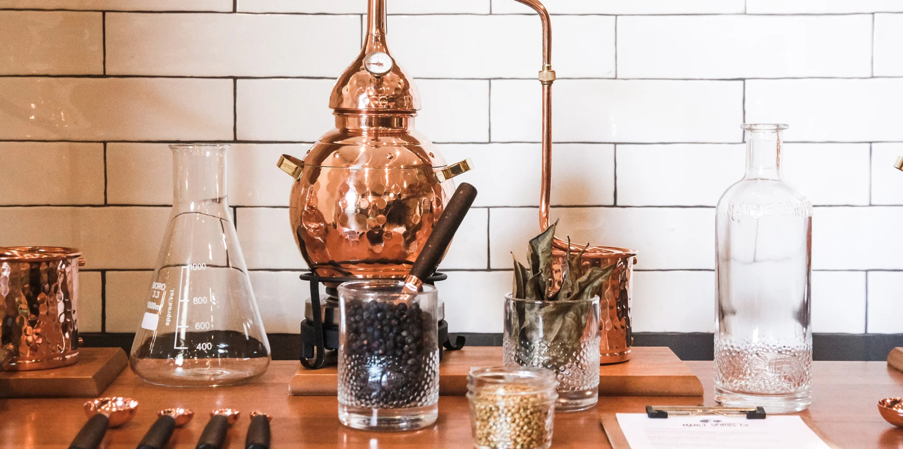

# How Spirits Are Made: An Overview

*An educational tour through the four stages of commercial spirit production (mash, ferment, distil, age) and what distinguishes vodka from whisky from rye from gin. For interested cooks who want to understand the spirits they drink. No home-distillation instructions; this is reference, not recipe.*

## Overview

This tutorial is unusual in this catalogue because it isn't a recipe. Home distillation of spirits is illegal in the UK, the US, most of the EU and the majority of jurisdictions worldwide, and badly-built stills can produce methanol (poisonous) and pose fire risk. So this is an educational tour: an explanation of how the spirits you buy at a shop are made, what the differences between them actually are, and why the legal restrictions exist.

If you're curious about the process and just want to understand what you're drinking, this is the page for you. If you want to make a gin-style spirit at home (which is legal because it's infusion, not distillation), see the [Compound Gin](../compound-gin/compound-gin.md) tutorial instead.

## The four stages of spirit production

Every spirit on the shelf goes through some version of these four stages. The differences between vodka, whisky, gin and rum come down to choices made at each stage.

### Stage 1: Mash
The starting material - usually grain (barley, rye, wheat, corn) but sometimes potato, sugar cane, agave, fruit or sugar beet - is cooked and combined with hot water. If grain is the base, enzymes in the malted barley convert the starches into fermentable sugars. The resulting sweet, cloudy liquid is called "mash" or "wash" depending on the tradition.

### Stage 2: Ferment
Yeast is added to the mash. The yeast eats the sugars and produces alcohol and CO2 - the same chemistry that makes wine and beer. After 3-7 days the fermentation is complete and the wash sits at about 7-12% ABV. At this stage, the liquid is essentially a strong, unhopped beer.

### Stage 3: Distil
The fermented wash is heated in a still. Alcohol vaporises at 78.3°C (well below water's 100°C boiling point), so by holding the wash at a temperature between those two points, the alcohol can be selectively boiled off, captured as vapour, cooled in a condenser, and collected as a liquid at a much higher ABV (typically 60-90%). Multiple distillations can push this even higher.

### Stage 4: Age (sometimes)
Some spirits are aged in oak barrels for years; some are bottled almost immediately after distillation. This is where vodka and whisky diverge most dramatically.

## What this course covers

This is the high-level reference. The two pages below go deeper:

- [The Distillation Process](distillation-process.md): a closer look at mash, ferment, distil and age - how each works at industrial scale, what the equipment looks like, what the chemistry actually does.
- [Spirit Types: What Makes Each Distinct](spirit-types.md): the actual differentiation. What makes vodka vodka, whisky whisky, rye rye, gin gin. The legal definitions, the typical processes, the regional variations.

## Why home distillation is illegal

The legal restrictions on home distillation exist for several reasons:

### Tax revenue
Distilled spirits are taxed heavily in nearly every country. In the UK, "Spirit Duty" is collected by HMRC - currently around £31.64 per litre of pure alcohol. A 70cl bottle of vodka at 40% ABV carries roughly £9 of spirit duty before VAT. Allowing unlicensed home distillation would create an obvious tax gap. The UK requires a Distiller's Licence (cost: tiered by production scale, but the application fee is non-trivial and the regulatory burden is significant) before any commercial or substantial-scale distillation can take place.

### Safety
Home stills have two real risks. First, badly constructed stills can pressurise and explode, or cause fires from contact between flame and high-proof vapour. Second, distillation produces some methanol (a toxic alcohol that causes blindness or death in modest doses) as well as ethanol (the alcohol you want to drink). Commercial distilleries discard the "heads" (the first portion of the distillate, which contains the highest methanol concentration) and the "tails" (the last portion, which contains heavier compounds), keeping only the "hearts" in the middle. Doing this safely takes equipment, experience and training. Home distillers without these skills have produced methanol-contaminated batches.

### Public health
Counterfeit spirits - sometimes sold cheaply at off-licence shops - have caused multiple poisoning incidents in the UK and across Europe. The restrictions on home distillation are partly intended to make it harder for criminal operations to claim hobby distillation as cover.

## What's legal in the UK

- **Beer and wine for personal use**: any quantity, no licence required.
- **Compound gin** (infusion of pre-distilled spirit with botanicals): legal, see the [Compound Gin tutorial](../compound-gin/compound-gin.md).
- **Flavoured spirits / infusions** (sloe gin, limoncello, vanilla vodka, etc.): legal because they're infusions, not distillations.
- **Cider, mead, perry**: legal for personal use.

## What requires HMRC permits

- **Any form of distillation**, even of fermented fruit purée into eau de vie, even for "personal use only". The Crown does not recognise hobby distillation as a category. A Distiller's Licence is required for any operation; the Application includes site inspections, security measures and ongoing duty payments.
- **Producing spirits commercially or selling spirits**: requires a Distiller's Licence and other permits (Alcohol Wholesaler Registration Scheme, etc.).
- **Even importing a still over 5 litres' capacity for "personal use"**: in the UK, you need HMRC notification.

The penalties for unlicensed distillation include unlimited fines, seizure of equipment, and up to 7 years imprisonment in serious cases.

## What this means for the home cook

If you're interested in spirits as a hobby, the legal path is:

1. Buy good commercial neutral grain spirit (a quality vodka serves the purpose) as your base.
2. Infuse it with botanicals to make [Compound Gin](../compound-gin/compound-gin.md).
3. Infuse with seasonal fruit to make sloe gin, damson gin, cherry brandy or limoncello.
4. Visit a craft distillery in person - many in the UK offer tours and tastings.
5. Read further about commercial spirit production for the love of understanding.

The next two pages cover the technical and category details for anyone who wants to understand what they're drinking better.

## Recommended further reading

- *The Whisky Cabinet* by Mark Bylok - accessible introduction to whisky production and tasting.
- *Bitters: A Spirited History of a Classic Cure-All* by Brad Thomas Parsons - covers extraction and infusion principles used in compound gin.
- *Distilled: From Absinthe & Brandy to Vodka & Whisky* by Joel Harrison & Neil Ridley - survey of the world's spirit categories.
- Visit the Scotch Whisky Experience in Edinburgh or the Beefeater Distillery in London for in-person tours.
