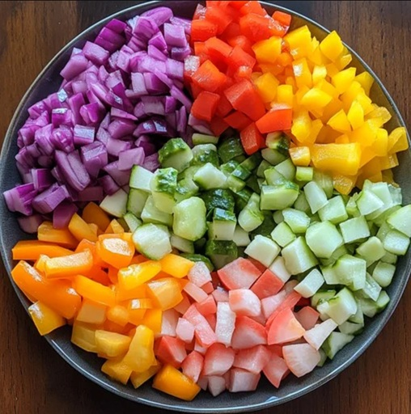

# Ingredient Order

*The canonical sequence: aromatics → protein → vegetables (hardest first) → sauce. Each goes in at the right moment, cooks for the right time, and pushes up the sides of the wok to make room for the next. Get the order right and a complex stir-fry comes together in 3 minutes. Get it wrong and everything ends up either burned or raw.*

## Overview
Once the wok is hot, the stir-fry is choreography. Six to ten ingredients hit the pan over 3-4 minutes, each at a different moment, each cooked for a different time. The skill is not in any one ingredient; it's in the sequence and the timing.

The canonical sequence has four phases, with a flexible ingredient-grouping inside:

1. **Aromatics.** 5-10 seconds. Garlic, ginger, scallion whites, dried chillies, sometimes shrimp paste.
2. **Protein.** 1-3 minutes. Stir-fry to just done; remove or push aside.
3. **Vegetables.** 1-3 minutes. Hardest first (carrot, broccoli stem), then medium (pepper, mushroom), then leafy (spinach, scallion green).
4. **Sauce.** 30-60 seconds. Returns protein, combines, thickens.

Total: 3-7 minutes for a full stir-fry.

## Prep First, Always

Stir-frying is too fast to chop mid-cook. Before you turn the heat on:

1. All ingredients pre-cut, in small bowls or piles by phase.
2. Sauces pre-mixed in a small jug (soy + cornflour slurry + sugar + vinegar + sesame oil, whatever the recipe calls for).
3. Cornflour slurry pre-made (1 tablespoon cornflour in 2 tablespoons cold water).
4. Aromatics finely chopped (garlic minced; ginger grated; scallion whites and greens separated and sliced).
5. Wok and spatula ready.
6. Plate to serve on, warmed.

Cut everything to similar bite size. Uniform cuts cook uniformly. See the [knife skills course](../knife-skills/knife-skills.md).

## Phase 1: Aromatics

5-10 seconds in hot oil. The aromatics give up their flavour to the oil; the oil then carries that flavour through everything else.

### Standard order within aromatics
1. **Whole dried chillies and Sichuan peppercorns** (10 seconds first; toast the spices).
2. **Garlic, ginger** (5 seconds together).
3. **Scallion whites, shrimp paste, fermented black bean** (3-5 seconds; can be at the same time as garlic-ginger).

### The window

Aromatics burn fast. The window between fragrant and burnt is 10 seconds. If you smell anything bitter or see the garlic going dark brown, get the protein in immediately to lower the wok temperature.

If you smell burning, the dish is lost. Tip everything out, wipe the wok, start over. Burnt garlic makes everything taste like ash.

## Phase 2: Protein

The protein gets the second-hottest moment of the wok's life. The goal is sear, not stew.

### Standard protein technique
1. Add the protein in a single layer (don't crowd; otherwise it steams).
2. Let it sit untouched for 20-30 seconds. The bottom side sears.
3. Toss aggressively. The seared sides face up; raw sides face down.
4. Continue tossing every 20-30 seconds until just cooked through (chicken: 2-3 minutes; beef: 1-2 minutes; prawns: 1 minute; tofu: 2-3 minutes).
5. Push the protein up the sides of the wok or scoop it onto a plate. The wok bottom is now free for the next phase.

### Marinades

Most Chinese protein stir-fries call for a brief marinade: cornflour + soy + Shaoxing wine + 1 tablespoon oil + a touch of sesame oil. The cornflour coats the protein, which keeps it juicy and helps the sauce cling later. The oil lubricates so pieces don't stick to each other. Marinate 15-30 minutes before cooking.

### When to add seafood

Prawns, scallops, calamari go in late (after most vegetables) because they cook in 60 seconds. Adding them too early overcooks.

## Phase 3: Vegetables

Vegetables go in by hardness order, hardest first. This is critical: a carrot needs 90 seconds; a spinach leaf needs 15. Adding them together produces raw carrot in wilted spinach.

### Standard hardness order

1. **Hardest** (90 seconds): carrot batons, broccoli stem slices, cauliflower florets, sliced fennel, white onion.
2. **Hard** (60 seconds): bell pepper, mushroom (large), green beans, courgette.
3. **Medium** (30-45 seconds): bok choy stems, mushroom (sliced thin), bean sprouts.
4. **Soft** (15-30 seconds): scallion greens, leafy greens (spinach, choi sum), bok choy leaves, herbs.

Each ingredient goes in to one side of the wok; let it sear briefly before tossing; push it up the side; add the next.

### Add water if anything is browning

Hard vegetables sometimes char before cooking through. A splash of water (1-2 tablespoons) into the wok creates steam, which cooks the vegetable from the inside, then evaporates within 30 seconds. The wok dries back to searing temperature.

## Phase 4: Sauce

The protein returns to the wok. Add any soft vegetables or finishing aromatics (scallion greens, sesame seeds, more chilli oil).

### The pour
1. Pour the pre-mixed sauce around the perimeter of the wok, not on top of the food.
2. The sauce hits the hot metal first, vaporises slightly, gets a rim of caramelisation, then runs down to coat the food.
3. Toss vigorously. The cornflour in the sauce thickens within 15-30 seconds.

### The finish

Off heat, drizzle 1 teaspoon toasted sesame oil over the top. Sesame oil's smoke point is too low to cook with; off-heat it just flavours.

Plate immediately. A stir-fry left in the wok for 90 seconds turns gluey as the sauce reabsorbs.

## Common Mistakes

**Garlic burnt.**
Aromatics added when the wok was too hot, or held too long. If you smell bitter, the dish is lost. Next time: add aromatics, count to five, add the protein.

**Protein dry and tough.**
Over-cooked. Stir-fried longer than needed, or seared on too-low heat (extended exposure). Pull at just-done.

**Vegetables wet and limp.**
Steamed, not stir-fried. The wok wasn't hot enough, or there was too much food at once. Cook in batches.

**Sauce sloshing in a thin liquid pool, not coating.**
Cornflour slurry insufficient. The sauce should thicken on contact with the hot wok; if it stays thin, more cornflour is needed (1 teaspoon extra slurried with 1 tablespoon water, added at the end).

**Sauce broken or grainy.**
Sauce poured directly onto a cold wok bottom, or overheated. Pour around the rim; the sauce should coat the food, not boil at the bottom.

**Some ingredients raw, others over-cooked.**
Ingredient order wrong. Hardest first; soft last. See the timing table above.

**Stir-fry tastes flat.**
Under-seasoned. Stir-fry sauces should taste slightly too strong on the spoon; the dilution from the food brings them right.

## Where Next
- [Wok Setup](wok-setup.md): the equipment side.
- [Wok Hei](wok-hei.md): the smoky char that defines top-tier stir-fry.
- [Knife Skills course](../knife-skills/knife-skills.md): uniform cuts cook uniformly.
- [Stir-Fry Course landing](stir-fry.md): back to the main course.
