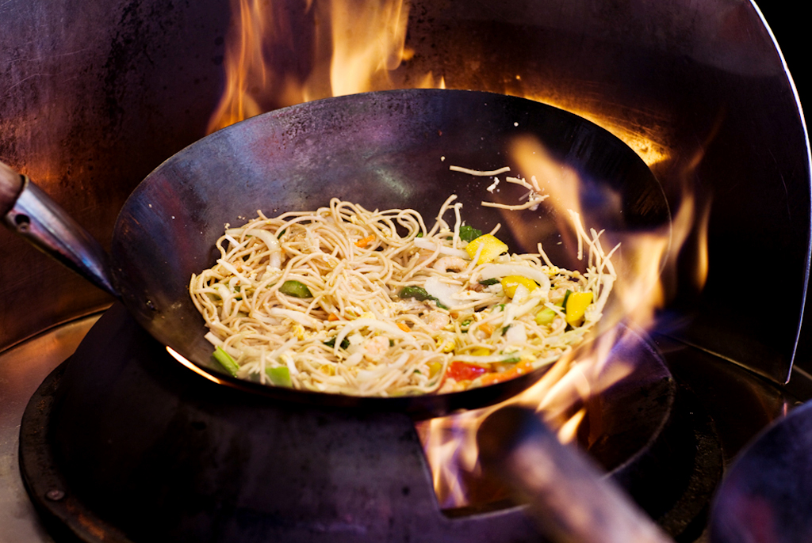

# Stir-Fry and Wok Work

*A good stir-fry is one of the fastest ways to put a meal on the table. A sad one is what happens when the pan isn't hot enough, the timing's off, and the garlic's burnt before the veg has cooked. This course covers the three things to get right: the heat, the order, and the smoky char that makes a stir-fry taste properly cooked.*

## Overview
Stir-fry is the cooking method most often executed badly at home. The technique looks simple: heat a pan, add oil, throw stuff in, toss. But the result depends on three things most home cooks get wrong:

1. **Heat.** Restaurant woks sit on burners that put out 100,000+ BTU. Home gas hobs put out maybe 10-15,000. The temperature gap is the difference between caramelisation in 30 seconds and a slow simmer for 5 minutes.
2. **Ingredient order.** Aromatics first; protein next; vegetables next; sauce last. Each goes in at the right moment, cooks briefly, and gets pushed up the sides of the wok to keep cooking gently. The bottom stays hot for the next addition.
3. **Wok hei.** "The breath of the wok": the smoky char that defines restaurant Cantonese stir-fries. Hard to reproduce at home; possible if you understand what it is.

This course covers all three.

## Course Outline

- [Wok Setup](wok-setup.md): pan choice, oil, heat management. The basics of getting the equipment right.
- [Ingredient Order](ingredient-order.md): the canonical sequence (aromatics → protein → vegetables → sauce) and why timing matters.
- [Wok Hei](wok-hei.md): the breath of the wok. What it is, how restaurants get it, what home cooks can do to approximate.

## The Universal Principle

Cook fast, in small batches, with everything ready before you start. This is the mise en place principle on speed: a stir-fry takes 2-4 minutes once the wok gets hot. You don't have time to chop garlic in the middle.

The standard workflow:

1. Set up all ingredients in small bowls beside the hob. Each one ready to grab.
2. Pre-mix any sauces (soy + cornflour slurry + sugar + vinegar) in a small jug.
3. Heat the wok empty until smoking faintly.
4. Add oil. Swirl.
5. Add aromatics (garlic, ginger, spring onion white). 5-10 seconds.
6. Add protein. Cook until just done.
7. Push protein to the side; add vegetables. Cook 1-2 minutes.
8. Pour in sauce. Toss to coat.
9. Plate immediately.

Total time from oil in pan to plate: 3-5 minutes.

## Where to Start
- New to stir-frying: [Wok Setup](wok-setup.md) first. Most failure starts with the wrong pan or insufficient pre-heat.
- Already have a wok, but your stir-fries are wet: [Ingredient Order](ingredient-order.md). The most common mid-cook failure.
- Want to chase that smoky char: [Wok Hei](wok-hei.md). Honest about what's reproducible at home.

## Recipes That Use This Technique

- [Chinese Fried Rice](../../cuisine/chinese/fried-rice.md): the universal worked example.
- [Stir-Fried Ginger Beef](../../cuisine/chinese/stir-fried-ginger-beef.md): protein-and-aromatic-led.
- [Kung Pao Chicken](../../cuisine/chinese/kung-pao-chicken.md): aromatics, protein, peanuts, sauce.
- [Sichuan Pepper Beef](../../cuisine/chinese/sichuan-pepper-beef.md): the numbing-pepper classic.
- [Stir-Fried Pork with Spring Onion](../../cuisine/chinese/stir-fried-pork-with-spring-onion.md): the simplest balance of pork, aromatic and sauce.

## Where Next
- [Knife Skills course](../knife-skills/knife-skills.md): stir-frying demands uniform cuts so everything cooks evenly. Knife-skills course covers the basic cuts you need.
- [Rice course / Fried Rice Technique](../rice/fried-rice-technique.md): the wet-rice problem and how cold day-old rice solves it.
