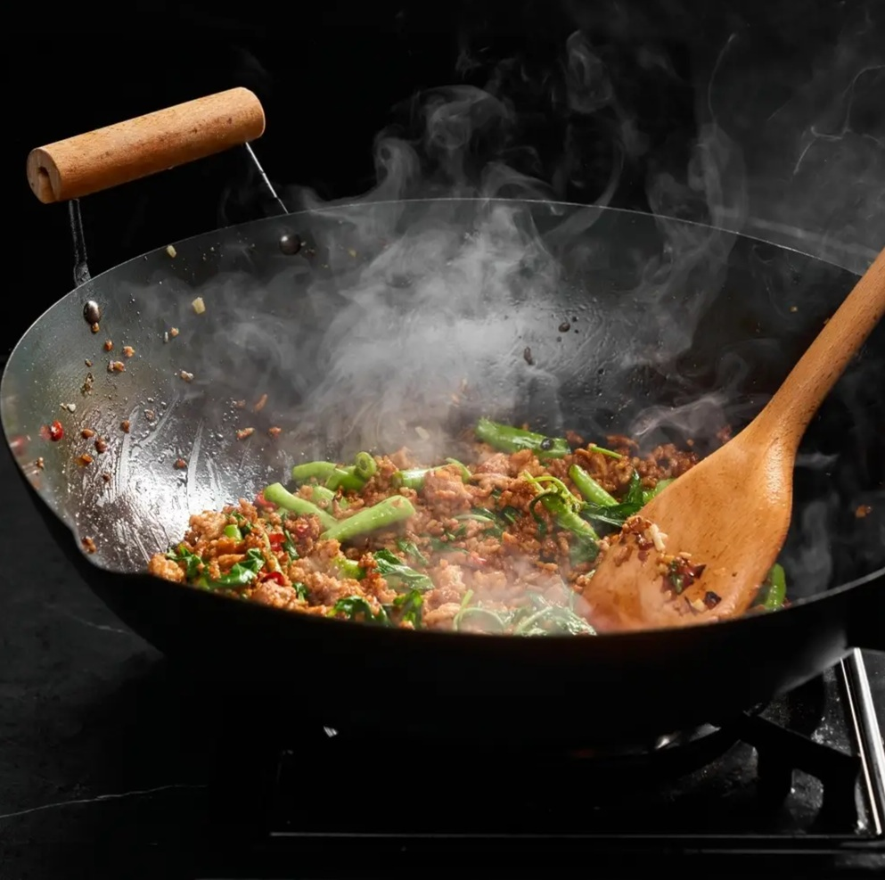

# Wok Hei

*Wok hei (literally "the breath of the wok") is the toasty, slightly-charred flavour that makes restaurant stir-fries taste like restaurant stir-fries. Home hobs can't quite match a proper commercial wok burner, but you can get a lot closer than you'd think. This page is honest about what's reachable at home and how to get there.*

## Overview
Wok hei is a Cantonese term that translates roughly to "the breath of the wok" or "the soul of the wok". It refers to the subtle smoky-toasty flavour that develops when food is stir-fried in a properly screaming-hot wok over an open flame. The flavour is partly Maillard browning (the same reaction that browns steak), partly caramelisation of sugars, partly tiny droplets of oil being vaporised on the wok surface and igniting briefly above the food.

Restaurants achieve this routinely. Home cooks achieve it rarely. The reason is heat. BTU (British Thermal Unit) is how gas burners are rated: it measures how much heat a burner delivers per hour. The higher the number, the more heat the burner can throw into the pan in a given moment. A commercial wok burner runs 40,000-100,000 BTU (with the highest-end Chinese-restaurant rigs going further), and the flames lick up around the sides of the wok. A home gas hob produces 10-15,000 BTU. The temperature difference is the difference between vaporising oil and just heating it.

## What wok hei actually tastes like

Wok hei is not "smoky" in the bonfire sense. It's subtle and very specific:

- A toasted-grain note, similar to popcorn just before it burns.
- A slight char on edges of vegetables and protein (visual: brown-black flecks on the edge of a pea pod or a piece of beef).
- An umami depth that water-only cooking can't produce.
- A slightly bitter-sweet finish, like the rim of a charred pepper.

Without wok hei, a stir-fry tastes "fine." With it, the same dish tastes professional.

## Can you get wok hei at home?

Partially. With three techniques, you can get most of the way:

### Technique 1: Pre-heat the wok past smoking

A wok that smokes faintly is hot enough for basic stir-fry. A wok that smokes vigorously is hot enough for wok hei. Pre-heat your empty carbon-steel wok over the highest flame for 4-5 minutes. The metal should be visibly shimmering with heat, and a drop of water flicked in should sizzle and evaporate in 1 second.

You can confirm with an IR thermometer: aim for 230-260 C on the wok surface before adding oil.

### Technique 2: Cook in very small batches

The single biggest reason home stir-fries lack wok hei: too much food at once. Each ingredient drops the wok temperature; 500 g of food in a domestic-sized wok drops the temperature below the Maillard threshold immediately.

Cook 200 g of protein at a time, max. Cook one ingredient, remove, cook the next, combine at the end.

### Technique 3: Toss aggressively, let things flame briefly

A bit of bravado here. When the wok is screaming hot and food contains some moisture or oil, tilting the wok toward the flame can ignite the vapour briefly, producing a 1-2 second flame above the food. This is the "wok hei flame" you see in restaurant stir-fry videos.

To do this:
1. Have a metal-handled wok (no wooden parts that could catch fire).
2. Heat the wok aggressively. Add oil. Add a hot ingredient (like marinated beef).
3. Tilt the wok 30-45 degrees toward the gas flame. The oil vapour rising off the food meets the flame and ignites.
4. The flame lasts 1-3 seconds. The food picks up a charred edge and a smoky note.

Safety: keep your face back. Have a lid handy. Don't do this with a wok full of food or oil; you only need a teaspoon of oil to vaporise.

If you're on an electric or induction hob, this technique is impossible. Sorry.

## Alternative: Pretend wok hei

For electric/induction cooks, or for cooks unwilling to flame their wok:

1. **Use a tiny pinch of MSG.** It approximates the umami depth that wok hei provides. About 1/4 teaspoon per stir-fry. Available at any Asian supermarket. The bad-rap on MSG is overblown.
2. **Add toasted sesame oil at the end.** Half a teaspoon. The aromatic compounds suggest "wok-ness" even when you didn't get a real char.
3. **Slightly under-cook then sear at the very end.** Pull the stir-fry off the heat just before the toss-and-finish stage. Heat the empty wok on its absolute hottest for 30 seconds. Return the food and toss for 15 seconds. The brief contact with the super-hot wok produces some char.
4. **Use chilli oil with crispy bits.** A teaspoon of homemade chilli oil with charred bits in it (see [chilli crisp recipe](../../cuisine/chinese/snacks/chilli-crisp.md)) gives umami and a hint of smoke without needing to torch the wok.

## When wok hei matters

For some dishes wok hei is essential. For others it's optional or even wrong.

### Wants wok hei
- Cantonese beef-and-broccoli stir-fries
- Char siu rice noodles
- Stir-fried clams in black bean sauce
- Singapore noodles
- Hong Kong-style chow mein
- Pad see ew (Thai; broader use of wok char)

### Doesn't want wok hei
- Sichuan mapo tofu (the chilli oil and fermented bean paste do the heavy work)
- Cantonese steamed dishes
- Vietnamese pho-style soups
- Most Thai curries (cooked, not stir-fried)
- Anything with delicate seafood that shouldn't go anywhere near a flame

## The Realistic Expectation

A home cook with a 10,000 BTU gas burner and an unbroken commitment to the technique can produce about 50-70% of restaurant wok hei. It's enough to taste the difference. It's not enough to confuse anyone for a Hong Kong takeaway.

The point of chasing wok hei isn't to replicate the restaurant; it's to know what you're working toward. Many home stir-fries fail not because they lack wok hei specifically, but because the cook never noticed how flat the result was. Aim for wok hei and you'll catch the smaller mistakes (cold pan, crowded pan, over-cooked vegetables) along the way.

## Common Misconceptions

**"You need a special burner."**
Mostly true. A 10,000 BTU home burner gets you 50% of the way; a 25,000 BTU outdoor wok burner gets you 90%. But the technique still matters at any BTU; people with restaurant-grade burners who don't know how to time ingredients still produce bad stir-fries.

**"It's about the flame."**
The flame is part of it; the heat is the bigger part. A flat-top induction hob with an aggressive wok-friendly disc can produce a respectable wok hei because the wok itself gets hot enough. The flame's role is the bit of theatre + a slight aromatic contribution from the gas.

**"Real wok hei means burnt food."**
No. Wok hei is the subtle char at the EDGES of food, not the whole piece. Anything actually burnt black is over-done.

**"Wok hei is in the oil."**
Partly. Higher-smoke-point oils (groundnut, rice-bran) help. Some chefs use beef fat or pork fat as a flavour booster. But mostly wok hei is the pan, not the oil.

## Where Next
- [Wok Setup](wok-setup.md): the equipment basics.
- [Ingredient Order](ingredient-order.md): the timing that lets wok hei survive the cook.
- [Chinese Fried Rice](../../cuisine/chinese/fried-rice.md): a wok-hei-defining home stir-fry test.
- [Stir-Fry Course landing](stir-fry.md): back to the main course.
