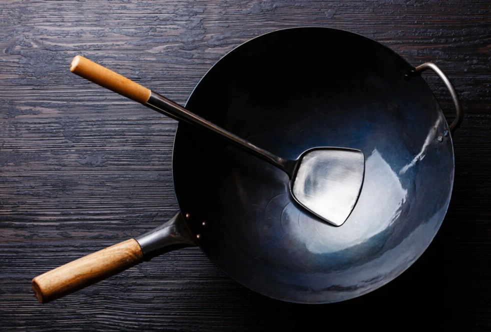

# Wok Setup

*Three things make or break a stir-fry before the food even hits the pan: the pan itself, the heat under it, and the oil in it. Get these right and stir-frying becomes a quick easy rhythm. Get them wrong and every dish is half-steamed and a bit sad.*

## Overview
Most home stir-fry failures start before any food hits the pan. The wrong pan won't get hot enough. The wrong oil burns before food caramelises. The wrong heat is too low to drive evaporation. This page covers the equipment choices and the heat-management techniques that make the difference between a sad sticky stir-fry and a proper one.

## The Wok

A wok is not a frying pan with rounded sides. It is a tool designed for the specific physics of high-heat tossing:

1. **The bottom focuses heat in a small zone.** This is where the searing happens.
2. **The flared sides catch tossed food.** Food cooked at the bottom gets pushed up the sides to cool slightly, making room for the next ingredient.
3. **Tossing is built into the shape.** A flick of the wrist rotates everything in the pan.

### Three wok types

**Carbon steel (the standard).** Light, conductive, takes seasoning, lasts a lifetime. The professional choice. £15-30 for a good 30 cm carbon-steel wok with a wooden handle.

**Cast iron.** Heavier, holds heat longer, slower to respond. Acceptable but less ideal; the slow response time means you can't adjust temperature with quick burner changes. Better for slow-braise wok cooking than stir-fry.

**Non-stick.** Almost useless for stir-frying. The coating can't handle the high heat. The metal underneath is usually aluminium, which doesn't hold heat. Don't.

**Flat-bottomed vs round-bottomed.** Traditional woks have round bottoms designed for gas burners with a wok stand. Most Western hobs need a flat bottom for stability. A flat-bottomed carbon-steel wok works fine on gas, electric, and induction (some woks).

### Seasoning

A new carbon-steel wok comes coated in protective oil and is grey, not black. Before first use, season it:

1. Scrub off the factory coating with hot soapy water.
2. Heat the dry wok over high heat until it smokes.
3. Tip in 1 tablespoon of high-smoke-point oil (vegetable, rapeseed, grapeseed). Swirl.
4. Add a handful of sliced ginger and spring onion. Stir-fry for 5-10 minutes; the aromatics flavour the patina and burn off impurities.
5. Discard the ginger; wipe the wok with kitchen paper.
6. The wok should be a faint brown. Repeat 2-3 times.

After seasoning, never use soap on the wok. Hot water and a stiff brush; dry on the hob over heat to evaporate any moisture.

A well-used wok develops a black mirror-finish patina over months. This is non-stick, durable, and the cook's signature.

## The Hob

This is where home cooks lose against restaurants. Restaurant burners put out 100,000+ BTU. Standard home gas hobs are 10-15,000. The gap is real.

### What home cooks can do

1. **Use the smallest wok that fits the food.** A 28-30 cm carbon-steel wok is the sweet spot for home gas. A larger wok spreads heat too thinly.
2. **Pre-heat the wok empty.** Heat the dry wok over the highest flame for 2-3 minutes, until it smokes faintly. This is non-negotiable.
3. **Cook in batches.** A small wok with 200 g protein cooks fast and hot. The same wok with 600 g protein never gets above 120 C; everything steams.
4. **Don't crowd the pan.** Food should sizzle when it hits. If it hisses and steams, the pan is not hot enough or there's too much in it.

### Gas vs electric vs induction

- **Gas:** the standard. Responds instantly. Burns under the pan, not in it. Best for stir-fry.
- **Electric coil:** slow response, but a hot coil does get hot enough. Wait longer for pre-heat; expect uneven heat.
- **Induction:** the surprise contender. Very efficient heat transfer to the pan; the bottom gets very hot. Needs a flat-bottomed induction-compatible wok. Once hot, performs almost as well as gas.

### Working with low heat

If your hob is weak, three compensations help:
1. **Cook one ingredient at a time.** Stir-fry the protein alone; remove; stir-fry the vegetables alone; combine at the end.
2. **Heat the wok longer.** 4-5 minutes of empty pre-heat instead of 2.
3. **Use less liquid.** Sauces with cornflour slurries can swamp the heat; thicken later instead of in the pan.

## The Oil

Stir-fry oils need three properties:
1. **High smoke point** (above 200 C).
2. **Neutral flavour.**
3. **No suspended solids** (clarified or refined).

### Good choices
- **Vegetable oil:** the everyday neutral.
- **Groundnut (peanut) oil:** the classical Cantonese choice, slightly nutty.
- **Sunflower oil:** neutral, high smoke point.
- **Grapeseed oil:** very neutral.
- **Rapeseed oil:** UK standard, similar to vegetable oil.
- **Rice-bran oil:** the patisserie-of-stir-fry oils, with a very high smoke point.

### Don't use
- **Olive oil:** burns at 180 C, far too low. Tastes wrong with Chinese flavours anyway.
- **Butter:** burns at 130 C. Use only for finishing.
- **Sesame oil:** very low smoke point. Used as a finishing oil drizzled at the end, never for the cook.
- **Toasted sesame oil:** same.

### How much oil

Less than you think. 1-2 tablespoons for a 30 cm wok. The wok's stored heat does most of the cooking; the oil just lubricates.

### The "long-handled spoon" or spatula

A wok needs a long-handled metal spatula or wooden spoon. The "wok chuan" (Chinese wok spatula) is a flat metal blade with a slight curve, perfect for scooping food off the wok's surface. Available at any Asian supermarket for £5-10.

A wok ladle (the spoon's deeper cousin) goes alongside for sauce pours and stock additions.

## Heat Management During the Cook

The wok temperature changes constantly during a stir-fry. Cold food drops the pan temp; hot oil raises it; ingredients steaming evaporate heat. Three rules:

1. **Listen.** The wok should hiss aggressively when food hits it. Quiet wok = cold wok = food will steam.
2. **Watch the smoke.** A thin haze of smoke from the oil is good. Heavy smoke means too hot. No smoke means too cold.
3. **Adjust with the flame and the wok position.** Lower the flame momentarily if everything is charring. Lift the wok off the burner for 2-3 seconds to let it cool, then return.

## Common Mistakes

**Food is wet and steamed, not seared.**
Pan not hot enough, or too much food at once. Pre-heat longer; cook in smaller batches.

**Oil smokes heavily before food goes in.**
Pan TOO hot; the oil is breaking down. Drop the heat; or remove from heat for 10 seconds.

**Food sticks to the wok.**
Wok not seasoned enough, or not pre-heated. Heat the wok empty until smoking, then add oil, then food. The food should release as soon as it sears.

**Garlic and ginger burn before the protein cooks.**
Added too early. Aromatics go in for 5-10 seconds before the protein, not before the wok is fully heated.

**The bottom of the wok is dry; food collects in the centre.**
Oil pooled at the bottom only. Swirl the oil up the sides at the start so the whole inner surface is lubricated.

## Where Next
- [Ingredient Order](ingredient-order.md): the canonical sequence once the wok is set up.
- [Wok Hei](wok-hei.md): the smoky-char finish.
- [Stir-Fry Course landing](stir-fry.md): back to the main course.

## Storage
- Stir-fries are best eaten immediately: texture and wok hei dissipate within minutes
- Refrigerate leftovers 1-2 days; reheat in a hot wok or pan, not the microwave
- Prepped ingredients (chopped veg, marinated proteins) keep 1 day refrigerated; do the mise en place in advance, the cooking last-minute
- Season your wok regularly; a well-seasoned carbon-steel wok improves with use
