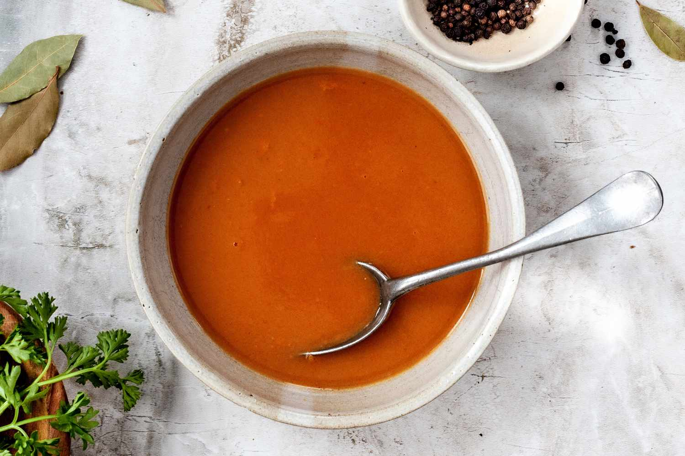

# Espagnole

*Espagnole is the most demanding of the mother sauces, and the one with the biggest pay-off. A dark roux, browned vegetables, slow-cooked stock, reduced down to demi-glace: a sticky meat sauce that tastes like a good restaurant. Most of an afternoon's work, but a small tub of it lifts pan sauces and steak finishings for weeks afterwards.*

## Overview
Espagnole is the most demanding of the five mother sauces. It is built on a brown roux (cooked further than the blond roux of veloute), made with brown stock (roasted bones), thickened with vegetables, and seasoned with tomato puree. The base is then simmered for hours to deepen, strained, and often reduced further into demi-glace, a syrupy concentrated meat reduction.

The whole process can take 6-8 hours. Most of that is waiting; active work is maybe an hour. But the result is so much richer than any shortcut that it is the gold standard for French saucing.

In a restaurant, demi-glace is made once a week, frozen in 50 ml portions, and used by the teaspoon: a teaspoon glazes a pan-sauce; a tablespoon finishes a bordelaise. Home cooks who make it discover their cooking lifts immediately.

## The Hierarchy

- **Brown stock** (fond brun): the roasted-bones starting stock. See [Stocks](stocks.md).
- **Espagnole sauce**: the base mother. Stock thickened with brown roux and mirepoix.
- **Demi-glace**: half espagnole + half brown stock, reduced by half. The "half-glaze".
- **Glace de viande** (meat glaze): further reduction to syrupy concentrate. Mostly gelatin and concentrated savoury essence.

Each layer concentrates the previous. Demi-glace is the most useful for home cooking.

## Espagnole Method

For 1 litre of finished espagnole. Plan 4 hours from start to finish.

### Ingredients
- 1.5 litres brown stock (chicken or veal)
- 60 g unsalted butter
- 60 g plain flour
- 1 large onion (finely chopped)
- 2 carrots (finely chopped)
- 2 celery stalks (finely chopped)
- 3 tablespoons tomato puree
- 1 bay leaf
- 4 parsley stalks
- 1 sprig thyme
- 10 black peppercorns (lightly crushed)
- 100 ml red wine (optional but recommended)

### Method

1. **Brown the mirepoix.** In a heavy-based pan, melt half the butter (30 g) over medium-high heat. Add the chopped onion, carrot and celery. Cook 15 minutes, stirring often, until deep brown but not burnt. This caramelisation is essential to the sauce's colour and depth.
2. **Add tomato puree.** Stir in the 3 tablespoons tomato puree. Cook 2 minutes, stirring; the puree should darken from bright red to brick.
3. **Deglaze (optional).** Pour in the 100 ml red wine. Reduce by half over high heat, 3-4 minutes.
4. **Reserve the mirepoix.** Tip the contents of the pan into a bowl. Set aside.
5. **Make the brown roux.** Wipe the pan. Melt the remaining 30 g butter. Add 60 g flour. Whisk constantly over medium heat for 8-10 minutes. The roux must go through stages: pale, biscuit, light brown, deep brown. Stop when the colour is the brown of milk chocolate, with a slightly nutty smell. Do not burn (acrid smell = start over).
6. **Whisk in the stock.** Pour in a quarter of the warm brown stock while whisking. The mixture will sputter. Continue whisking until smooth. Add the rest of the stock in three additions, smoothing each before the next.
7. **Combine.** Add the reserved mirepoix back into the pan, plus the bay, parsley, thyme, peppercorns.
8. **Simmer.** Bring to a slow simmer. Cook uncovered (or with the lid cracked) for 2-3 hours. Skim any foam that rises. The volume should reduce by about a third.
9. **Strain.** Pass through a fine sieve into a clean container. Discard the solids (they have given up everything by now).
10. **Continue reducing** (optional). If you want demi-glace, return the strained sauce to the pan with an equal volume of fresh brown stock. Reduce by half. This is now demi-glace.
11. **Cool, store.**

Volume yield: about 1 litre espagnole; about 750 ml demi-glace (if you took the second reduction); about 250 ml glace de viande (if you reduced further).

## The Derivatives

### Sauce Bordelaise
The classical French steak sauce. Reduce 100 ml red wine with 1 chopped shallot to a glaze. Add 250 ml demi-glace. Simmer 5 minutes. Off heat, whisk in 30 g cold butter and 30 g sliced cooked beef marrow. Pour over a grilled ribeye.

### Sauce Robert
A pork sauce. Sweat onions in butter, add 100 ml white wine, reduce. Add 250 ml demi-glace, 1 tablespoon Dijon mustard. Finish with 1 teaspoon lemon juice. Pour over pork chop.

### Sauce Charcutiere
Sauce Robert + gherkins. Add 2 tablespoons chopped cornichons at the end. Goes with pork, sausages.

### Sauce Lyonnaise
Sweat finely sliced onions in butter until dark gold. Deglaze with 100 ml white wine vinegar, reduce. Add 250 ml demi-glace. Simmer 5 minutes. Classic with liver or steak frites.

### Sauce Madere
Add 100 ml Madeira wine to 250 ml demi-glace, reduce 5 minutes. Pour over beef wellington, kidney, mushroom-stuffed beef.

### Sauce Perigueux
Madere + truffle. Add 1 tablespoon black truffle juice and 2 teaspoons chopped truffle. Restaurant-level.

### Sauce Diane
Madere + cream. Add 50 ml double cream to a Madere sauce. Steak Diane.

## Why Brown Roux is the Hard Bit

The brown roux is the make-or-break step of espagnole. Three failure modes:

1. **Under-cooked.** A roux pulled too early gives a pale sauce that tastes of flour. The sauce never quite tastes right.
2. **Over-cooked / burnt.** A roux taken too dark, or worse, burnt, gives an acrid bitter sauce. Throw it away and start over. Burnt roux cannot be recovered.
3. **Unevenly cooked.** Without constant whisking, the roux scorches in patches. Some bits are fine, others taste burnt. The sauce is muddy in colour and inconsistent in flavour.

Use a heavy-based pan that distributes heat well. Whisk constantly, all the way to the corners. Adjust the heat down if the roux is darkening too fast; medium-low for the last 3 minutes is safer than medium.

## Common Mistakes

**The sauce is thin.**
Roux under-developed, or the simmer was too short. Continue reducing on a low heat.

**The sauce tastes bitter.**
Burnt roux, burnt mirepoix, or burnt tomato puree. Once any of these tip into bitterness, the batch is lost. Start over.

**The sauce is greyish-brown, not glossy mahogany.**
Mirepoix not browned enough, or roux not dark enough. Both contribute the colour.

**The sauce tastes muddy.**
Skim more aggressively during the simmer. A film of fat or scum on top fouls the flavour over hours.

**The demi-glace is gluey, not silky.**
Over-reduced. Espagnole reduced to less than half its volume gets sticky-tacky. Either thin with fresh stock, or accept it as a glaze rather than a sauce.

## Storage

Espagnole and demi-glace freeze beautifully. Pour into ice-cube trays (each cube is roughly 20 ml = enough to finish one portion of sauce). Once frozen, transfer to a freezer bag. Drop a cube into a hot pan sauce; melts in 30 seconds.

Fridge: 5 days. Freezer: 6 months.

## Where Next
- [Stocks](stocks.md): the foundation under espagnole.
- [Bechamel](bechamel.md): the white mother sauce.
- [Veloute](veloute.md): the blond mother sauce.
- [Hollandaise](hollandaise.md): the emulsion mother sauce.
- [Espagnole recipe](../../sauces/sauce-savory/espagnole.md): canonical recipe.
- [Stocks-Sauces Course landing](stocks-sauces.md): back to the main course.
