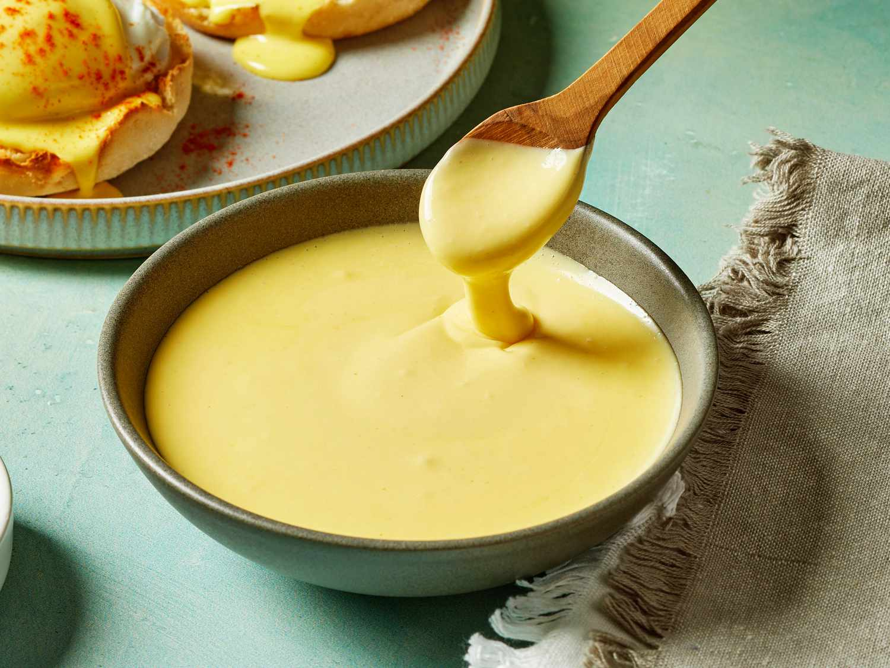

# Hollandaise

*Hollandaise looks like a magic trick from the outside: warm yolks, lots of butter, a splash of acid, and somehow it all comes together into a silky sauce. The only real thing to watch is the heat. Go gently and it works. Push it and you get scrambled eggs. Once you've made it a couple of times, it's a ten-minute job you'll trust yourself to do.*

## Overview
Hollandaise is the simplest of the mother sauces in ingredients, the trickiest in technique. It is an emulsion: tiny droplets of fat (the butter) suspended in a stable matrix held by an emulsifier (the egg yolks' lecithin). Add the butter too fast or let the eggs overheat, and the emulsion breaks: the sauce separates into a greasy puddle with a curdled scramble at the bottom.

The trick is gentle heat and gradual addition. The yolks need to thicken (form the emulsion base) without scrambling. Then the warm butter goes in slowly enough that each droplet gets coated by the yolks before the next droplet arrives.

Most home cooks get nervous about hollandaise and overcook it the first few times. Once you have made it three times, it stops being scary.

## The Recipe

For 250 ml hollandaise (4 portions, eggs benedict style):

### Ingredients
- 3 egg yolks (room temperature; cold yolks emulsify slowly)
- 1 tablespoon white wine vinegar (or lemon juice)
- 1 tablespoon water
- 150 g unsalted butter
- 1 small pinch fine sea salt
- 1 small pinch cayenne or white pepper (optional)
- Squeeze of lemon (to finish)

## Method

### Stage 1 - Clarify the Butter

Optional but recommended for a glossier finish. Otherwise use plain melted butter.

1. Place 150 g butter in a small saucepan.
2. Melt over very low heat. White foam rises to the top.
3. Skim the foam off with a spoon (this is the whey).
4. Pour the clear gold butter into a jug, leaving the milky solids behind in the pan.
5. The jug contains clarified butter (ghee, more or less). Should be warm but not hot when added to the eggs.

If you skip clarifying: just melt the butter and use it warm, including the milk solids. The hollandaise will be a touch less stable but easier in practice.

### Stage 2 - Make a Reduction

This step adds the classical hollandaise "lift". You can skip it and use lemon juice + water directly; the result is slightly less complex but very acceptable.

1. In a small pan, combine 1 tablespoon white wine vinegar, 1 tablespoon water, 4 black peppercorns (lightly crushed), 1 small bay leaf.
2. Heat gently. Reduce by half (about 1 tablespoon of liquid).
3. Strain through a sieve; discard solids.

### Stage 3 - The Sabayon (Egg-Yolk Base)

This is the critical step.

1. Place a heatproof bowl over a saucepan of barely simmering water (a bain-marie). The bowl should not touch the water.
2. In the bowl, whisk 3 yolks with the reduction (or with the tablespoon vinegar + tablespoon water if you skipped step 2).
3. Whisk constantly, vigorously. The yolks heat slowly, then thicken into a pale-yellow foamy ribbon (about 3-5 minutes).
4. The right moment: the whisk leaves a clear track through the mixture, and a ribbon of egg drawn from the whisk stays on the surface for 2 seconds before sinking. This is the "sabayon" stage.
5. Heat is critical. Yolks coagulate at 70 C; you want to take them to 65 C. If the water boils hard, the bowl gets too hot and you have scrambled eggs. Keep the water at the slightest simmer; lift the bowl off the heat every 30 seconds if needed.

### Stage 4 - Incorporate the Butter

1. Remove the bowl from the heat. Set on a damp tea towel (so it doesn't slide).
2. While whisking constantly, pour the warm clarified butter in a very thin stream. Start with just a few drops; once you see the emulsion form, you can pour a steady (but still thin) stream.
3. As the butter goes in, the sauce thickens. If it becomes too thick to whisk, add a teaspoon of warm water and continue.
4. Keep going until all 150 g butter is in. The finished sauce should be glossy, pourable but thick, and pale yellow.

### Stage 5 - Season and Finish

1. Salt to taste (1/4 teaspoon).
2. Cayenne or white pepper if you like the warmth.
3. Squeeze of lemon juice (1 teaspoon).
4. Taste; adjust.

## Holding Hollandaise

Hollandaise does not reheat. Once made, hold it for up to 1 hour at warm-not-hot temperature: cover the bowl, sit it in a wider bowl of warm water (not boiling), stir occasionally.

If it firms up over time: whisk in a teaspoon of warm water to loosen.

Refrigerator-cold hollandaise is useless; the emulsion has set and broken simultaneously. Make hollandaise to order.

## The Derivatives

### Sauce Bearnaise
The most famous hollandaise derivative. Replace the vinegar-water reduction with:
- 2 tablespoons white wine vinegar
- 2 tablespoons white wine
- 1 finely chopped shallot
- 1 small bunch tarragon (stalks reserved, leaves chopped and reserved)

Reduce as the reduction step. At the end, stir the chopped tarragon leaves into the finished sauce. Classical with steak (steak bearnaise).

### Sauce Choron
Bearnaise + tomato. Stir 1 tablespoon thick tomato puree (or 2 tablespoons reduced fresh tomato sauce) into the finished bearnaise. Goes with grilled meat and fish.

### Sauce Maltaise
Hollandaise + blood orange. Replace the lemon at the end with the juice of half a blood orange and 1 teaspoon zest. Classical with asparagus.

### Sauce Mousseline
Hollandaise + whipped cream. Fold 50 ml softly whipped double cream into the finished sauce. Lighter, paler. Goes with poached fish, vegetables.

### Sauce Noisette
Hollandaise made with browned butter (beurre noisette) instead of plain butter. Take the butter past the foam stage to the nutty-brown stage. Adds a deep nutty flavour. Goes with white fish or eggs.

## Rescuing a Broken Hollandaise

If the sauce splits into a greasy mess:

**Method 1: Restart with a yolk.**
1. In a clean bowl, whisk 1 fresh yolk with 1 teaspoon warm water.
2. Slowly whisk in the broken sauce, drop by drop, as if it were butter.
3. The new yolk re-emulsifies the broken sauce.

**Method 2: Restart with cold water.**
1. In a clean bowl, place 1 tablespoon ice-cold water.
2. Slowly whisk in the broken sauce, drop by drop. The thermal shock helps the emulsion reform.

Method 1 is more reliable; method 2 is faster.

If the sauce is broken AND has scrambled eggs in it (the eggs went too hot), there is no recovery. Start over.

## Common Mistakes

**The sauce broke.**
Either too much heat (yolks scrambled before the emulsion formed) or butter added too fast. Use the rescue methods above; next time go slower with the butter.

**The sauce is grainy.**
Yolks partially cooked. The emulsion is fragile; reheat very gently if at all. Most likely you cannot recover; start over.

**The sauce is too thin.**
Not enough butter incorporated, or too much water/reduction. Continue adding more butter (warm). If you have used all the butter, accept the thinner consistency.

**The sauce is too thick.**
Loosen with warm water, a teaspoon at a time, whisking.

**The sauce tastes flat.**
Under-salted, or under-acidified. Add a squeeze of lemon and a pinch more salt.

**The sauce has metallic notes.**
Whisked in an aluminium bowl. Use stainless steel, glass or ceramic.

## Where Next
- [Eggs course / Custards](../eggs/custards.md): the cooked-yolk technique is the foundation of hollandaise.
- [Bechamel](bechamel.md): the simplest mother sauce.
- [Hollandaise recipe](../../sauces/sauce-fish/hollandaise-sauce.md): canonical recipe.
- [Stocks-Sauces Course landing](stocks-sauces.md): back to the main course.

## Storage
- Stocks: refrigerate 4 days, freeze 3 months in 250 ml or 500 ml portions
- Mother sauces (béchamel, velouté, espagnole): refrigerate 3 days; freeze 2 months (some break on thaw, reheat gently)
- Emulsion sauces (hollandaise, béarnaise): make to order; do not refrigerate or freeze, they split
- Tomato-based sauces: refrigerate 5 days, freeze 3 months in ice-cube trays for easy portioning
