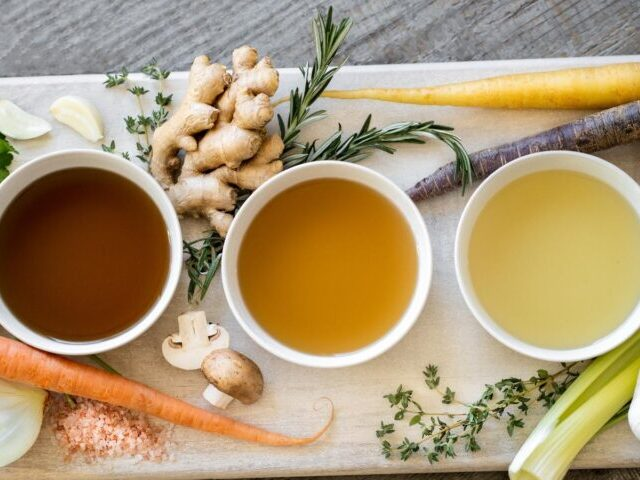

# Stocks and Sauces

*Get a good stock and the five mother sauces in your back pocket and you can finish almost anything. Stock turns bones and vegetable trim into a useful liquid; the mother sauces (bechamel, veloute, espagnole, hollandaise, tomato) turn that liquid into the sauces that dress a roast chicken, a souffle, a tray of lasagne, or a plate of asparagus.*

## Overview
Classical French cuisine is built on stocks and the five mother sauces. Auguste Escoffier codified the system at the turn of the 20th century. The system has held up for more than a hundred years because it works: a small number of foundational recipes, each of which is the parent of dozens of derivatives. Once you can make a clean stock and the five mothers, you can make hundreds of finished sauces by changing one or two ingredients.

This course covers the stocks first (because the mother sauces are built on them), then each of the five mother sauces. The deep-dives include the master recipe, the derivatives that branch from it, and the common failure modes.

## Course Outline

### Foundations
- [Stocks](stocks.md): chicken, beef, fish, vegetable, dashi. The flavoured liquids that every later sauce builds on.

### The Five Mother Sauces
- [Bechamel](bechamel.md): the white milk-based sauce. Parent of mornay (cheese), soubise (onion), nantua (shellfish).
- [Veloute](veloute.md): the blond stock-based sauce. Parent of supreme (chicken cream), Allemande (egg yolk and lemon), Albufera (with veal demi-glace).
- [Espagnole](espagnole.md): the brown stock-based sauce. Parent of demi-glace, bordelaise, Robert, charcutiere, lyonnaise.
- [Hollandaise](hollandaise.md): the warm egg-yolk-and-butter emulsion. Parent of bearnaise (with tarragon), choron (with tomato), maltaise (with blood orange), mousseline (lightened with cream).
- [Tomato Sauce](tomato-sauce.md): not a mother sauce in the strict French canon, but Escoffier elevated it; the basis for every red sauce on the menu.

## Master Recipes
The course refers back to these:

- [Chicken Stock](../../stocks/chicken-stock.md): the everyday workhorse.
- [Beef Stock](../../stocks/beef-stock.md): roasted, deep, the base of espagnole.
- [Brown Stock](../../stocks/brown-stock.md): the dark version.
- [Fish Stock (Fumet)](../../stocks/fumet-de-poisson.md): light, quick, for veloute de poisson.
- [Vegetable Stock](../../stocks/vegetable-stock.md): the meat-free base.
- [Bechamel](../../sauces/sauce-savory/bechamel.md): the master white sauce.
- [Veloute](../../sauces/sauce-savory/veloute.md): the master stock-thickened sauce.
- [Espagnole](../../sauces/sauce-savory/espagnole.md): the master brown sauce.
- [Hollandaise](../../sauces/sauce-fish/hollandaise-sauce.md): the master emulsion.
- [Pizza Sauce](../../cuisine/italian/pizza/pizza-sauce.md): the no-cook tomato base; see also the tomato course page.

## The System in One Sentence

You make a stock once a week and freeze it in 500 ml batches. When you need a sauce, you cook a roux (or temper egg yolks), whisk in stock or milk, simmer, and that is a mother sauce. Change one or two finishing ingredients and it becomes any of the derivatives.

This is why classical kitchens move so fast at service time. The stocks were made yesterday. The roux is sitting cold in the fridge. A sauce is built in 8 minutes during plating.

## Where to Start
- New to sauces: [Stocks](stocks.md) first. Without a good stock, every veloute and espagnole derivative tastes flat. The hour spent making chicken stock is the highest-leverage hour in your week.
- Want the most useful single sauce: [Bechamel](bechamel.md). Underpins lasagne, gratin, mac and cheese, moussaka, soubise onions, mornay-glazed vegetables.
- Want to impress: [Hollandaise](hollandaise.md). It looks like a magic trick; it is actually 10 minutes' work once you know the technique.
- Want depth: [Espagnole](espagnole.md). The slow brown sauce that takes 4-6 hours but tastes like a restaurant.

## Where Next
- [Pastry course](../pastry/pastry.md): bechamel and choux together build most of the savoury patisserie canon.
- [Eggs course](../eggs/eggs.md): hollandaise is an egg-yolk emulsion; many of the techniques transfer.
- [Bread course](../bread/bread.md): the panade in choux is the closest dough-side relative of a roux.
