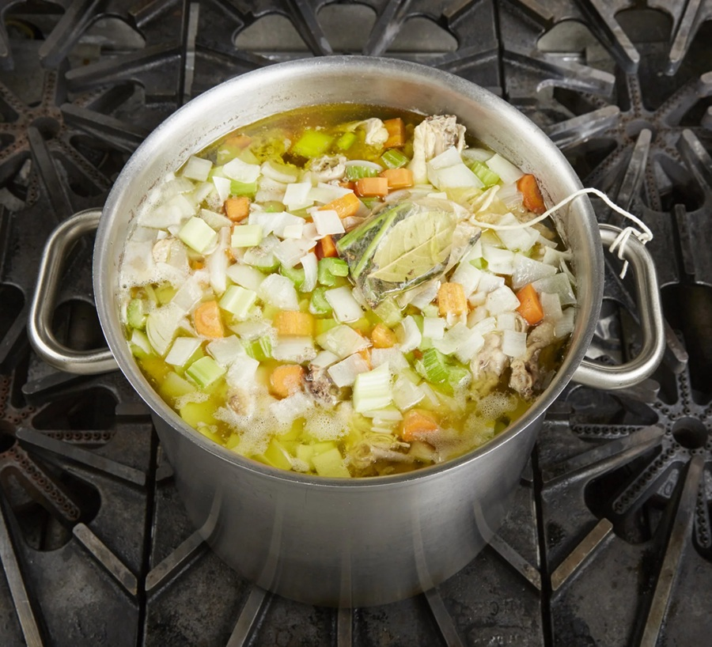

# Stocks

*The flavoured water under everything else. Bones, vegetable trim, herbs and water simmered for hours into a clean savoury base. The single highest-leverage thing you can do in a kitchen: an hour's work yielding 4 litres of stock that elevates every soup, sauce and braise for the next month.*

## Overview
Stock is not soup. Stock is what soup is made from. The difference is seasoning: stock is unseasoned (or barely seasoned), so it can be reduced, salted, and finished into whatever final dish you want. Soup is salted, often thickened, and ready to eat.

Five stocks cover almost every Western preparation, plus dashi for Japanese cooking:
1. **White chicken stock** (fond blanc de volaille): everyday workhorse.
2. **Brown chicken / veal stock** (fond brun): roasted bones, deeper, espagnole's base.
3. **Beef stock**: long-simmered, the base of many braises.
4. **Fish stock / fumet**: light, quick (45 min), for fish veloute and bisque.
5. **Vegetable stock**: meat-free, faster, for grain dishes and vegetarian soups.
6. **Dashi**: Japanese, made from kombu and bonito, 15 minutes. The foundation of miso soup, ramen broth, dipping sauces.

## Why Stock Matters

The flavour difference between a sauce made with shop-bought stock cube + water and one made with proper homemade stock is the difference between professional cooking and amateur cooking. The difference between shop-bought "fresh" stock from the chiller and homemade is also significant; commercial stocks are usually under-extracted and over-salted.

Stock takes time, but very little active work. A batch of chicken stock is 10 minutes' work upfront, then 4 hours' simmering. You can do other things during the simmer.

## White Chicken Stock

The most useful single stock. Use the carcass from a roast chicken, or buy chicken wings and necks specifically.

### Ingredients (4 litres finished)
- 2 kg chicken bones (carcasses, wings, necks, feet if you can get them)
- 4 litres cold water
- 1 large onion (skin on, halved)
- 2 carrots (rough chopped)
- 2 celery stalks (rough chopped)
- 1 leek (rough chopped, optional)
- 1 head garlic (halved horizontally)
- 1 bay leaf
- 1 small bunch parsley stalks
- 1 teaspoon black peppercorns
- (no salt)

### Method

1. Place the bones in a tall stockpot. Cover with the cold water. Bring to a slow boil over medium-high heat.
2. As the water heats, grey scum rises to the surface. Skim with a ladle and discard. Continue skimming until no more scum rises (about 10 minutes after the boil starts). This is what makes the stock clear.
3. Reduce to a gentle simmer (bubbles breaking the surface lazily, not a rolling boil).
4. Add the vegetables, garlic, bay, parsley and peppercorns.
5. Simmer uncovered (or with the lid cracked) for 4 hours. Skim occasionally if scum reappears.
6. Strain through a fine sieve lined with muslin (or a clean tea towel) into a clean pot.
7. Cool quickly: an ice bath is fastest; otherwise stand in cold water in the sink, then refrigerate.
8. The next day, scrape any solidified fat off the surface and discard. The stock should be a clear pale gold, sometimes lightly jellied (a sign of good gelatin extraction).

Store: 4 days in the fridge; 3 months in the freezer (portion into 500 ml containers).

### The Two Critical Rules

1. **Cold water start.** Hot water seals the proteins inside the bones, blocking extraction. Cold water lets flavour leach out gradually as the temperature rises.
2. **Simmer, never boil.** A rolling boil emulsifies fat into the stock, making it cloudy and greasy. A gentle simmer keeps the fat on the surface where you can skim it.

## Brown Chicken or Veal Stock (Fond Brun)

Roasted bones first, then simmered. Darker, richer, more umami. The base for espagnole and demi-glace.

### Method

1. Heat the oven to 220 C.
2. Spread 2 kg chicken or veal bones on a roasting tray. Roast 45 minutes, turning halfway, until deep mahogany.
3. Add chopped vegetables (onion, carrot, celery, leek) to the tray. Roast another 15 minutes.
4. Transfer everything to a stockpot. Cover with cold water.
5. Deglaze the roasting tray: pour off any fat, then add 250 ml of water to the tray and scrape up the browned bits. Tip the deglaze liquid into the stockpot.
6. Add 1 tablespoon tomato puree, 1 bay leaf, parsley stalks, peppercorns.
7. Bring to a slow boil, skim, drop to a simmer.
8. Simmer 6-8 hours (longer than white stock; the roasted bones release flavour more slowly).
9. Strain, cool, store as above.

The finished colour should be dark amber. The taste is markedly deeper than white stock.

## Beef Stock

Same approach as brown veal stock, but with beef bones. Marrowbones plus knuckle bones are the ideal mix. Simmer 8 hours or longer; beef releases its flavour very slowly. The finished stock is deeply red-brown and should jelly hard when cold.

## Fish Stock (Fumet de Poisson)

Faster (45 minutes total). Made from the bones and heads of white fish: sole, turbot, plaice, halibut. Avoid oily fish (mackerel, salmon, tuna) for stock; they make it muddy and strong.

### Method

1. Rinse 1 kg fish bones and heads thoroughly under cold water. Remove gills (they turn the stock bitter).
2. Sweat 1 sliced leek and 1 chopped shallot in 30 g butter in the stockpot, 5 minutes, no colour.
3. Add the fish bones, 250 ml white wine, 1.5 litres cold water, 1 bay leaf, 4 parsley stalks, 4 peppercorns.
4. Bring to a slow boil, skim.
5. Simmer 30-45 minutes. NOT longer; over-cooked fish stock turns gluey and bitter.
6. Strain through a very fine sieve. Cool quickly.

Store: 2 days in the fridge; 1 month frozen.

## Vegetable Stock

Lighter, faster, vegetarian. The default base for vegetable soups, grain dishes, vegetarian risottos.

### Method

1. In a stockpot with 1 tablespoon oil, gently cook chopped onion, carrot, celery, leek and garlic for 10 minutes without colour.
2. Add 2 litres cold water, 1 bay leaf, parsley stalks, thyme sprig, peppercorns.
3. Simmer 30-40 minutes.
4. Strain.

Vegetable stock is best used within 3 days; it does not freeze as well as meat stocks.

Avoid: brassicas (broccoli, cabbage) and beetroot in vegetable stock. They overwhelm everything. Onion skins are fine and add colour.

## Dashi

The Japanese stock. Made in 15 minutes from kombu (dried kelp) and katsuobushi (dried bonito flakes). The base of miso soup, the broth in ramen, the seasoning of every classical Japanese sauce.

### Method (Ichiban Dashi: First Dashi)

1. Wipe a 10 cm square of kombu with a damp cloth. Place in 1 litre of cold water in a pan. Leave 30 minutes.
2. Heat slowly until small bubbles form at the edges (just below boil). Remove the kombu immediately.
3. Bring to a brief boil. Off the heat, add a generous handful (about 20 g) of katsuobushi flakes.
4. Let stand 2 minutes; the flakes sink.
5. Strain through fine muslin into a clean container.

Use the same day. Dashi loses its delicate aroma in storage; it does not freeze well.

## Common Mistakes

**The stock is cloudy.**
Boiled instead of simmered, or the scum wasn't skimmed at the start. Both are unrecoverable in the same batch; the stock still tastes fine but won't be clear.

**The stock tastes bitter.**
Over-cooked, or had gills/livers/spleen in the pot. Strain immediately at the right stop time; remove organs from carcasses before pot-up.

**The stock is greasy.**
Not skimmed enough. After cooling overnight, the fat solidifies on top and lifts off easily. Always strain the next day if possible.

**The stock is weak.**
Too little bone per litre of water (rule of thumb: 1 kg bones per 2 litres water), or simmered too short. Reduce a weak stock by half on the hob; it concentrates.

**The fish stock is gluey.**
Simmered too long (more than 45 minutes). Fish bones release a gelatinous sliminess after that point. Strain at 40 minutes next time.

**The vegetable stock is sweet and one-note.**
Too much carrot or onion. Balance with celery, leek, garlic, herbs. Or roast the vegetables first for a Maillard layer that cuts the sweetness.

## Storage and Use

- **Fridge:** 3-4 days for meat stocks; 2-3 days for fish; 2 days for vegetable.
- **Freezer:** portion into 250 ml or 500 ml containers. 3-6 months for meat stocks; 1 month for fish; 1-2 months for vegetable.
- **Reduction:** simmer to half-volume for "double strength" stock. Reduce to a quarter for "glace" (sticky meat reduction; 1 tsp seasons a sauce).

## Where Next
- [Bechamel](bechamel.md): the milk-based sauce; uses no stock, but the same roux technique.
- [Veloute](veloute.md): the first stock-based mother sauce.
- [Espagnole](espagnole.md): the brown-stock mother sauce; needs the brown stock from above.
- [Stocks-Sauces Course landing](stocks-sauces.md): back to the main course.
