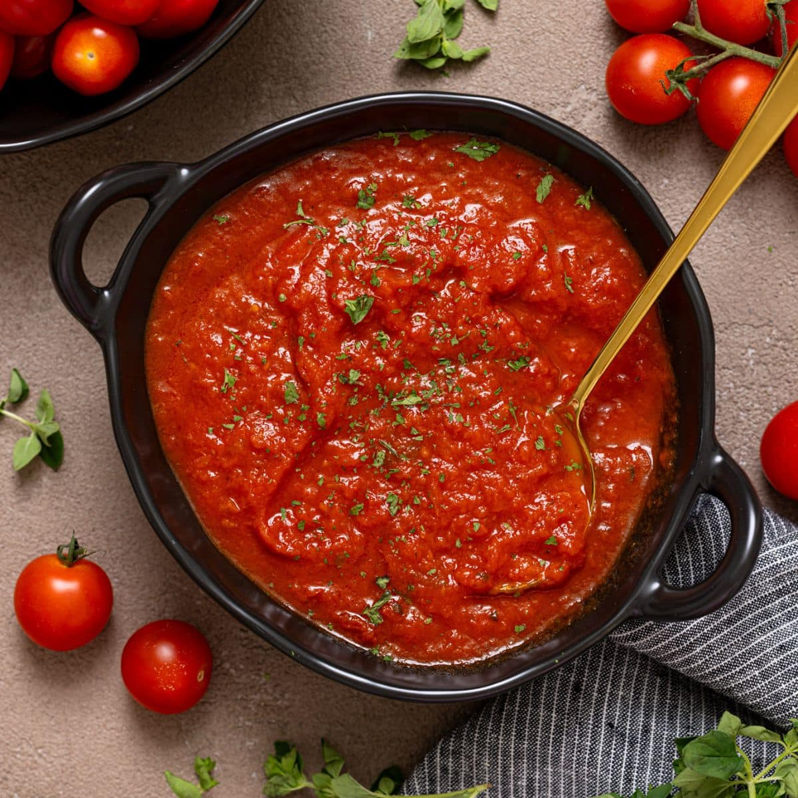

# Tomato Sauce

*Tomato sauce is the most well-travelled member of the mother sauce family. The Italians, Spanish, Mexicans and Americans all do their own version, but most of it boils down to two starting points: the slow-cooked Italian sugo and the quick raw-passata pizza-style. Get those down and most red sauces are variations on one or the other.*

## Overview
Tomato sauce occupies a strange place in classical French canon. Escoffier added it to the five mothers in the early 1900s, recognising its ubiquity in Mediterranean and Italian-French cooking. Some French purists still treat it as a daughter sauce; the rest of the world treats it as foundational.

Two foundational styles cover most applications:

1. **Slow-cooked tomato sauce** (sauce tomate, sugo, or arrabbiata's base). Onion, garlic, herbs, tinned plum tomatoes, simmered 30-60 minutes. Pours over pasta, layers into lasagne, finishes meatballs.
2. **Raw or barely-cooked passata** (the Neapolitan pizza-sauce style). Just crushed tomatoes, salt, olive oil, basil. The 90 seconds in the pizza oven is the only cooking.

The two are very different, despite shared ingredients. Slow-cooked is rich, deep, slightly caramelised. Raw is bright, acidic, vivid. You can't get to one from the other; pick the right style for the dish.

## The Tomatoes

Quality matters more than recipe.

**Best:** San Marzano DOP tomatoes from Italy. Look for the DOP seal. Lower water content, sweeter, less acidic, the standard against which others are measured.

**Acceptable substitutes:** "Italian plum tomatoes" without the DOP label (cheaper, slightly less consistent), good organic brands like Mutti or Cirio.

**Avoid:** generic supermarket tinned tomatoes. They tend to be watery, with a metallic sour edge. Fresh in-season tomatoes are fine if peak quality and ripe; out-of-season "fresh" tomatoes are worse than a decent tin.

For raw passata (pizza), use whole tinned tomatoes and crush yourself (more texture, more control) rather than buying passata that is already pureed (often smoother than you want).

## Slow-Cooked Tomato Sauce (Italian Sugo)

The everyday pasta sauce. For 4 portions:

### Ingredients
- 2 tablespoons olive oil
- 1 medium onion (finely chopped)
- 3 garlic cloves (finely chopped or sliced)
- 1 x 400 g tin whole plum tomatoes (San Marzano if possible)
- 1 small handful fresh basil leaves (or 1 teaspoon dried oregano)
- Pinch caster sugar (only if the tomatoes are acidic)
- Salt and pepper

### Method

1. Heat the oil in a heavy-based pan over medium heat. Add the chopped onion. Cook gently 10 minutes, stirring, until soft and translucent (not browned).
2. Add the garlic. Cook 1 minute until fragrant.
3. Crush the tomatoes by hand into the pan (or use a fork in the tin first). Add their juice.
4. Half-fill the empty tin with water; swill out the residue; tip into the pan.
5. Tear in half the basil leaves. Season with salt.
6. Simmer uncovered for 25-40 minutes, stirring occasionally. The sauce thickens and deepens in colour.
7. Taste. Adjust salt. Add a small pinch of sugar if it tastes too sharp.
8. Stir in the remaining fresh basil at the end.

For a smoother sauce, pass through a sieve or food mill (mouli). For a chunkier sauce, leave as is.

### Variations

- **Arrabbiata:** add 1 dried bird's-eye chilli to the oil with the garlic. Finish with chopped parsley.
- **Puttanesca:** add 4 anchovy fillets and 1 tablespoon of capers with the garlic; finish with 50 g chopped black olives.
- **Sugo al pomodoro:** the standard above; the pasta sauce of every Italian household.
- **Marinara:** the same as sugo but cooked with garlic instead of onion, very short (10-15 minutes). Less mellow, more aggressive.

## Raw Tomato (Pizza Sauce)

The Neapolitan tradition. No cooking. Just crushed tomatoes, salt, and either basil or oregano.

### Ingredients (enough for 2-4 pizzas)
- 1 x 400 g tin whole San Marzano tomatoes
- 1/2 teaspoon fine sea salt
- 4-5 fresh basil leaves (added to the pizza, not the sauce)

### Method

1. Pour the tomatoes into a wide bowl with their juice.
2. Crush each tomato by hand: squeeze it through your fingers into chunks. Stop when the texture is roughly chunky, with some 5 mm pieces and some smaller bits.
3. Add the salt. Stir.
4. Done.

The 90 seconds in the pizza oven cooks the sauce. Pre-cooking ruins it: the sauce loses its brightness and tastes like pasta sauce on bread, not pizza.

See [Pizza Tutorial / Sauce](../pizza/sauce.md) for fuller detail.

## Tomato Sauce for Other Cuisines

### Bolognese
Tomato + meat. Italian ragu. Starts with a soffritto (onion, carrot, celery), browned ground beef and pork, white wine, then tinned tomatoes, then very long slow cook (2-4 hours). Different sauce than sugo; less tomato-forward, more meat-rich.

### Hogao (Colombian Sofrito)
Tomato + onion + garlic + cumin, slowly cooked. The starting sauce of nearly every Colombian savoury dish. Built like sugo but with cumin and sometimes red bell pepper.

### Marinara (American Italian)
A thick, herby sauce with oregano, parsley, and red wine. Used as a dipping sauce for fried foods, on Italian-American pasta. Spicier and more aromatic than the Italian original.

### Salsa de Tomate (Spanish)
Similar to sugo but often with green pepper. Used on tortilla, fried eggs, and as a starter sauce for many Spanish stews.

### Salsa (Mexican)
Different family entirely. Mexican salsas are usually raw or roasted-then-blended, with green chillies, lime, coriander, onion. Sharper, fresher, served as a condiment rather than a cooked sauce.

## Common Mistakes

**The sauce tastes harsh and acidic.**
The tomatoes are wrong, or the sauce didn't cook long enough. Try a better brand (San Marzano), or simmer longer (the acidity mellows over time). A pinch of sugar can mask, but it doesn't fix.

**The sauce tastes flat.**
Under-salted. Tomato needs salt to come alive. Add 1/4 teaspoon at a time.

**The sauce is watery.**
Either too much water added, or too little simmering. Continue uncovered until it thickens.

**The sauce is bitter.**
Garlic burnt during the saute. Bitter garlic ruins the whole batch. Use lower heat and shorter sweat times.

**The sauce is one-note.**
No basil/oregano/herb finish. Stir in fresh herbs at the end; they brighten the long-cooked depth.

**The pizza sauce is wet, soaks the base.**
Used a smooth puree, or applied too thickly. Use crushed tomato (chunky), apply thinly.

## Where Next
- [Pizza tutorial / Sauce](../pizza/sauce.md): deep-dive on the no-cook style.
- [Pizza Sauce recipe](../../cuisine/italian/pizza/pizza-sauce.md): traditional pizza-sauce recipe.
- [Bechamel](bechamel.md): the white mother sauce.
- [Stocks-Sauces Course landing](stocks-sauces.md): back to the main course.

## Storage
- Stocks: refrigerate 4 days, freeze 3 months in 250 ml or 500 ml portions
- Mother sauces (béchamel, velouté, espagnole): refrigerate 3 days; freeze 2 months (some break on thaw, reheat gently)
- Emulsion sauces (hollandaise, béarnaise): make to order; do not refrigerate or freeze, they split
- Tomato-based sauces: refrigerate 5 days, freeze 3 months in ice-cube trays for easy portioning
