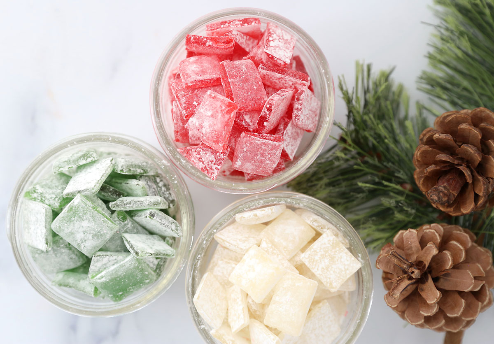

# Candy

*The rest of the confectionery toolkit. Hard candies (lollipops, butterscotch), chewy taffies and soft caramels, gummies (gelatin-set), marshmallow (whipped sugar protein foam). Different stages of cooked sugar plus the trick of each.*

## Overview
This lesson covers the candy types not covered in the dedicated lessons, hard candies, taffies, gummies and marshmallow. Each leans on a different sugar-work technique combined with a defining secondary ingredient (gelatin, whipped air, pulled stretch, butter). The temperatures stay in the same family as the earlier lessons; the variations are in what gets added afterward.

This is the "everything else" lesson; the previous lessons covered the major confection families in depth, and this lesson rounds out the candy types so you have a complete map of what's possible.

## Hard Candies (Lollipops, Drops, Butterscotch)

Sugar cooked to hard crack (149-154 C) with no fat. Once cooled, sets to a glassy, glossy hardness that lasts months.

### Hard Candy Drops

- 250 g caster sugar
- 100 g light corn syrup
- 60 ml water
- Flavouring oil (peppermint, lemon, cinnamon)
- Food colouring (optional)

Method:
1. Combine sugar, corn syrup and water. Heat to dissolve; stop stirring.
2. Cook to 154 C (hard crack).
3. Remove from heat; wait 30 seconds for bubbles to subside.
4. Stir in flavouring and colouring.
5. Spoon onto a greaseproof-paper-lined sheet in drops, OR pour into hard candy moulds, OR (if you want lollipops) onto sticks pre-placed on the sheet.
6. Cool completely. Unmould or peel off.

The dose for hard candy flavouring oils is small (1 tsp per 250 g sugar): these are concentrated essential oils, not extracts.

### Butterscotch Drops

Hard candy with butter added at the end.

- 200 g brown sugar
- 100 g light corn syrup
- 60 g unsalted butter
- 60 ml water
- 1 tsp vanilla
- 1/2 tsp salt

Method:
1. Combine sugar, syrup and water. Heat to dissolve; stop stirring.
2. Add butter; let it melt in. Continue cooking.
3. Cook to 149 C (slightly cooler than pure hard candy due to butter).
4. Off heat, stir in vanilla and salt.
5. Pour into moulds.
6. Cool completely.

Butterscotch has the slightly soft, melt-on-tongue character that pure hard candy lacks; the butter is doing the work.

## Taffy

The chewy, pulled-stretched candy. Cooked to soft crack (132-143 C), then pulled while warm to incorporate air and develop the chewy texture.

### Saltwater Taffy

- 300 g caster sugar
- 100 g light corn syrup
- 100 ml water
- 60 g unsalted butter
- 1 tsp glycerin (or 1 tsp vinegar, prevents excessive crystallisation)
- 1 tsp vanilla
- 1/2 tsp salt
- Food colouring (optional)

Method:
1. Combine sugar, corn syrup, water, butter and glycerin. Dissolve.
2. Cook to 132-143 C (soft crack). Lower end produces chewier taffy; higher end produces firmer.
3. Off heat, add vanilla, salt and colour.
4. Pour onto a buttered baking sheet or marble slab.
5. **Let cool to 60-70 C**: cool enough to handle but still warm and pliable.
6. **Pulling:** with buttered hands, gather the taffy and start pulling. Stretch the mass into a rope; fold; stretch; fold. This is the work that gives taffy its characteristic texture. Pull for 10-15 minutes; the taffy goes from translucent to opaque and lightens in colour.
7. Roll into a rope; cut with buttered scissors into 1-2 cm pieces. Wrap each in greaseproof paper twists.

The pulling does two things: incorporates air (lightening the texture and colour) and breaks down the sugar crystals into a smooth chewy structure. Without the pulling, taffy is sticky and goopy; with the pulling, it is the chewy candy of childhood.

## Gummies

Gelatin-set sugar with flavouring. Soft, bouncy, slightly translucent.

### Recipe

- 200 ml fruit juice (orange, apple, raspberry, or a mix)
- 100 g caster sugar
- 30 g powdered gelatin (or 12 sheets, soaked)
- 1 tbsp lemon juice
- A few drops of citric acid (optional, for tart gummies)

Method:
1. Soak gelatin in cold water; let bloom 5 minutes.
2. Heat fruit juice, sugar and lemon juice in a saucepan to a simmer.
3. Off heat, stir in bloomed gelatin until dissolved.
4. Pour into silicone candy moulds (gummy bear moulds, fruit-shape moulds, etc.).
5. Refrigerate 2 hours to set.
6. Unmould.

The texture depends on the gelatin amount. Standard gummies use about 12-15 g gelatin per 100 g sugar by weight; more gelatin produces firmer, chewier gummies.

For sour gummies, dust the unmoulded gummies in a 50/50 mix of caster sugar and citric acid. The sour coating develops over a few hours as the sugar absorbs surface moisture from the gummy.

### Variations

- **Wine gummies:** Replace half the juice with red wine. The alcohol cooks off; the wine flavour stays.
- **Hot chilli gummies:** Add 1 tsp dried chilli flakes during the simmer; strain before adding gelatin.
- **Coffee gummies:** Replace half the juice with strong coffee.

Gummies keep refrigerated 2 weeks; eat soonest for the best texture.

## Marshmallow

Whipped sugar syrup stabilised by gelatin. Light, soft, airy.

### Recipe

- 250 g caster sugar
- 100 g light corn syrup
- 100 ml water
- 4 egg whites (about 120 g): sometimes omitted in egg-free versions
- 30 g powdered gelatin (or 12 sheets, soaked)
- 1 tsp vanilla extract
- Pinch of salt
- Icing sugar + cornflour, 50/50, for dusting

Method:
1. **Bloom the gelatin.** Sprinkle over 60 ml cold water; let stand 5 minutes.
2. **Cook the syrup.** Combine sugar, corn syrup and water (the remaining water). Cook to 116-118 C (firm ball stage).
3. **Whip egg whites** to soft peaks in a stand mixer.
4. **Pour the hot syrup** slowly into the whipping egg whites in a thin stream, with the mixer on medium. Continue whipping.
5. **Add the bloomed gelatin** (gently warmed if it has set) and vanilla and salt. Continue whipping.
6. **Whip 8-10 minutes total** until the mixture is glossy, doubled in volume, and holds firm peaks.
7. **Pour into a tin** dusted with the 50/50 icing sugar + cornflour mix. Smooth the top.
8. **Set at room temperature** 6-8 hours, or overnight.
9. **Cut into squares** with a scissors or oiled knife, dusted with the powder to prevent sticking.

For the egg-free version, skip the egg whites and beat the gelatin-syrup mixture directly. The result is denser and less fluffy but easier and still good.

### Variations

- **Chocolate marshmallow:** Stir in 50 g unsweetened cocoa with the vanilla.
- **Vanilla bean marshmallow:** Use the scrapings of a real vanilla bean instead of (or alongside) vanilla extract.
- **Toasted-coconut marshmallow:** Roll the set squares in toasted coconut for coating.

## Pralines (Pecan or Almond)

A Southern American confection, sugar with nuts, cooked and beaten until creamy. Like fudge but with nuts as the dominant feature.

### Recipe

- 250 g caster sugar
- 250 g brown sugar
- 200 ml double cream
- 100 g unsalted butter
- 1 tsp vanilla
- 1/2 tsp salt
- 200 g pecan halves, toasted

Method:
1. Combine sugars, cream, butter and salt in a heavy saucepan.
2. Stir to dissolve. Bring to a boil.
3. Cook to 113-115 C (soft ball, same as fudge).
4. Off heat, add vanilla and pecans.
5. **Beat with a wooden spoon for 30 seconds.** This is the key difference from fudge, much shorter beating period for a creamier, looser texture.
6. Drop spoonfuls onto greaseproof paper to set. Each spoonful spreads to a 5cm round, slightly domed.
7. Cool fully.

The shorter beat produces a softer praline than fudge. The pecan halves stay distinct in the praline, half-buried in the creamy base. Each praline is one good mouthful.

## Where Next
- [Sugar Stages](sugar-stages.md): the reference for all the cooking temperatures above.
- [Crystallisation](crystallisation.md): why beating fudge works but pulling taffy works differently.
- [Fudge](fudge.md): the related soft-ball confection with deliberate crystallisation.
- [Caramel](caramel.md): the related caramelisation-stage confection.
