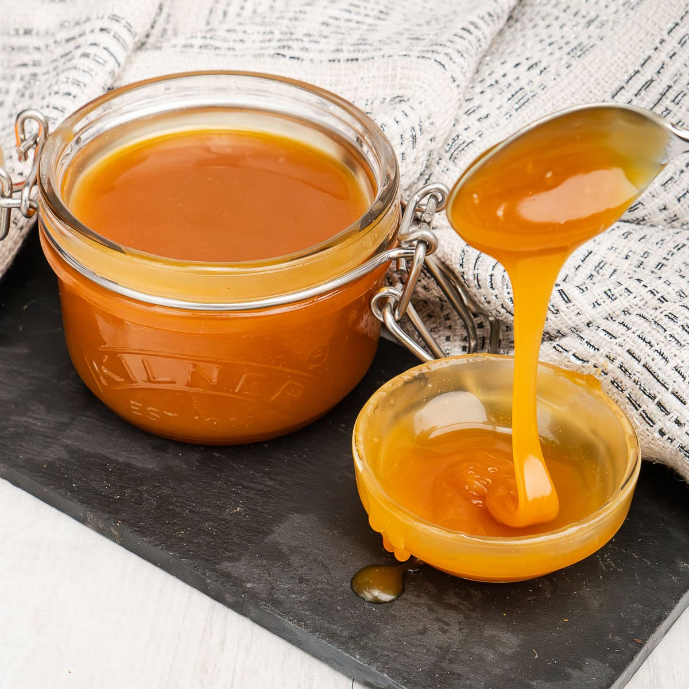

# Caramel

*Sugar cooked to 170-180 C, where it stops being sweet and starts being interesting. Caramel sauce, caramel for dipping, caramel for chocolates, and the two basic techniques, wet caramel and dry caramel, that produce all of them.*

## Overview
Caramel is sugar past the soft and hard crack stages, taken to where it begins to brown. The browning is a series of chemical reactions (caramelisation, distinct from Maillard browning, which needs amino acids) that produce hundreds of new flavour compounds. Pure white sugar at 100 C tastes only sweet. The same sugar at 170 C tastes complex, butterscotch, nutty, slightly bitter, with the deep amber colour and the unmistakable caramel aroma.

Two techniques produce caramel:

- **Wet caramel:** sugar dissolved in water first, then boiled until the water evaporates and the sugar caramelises. Slower, more controlled, easier for beginners.
- **Dry caramel:** sugar heated in a pan alone, with no water. Faster, less forgiving, can scorch in spots. Used when you want a deeper, more intense caramelisation flavour.

This lesson covers both, plus the worked recipes for caramel sauce, soft caramels, and the caramel that fills bonbons.

## Wet Caramel (Beginner-Friendly)

### Method

1. **Combine sugar and water in a heavy saucepan.** Typical ratio: 4:1 sugar to water by weight, or 250 g sugar to 60 ml water. The water helps the sugar dissolve evenly and gives you more cooking time before the temperature spikes.
2. **Optional: add a pinch of cream of tartar** (or a few drops of lemon juice): this is anti-crystallisation insurance.
3. **Heat gently** to dissolve the sugar. Stir if needed to help the sugar dissolve.
4. **Stop stirring** the moment the sugar is dissolved.
5. **Bring to a boil.** Now the temperature will climb steadily as water evaporates. Wipe down the pan walls occasionally with a wet pastry brush.
6. **Cook until the syrup turns colour.** First it stays clear; then it goes pale gold (about 160 C); amber (170 C); deep amber (175 C); dark amber, almost mahogany (180 C). Use a digital thermometer to read the temperature, or learn to read the colour.
7. **Stop at the right colour for your recipe.**

### Colour Guide for Caramel

- **Pale gold (160-165 C):** Subtle, mostly sweet, slight caramel hint. Used in light caramel sauces, simple sugar candies.
- **Amber (170-175 C):** Classic caramel flavour. The default for most recipes.
- **Deep amber (175-180 C):** Rich, complex, slight bitter edge. The "right" caramel for sauces and most bonbons.
- **Mahogany (180-185 C):** Bordering on burnt. Strong-flavoured; useful for caramel that needs to stand up to chocolate or cream.
- **Past mahogany (185 C+):** Burnt. Acrid, bitter, smoking. Throw out.

Once you reach your target colour, immediately remove from the heat. The pan retains heat; the syrup will continue darkening for another 15-30 seconds. Pull it off slightly before you think you should.

## Dry Caramel

### Method

1. **Heat a heavy pan over medium heat.** Empty.
2. **Add sugar in batches.** Start with about a third of the total. Let it begin to melt and slightly brown.
3. **Add more sugar** in batches as the previous batch is mostly melted. Stir gently to incorporate. Repeat until all the sugar is in the pan.
4. **Continue cooking** until the desired colour is reached.

The "in batches" approach is the trick. Dumping all the sugar in at once produces uneven heating, the bottom melts while the top stays as crystals, and the parts in contact with the pan bottom burn before the top has melted. Adding in batches lets each batch incorporate fully into the molten sugar.

Dry caramel is faster, requires more attention, and produces a slightly different flavour (slightly more intense, with a hint of bitter that wet caramel does not have). Skilled confectioners use dry caramel for the deepest caramel notes.

## Caramel Sauce

A wet caramel finished with cream and butter. The classic dessert sauce.

### Recipe

- 200 g caster sugar
- 60 ml water
- A pinch of cream of tartar
- 200 ml double cream, warmed
- 60 g unsalted butter, cubed
- 1/2 tsp sea salt
- 1 tsp vanilla extract

### Method

1. Combine sugar, water and cream of tartar in a heavy saucepan. Heat gently to dissolve. Stop stirring.
2. Bring to a boil; cook to 175-180 C (deep amber).
3. **Off the heat,** carefully add the warmed cream. The mixture will hiss and steam violently, be careful. Stir to combine.
4. Add butter cubes one at a time, whisking in each before adding the next. The mixture becomes glossy and emulsified.
5. Stir in salt and vanilla.
6. Pour into a heatproof jar. Cool to room temperature, then refrigerate.

Keeps refrigerated 1 month. Gentle reheat (microwave 20 seconds or warm in a saucepan) restores the pour.

### Variations

- **Salted caramel sauce:** Increase salt to 1 tsp. The salt becomes a dominant flavour.
- **Whisky caramel:** Add 2 tbsp whisky off the heat. Lights up the caramel without dominating.
- **Coffee caramel:** Steep 1 tbsp coarse-ground coffee in the warm cream before adding; strain before pouring in.
- **Brown sugar caramel:** Replace caster sugar with light brown sugar. The molasses in the brown sugar adds depth.
- **Bourbon caramel:** Add 2-3 tbsp bourbon off the heat. American classic.

## Soft Caramels (For Chocolates, Bonbons or Cutting Into Squares)

### Recipe

- 200 g caster sugar
- 200 g glucose syrup (light corn syrup substitutes)
- 200 ml double cream, warm
- 60 g unsalted butter, cubed
- 100 ml condensed milk (or just more cream)
- 1 tsp vanilla extract
- 1 tsp sea salt

### Method

1. Combine sugar, glucose syrup, half the cream and the butter in a heavy saucepan. Stir to combine.
2. Bring to a boil. Cook to 120-122 C (firm ball stage). Time required: 10-15 minutes.
3. Off the heat, stir in the remaining cream, condensed milk, vanilla and salt.
4. Return to the heat. Cook back to 120-122 C, stirring continuously, watch the bottom carefully, this stage scorches easily.
5. Pour into a silicone-lined 20cm square pan or a buttered baking tin.
6. Cool to room temperature 2 hours; refrigerate overnight.
7. Cut into squares with a sharp oiled knife.

Wrap individually in greaseproof or wax paper. Keep at cool room temperature 2-3 weeks; refrigerate 6 weeks; freeze 3 months.

## Caramel for Bonbons

Use the soft caramel recipe above but cook slightly cooler (118-120 C, soft ball / firm ball boundary). The result is pourable when warm; sets to a firm but yielding texture that pipes into chocolate shells.

Pipe into pre-tempered chocolate shells; allow to cool 1 hour; then seal with tempered chocolate. See [Bars and Bonbons](../chocolate/bars-and-bonbons.md).

## Apple-Dipping Caramel

Less complex than the soft caramels above. A thicker, stickier caramel for coating fresh apples.

- 250 g caster sugar
- 100 g brown sugar
- 200 g golden syrup (or corn syrup)
- 200 ml double cream
- 100 g unsalted butter
- 1 tsp vanilla
- 1/2 tsp salt

Method:
1. Combine all ingredients in a heavy saucepan.
2. Heat slowly, stirring until sugar dissolves.
3. Cook to 130-138 C (hard ball to soft crack); a 120-125°C caramel stays sticky and slides off the apple.
4. Dip washed dry apples (sticks pushed in for handles) one at a time into the caramel, swirling to coat.
5. Set on greaseproof paper. Allow to cool 1 hour at room temperature.

## Common Failures

| Symptom | Cause | Fix |
|---------|-------|-----|
| Crystallised before reaching caramel | Pan walls had crystals or stirring during the cook | Use clean wet brush to wipe walls; do not stir; add small amount of acid |
| Caramel burnt | Too hot or too long | Pull off heat at lower colour next time; remember residual heat carries the cook |
| Caramel grainy after cooling | Crystallisation during the cool-down | Stir less during cool; check if sugar was fully dissolved at start |
| Caramel rubbery | Too much butter or fat for the sugar ratio | Reduce dairy slightly |
| Caramel too soft, won't hold shape | Cooked too cool | Cook to a higher temperature next time |
| Caramel sauce too thick when cool | Cooked too long | Stop earlier; or add a few tablespoons hot cream to thin |

## Where Next
- [Toffee and Brittle](toffee-and-brittle.md): the hard-crack confections, which cook past caramel.
- [Fudge](fudge.md): the soft-ball confection.
- [Chocolate / Bars and Bonbons](../chocolate/bars-and-bonbons.md): the application where caramel fills chocolate shells.
