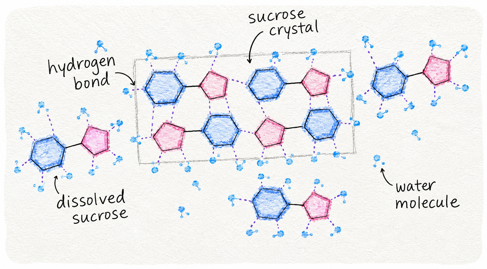

# Crystallisation

*Sucrose wants to crystallise. Half of confectionery is stopping it (clear glassy candies); the other half is encouraging it under control (fudge, fondant). Knowing what makes crystals form lets you predict and avoid both extremes.*

## Overview
Sugar (sucrose) is a small symmetrical molecule that crystallises easily from concentrated solutions. The desirable behaviour depends on the product:

- **Hard candy, lollipops, brittle, glassy caramel.** No crystals. Smooth, transparent, snaps cleanly.
- **Fudge, fondant, pralines.** Fine crystals throughout. Smooth-fine-grained texture.
- **Rock candy.** Large visible crystals. Decorative or whimsical.

Each requires different handling. The same recipe handled differently gives different results - and the same recipe handled the wrong way gives a failed batch.

## The Two Failure Modes

**Crystallisation when you do not want it.**

A batch of caramel intended for sauce becomes a grainy mass of sandy crystals. A lollipop intended to be glossy becomes opaque white. A brittle that should snap cleanly turns to sugar sand.

Causes:
- A single seed crystal nucleated the rest of the batch
- Sugar dissolved unevenly at the start - undissolved crystals seeded the whole pan
- Crystals on the pan wall (from splashing) dropped into the molten mass
- Stirring during the cook brought crystals out of solution
- Cooling was too slow or in the wrong conditions

**Not crystallising when you do want it.**

A batch of fudge intended to set with fine crystals stays runny, refuses to set. The texture remains too soft. It tastes sweet but has no structure.

Causes:
- Too much glucose syrup or invert sugar (these are anti-crystallising agents)
- Cooked too cool (insufficient water removal; final concentration too low)
- Not stirred during cooling (no nucleation; stays supersaturated)
- Cooled in the wrong vessel (heat loss too slow or fast)

## What Causes Crystals to Form

Sugar in water is a solution. The water has dissolved the sugar. As you boil the water away, the syrup becomes increasingly concentrated; at the higher stages (firm ball, hard ball, hard crack) the solution is "supersaturated" - it contains more dissolved sugar than the water can normally hold.

In a supersaturated state, the sucrose molecules want to leave solution and reform into crystals. The reason they do not is that the molecules need a starting point - a seed crystal - to attach to. Without a seed, the supersaturated syrup stays liquid for a long time.

A seed crystal can be:
- An undissolved sugar grain from the original sugar
- A crystal that fell off the pan wall back into the syrup
- A bit of crystallised sugar splashed up onto the wall during boiling that then dropped back
- A particle of impurity (dust, a fragment of cinnamon stick) that catches the first crystal

Once a single crystal nucleates, the supersaturated sugar around it crystallises rapidly. The whole batch can convert from clear liquid to opaque sand in seconds.

## Anti-Crystallisation Strategies

### Glucose Syrup (or Corn Syrup)

The most important tool. Glucose is a different sugar (a monosaccharide; sucrose is a disaccharide). Adding glucose to a sucrose solution physically blocks the sucrose molecules from packing together into crystals. The glucose molecules sit between the sucrose molecules, preventing the regular lattice from forming.

Typical addition: 10-20% of the sugar weight, as glucose syrup.

For 250 g sugar, use 30-50 ml of glucose syrup.

Light corn syrup (American name) is essentially the same product - mostly glucose with some water. Substitute equally.

Honey, golden syrup and maple syrup contain mostly different sugars (fructose, dextrose) and also work as anti-crystallisers, with their own flavour notes.

### Invert Sugar

Sucrose hydrolysed (broken into its two component sugars: glucose and fructose) makes "invert sugar." Like glucose syrup, it disrupts crystallisation. Used in fondant and some caramel recipes.

You can make invert sugar by heating sugar with water and a small amount of acid (cream of tartar, lemon juice). The acid hydrolyses the sucrose.

### Acid (Cream of Tartar, Lemon Juice, Vinegar)

A small amount of acid converts some of the sucrose to invert sugar during the cook (the heat plus acid is the catalyst). For sugar syrups that need to stay clear (like a wet caramel), a pinch of cream of tartar in the pot acts as insurance against crystallisation.

Typical addition: 1/4 tsp cream of tartar per 250 g sugar.

### Pan Wall Brush

During the boiling phase, sugar can splash up onto the pan walls above the syrup level. As the splashed sugar dries on the wall, it crystallises. Eventually a chunk of crystallised sugar falls back into the syrup and seeds the whole batch.

Use a clean wet pastry brush to wipe down the pan walls during the cook. This dissolves any splashed sugar before it can crystallise.

### No Stirring

Once the sugar has dissolved at the start, do not stir the syrup as it cooks. Stirring drags sugar molecules together and can nucleate crystals.

Exception: at the very start, when sugar is dissolving in water, stir gently to help it dissolve. Once it boils and the sugar is fully in solution, stop stirring entirely.

### Add the Butter or Cream After

For caramel sauces and toffees that include butter or cream, add the dairy after the sugar has reached the target temperature. Adding it earlier introduces water and proteins that can interfere with the cook.

## Pro-Crystallisation Strategies (for Fudge)

Fudge is the deliberately-crystallised confection. The goal is to encourage many small crystals to form simultaneously, producing a smooth-fine-grained texture.

The technique:

1. **Cook to soft ball stage (113-115 C).** Stop the cook here; this is the concentration that allows fine crystals to form during cooling.
2. **Do not stir during cooling.** Pour onto a cold surface or into a cold buttered tin. Let it cool to 43-50 C undisturbed.
3. **Then beat vigorously.** Once cooled, beat with a wooden spoon or paddle for 5-10 minutes. The beating shears the syrup and nucleates many crystals at once - the abrupt mechanical action produces the fine grain.

The key insight: the syrup must be supersaturated and cool when the beating begins. Beating earlier (while still hot) produces no crystallisation; beating later (after the syrup has set) is too late.

Adding a small amount of butter and a pinch of salt during the beating phase helps lubricate the crystal formation and prevents larger crystals from forming.

## Stirring Discipline Summary

| Stage | Stirring |
|-------|----------|
| Dissolving sugar in water | Stir to help dissolve |
| Once sugar is dissolved | Stop stirring |
| Heating to target temperature | Do not stir; wipe pan walls with wet brush |
| Adding cream / butter (caramel sauces) | Stir gently after addition |
| Cooling cooked sugar (fudge) | Do not stir until cool |
| Beating fudge | Beat vigorously when cool |
| Cooling hard candies | Do not stir; let cool undisturbed |

## Visual Tells

You can see crystallisation starting:

- The syrup in the pan becomes cloudy or opaque (was clear, now milky)
- A "skin" forms on top of the syrup
- Small bright crystals appear at the edges of the pan
- The mixture suddenly thickens unexpectedly

When you see any of these signs during a cook that is supposed to be clear (caramel, lollipops), the batch is starting to crystallise and is on the way to failure. Sometimes you can rescue it by adding a tablespoon of water, restarting the cook, and being more careful with the pan walls. Usually you start over.

## Where Next
- [Sugar Stages](sugar-stages.md): the temperatures these strategies apply to.
- [Caramel](caramel.md): the no-crystals confection that depends on careful anti-crystallisation.
- [Fudge](fudge.md): the deliberately-crystallised confection.
