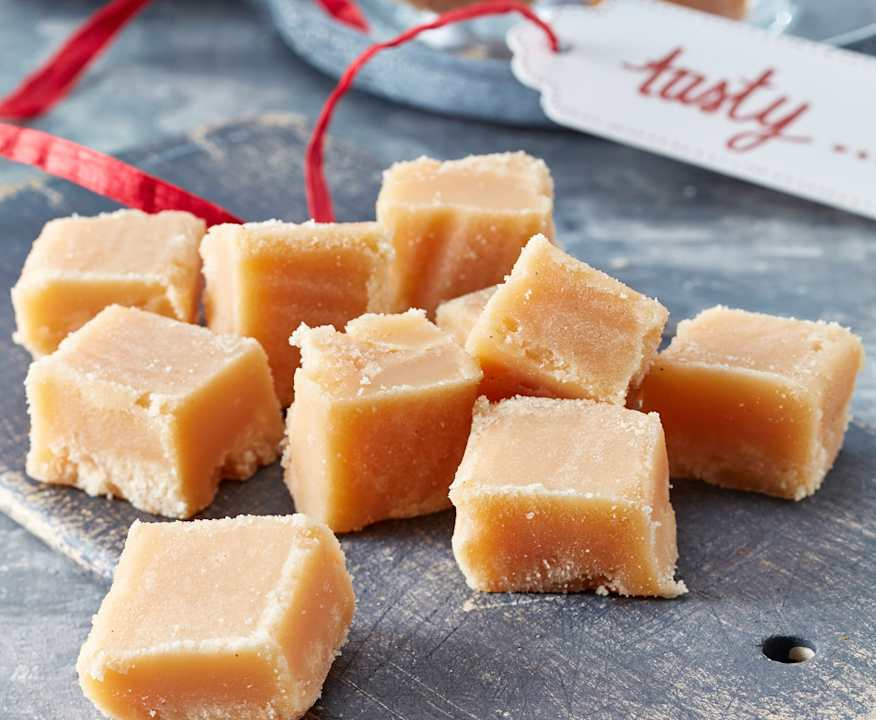

# Fudge

*The deliberately-crystallised confection. Sugar cooked to soft ball, cooled untouched, then beaten until it sets in a smooth-fine-grained crystal structure. The texture is short and creamy; the flavour comes from the sugar and dairy plus added vanilla, chocolate or nuts.*

## Overview
Fudge is the opposite of toffee. Where toffee depends on preventing all crystallisation, fudge depends on encouraging crystallisation, just with the right size and quantity of crystals. The "fine-grained" texture of good fudge is millions of tiny sugar crystals separated by a thin film of butter and dairy.

The technique is simple but specific:

1. Cook the sugar with cream to soft-ball stage (113-115 C).
2. Pour into a pan and cool to 43-50 C without stirring.
3. Beat vigorously until the mixture loses its gloss and becomes opaque.
4. Pour into a tin to set.

The beating is the magic step. It shears the supersaturated syrup, nucleating many small crystals simultaneously. Beating earlier (while still hot) or later (after it has set) produces wrong textures. The beating must happen at the right temperature window.

## Classic Vanilla Fudge

### Recipe

- 400 g caster sugar
- 200 ml double cream
- 100 ml whole milk
- 50 g unsalted butter
- 2 tbsp golden syrup (or light corn syrup): controls crystallisation
- 1 tsp vanilla extract
- 1/2 tsp salt

### Method

1. **Prepare a 20cm square tin.** Line with greaseproof paper or grease lightly.
2. **Combine sugar, cream, milk, butter and golden syrup** in a heavy saucepan.
3. **Stir over medium heat** until sugar is fully dissolved and butter melted. Bring to a simmer.
4. **Stop stirring** once the sugar is dissolved. Cook to 113-115 C (soft ball stage). This takes 15-20 minutes.
5. **Remove from heat.** Add vanilla and salt, but do not stir them in yet.
6. **Pour onto a clean cold surface**: a granite slab if you have one, or into a clean cool baking pan. Do not scrape the saucepan; pour what flows out cleanly.
7. **Cool without stirring** until the mixture reaches 43-50 C (45 C is the sweet spot). This takes 30-45 minutes at room temperature. The surface should be cool to the touch but the mass still pourable underneath.
8. **Beat vigorously** with a wooden spoon or paddle. The mixture starts glossy and translucent; after 5-10 minutes of beating it goes from glossy to opaque to thicken. This is the crystallisation happening, small crystals forming in supersaturated solution.
9. **The moment it becomes opaque and thick**: it will look like cake batter, pour into the prepared tin.
10. **Smooth the top.** Press greaseproof paper directly onto the surface.
11. **Cool to room temperature** 2-4 hours, then refrigerate to firm fully.
12. **Cut into squares** with a sharp knife.

The beating phase is the difference between a successful batch and a failed one. Beat too short and the fudge stays runny (insufficient crystals). Beat too long and the fudge becomes hard and sandy (crystals too large or too many).

### Sign It Is Done Right

- The fudge sets to a firm but yielding texture, holds its shape but yields to a fingernail.
- The texture is fine-grained, almost creamy, if you can detect individual crystals, they are too large.
- The colour is matte, not glossy.
- Cuts cleanly with a sharp knife.

## Chocolate Fudge

The most common American style. Adds chocolate to the vanilla base.

### Recipe

- 400 g caster sugar
- 200 ml double cream
- 100 ml whole milk
- 100 g unsalted butter
- 2 tbsp golden syrup
- 150 g dark chocolate (60-70%), chopped
- 50 g cocoa powder
- 1 tsp vanilla extract
- 1/2 tsp salt

### Method

Same as vanilla fudge with the chocolate added at the very end:

1. Cook the sugar-cream-milk-butter-syrup mixture as above. Cook to 113-115 C.
2. Off heat, stir in chopped chocolate, cocoa powder, vanilla and salt. Stir until smooth.
3. Cool to 43-50 C without further stirring.
4. Beat vigorously until opaque.
5. Pour into a prepared tin; cool and set.

The chocolate makes the fudge darker; the texture is the same.

## Russian Fudge (New Zealand classic)

A condensed-milk based variation, dramatically easier than the classical method.

### Recipe

- 400 g caster sugar
- 200 ml whole milk
- 100 g unsalted butter
- 200 g sweetened condensed milk
- 2 tbsp golden syrup
- 1 tsp vanilla
- 1/2 tsp salt

### Method

1. Combine all ingredients except vanilla and salt in a heavy saucepan.
2. Stir over medium heat to dissolve sugar.
3. Boil, stirring continuously (this style of fudge does need constant stirring to prevent the milk from scorching), to 115-118 C.
4. Off heat, add vanilla and salt.
5. **Beat the still-hot mixture immediately** (unlike classical fudge, no cool-down phase) for 5 minutes until thick and grainy.
6. Pour into a prepared tin.
7. Cool to room temperature; refrigerate.

This style produces a slightly grainier, softer fudge than the classical method but is much more forgiving for beginners.

## Brown Sugar Fudge (Penuche)

The Southern American variation. Brown sugar replaces white sugar.

### Recipe

- 400 g dark brown sugar
- 100 g caster sugar
- 200 ml double cream
- 100 ml whole milk
- 100 g unsalted butter
- 2 tbsp golden syrup
- 1 tsp vanilla
- 1/2 tsp salt
- 100 g pecans, toasted and chopped (optional)

Same method as classical vanilla fudge. The brown sugar contributes molasses notes and a deeper colour; the texture is identical.

## Vegan Fudge (Coconut-Based)

For dairy-free options.

### Recipe

- 400 g caster sugar
- 200 ml coconut cream (the thick part from the top of a can)
- 100 ml coconut milk
- 50 g coconut oil
- 2 tbsp light corn syrup
- 1 tsp vanilla
- 1/2 tsp salt

Same method. The coconut adds a distinct flavour; the texture is otherwise similar to dairy fudge.

## Storage

Fudge keeps:
- Room temperature, airtight: 1-2 weeks
- Refrigerated, airtight: 3-4 weeks
- Frozen, wrapped in paper then foil: 2-3 months

The refrigerated fudge needs to come to room temperature before serving (about 30 minutes) to restore the right texture.

## Common Failures

| Symptom | Cause | Fix |
|---------|-------|-----|
| Fudge sandy or grainy | Stirred during cool phase, or beaten too long | Do not stir before beating; stop beating sooner |
| Fudge stays runny (won't set) | Undercooked (didn't reach soft ball), or beaten too soon | Verify temperature; cool fully before beating |
| Fudge hard like toffee | Cooked too long (past soft ball into firm or hard ball) | Pull off heat at 113-115 C; verify thermometer |
| Fudge has visible large crystals | Stirred during cooling, or scrapped pan into the cooling syrup | Pour cleanly; do not scrape sides |
| Fudge stuck in pan | Pan not greased or paper not lined | Always line the pan |

## Why Beat at All?

The beating mechanically shears the syrup, breaking the surface tension that holds the supersaturated state. Once broken, sucrose crystals begin to form at multiple points simultaneously. The simultaneous nucleation produces many small crystals rather than a few large ones. The many small crystals are what give fudge its fine-grained, smooth texture.

A batch that is not beaten will eventually crystallise (the supersaturation is unstable indefinitely) but will produce a few large crystals over hours, resulting in grainy, sandy texture.

A batch that is beaten while still hot will not nucleate properly, the syrup is too thin and the crystals do not stay attached. The result is runny.

A batch that is beaten at the right temperature window (43-50 C) crystallises evenly and quickly. The window matters.

## Where Next
- [Sugar Stages](sugar-stages.md): the soft-ball stage that defines fudge.
- [Crystallisation](crystallisation.md): the science of why beating works.
- [Caramel](caramel.md): the no-crystals cousin in the same family of confections.
