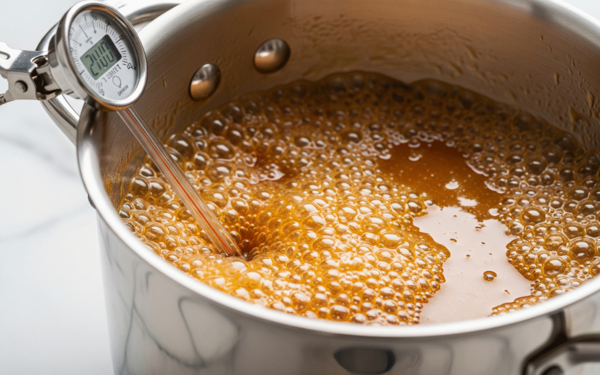

# Sugar Stages

*Cooked sugar passes through a series of temperature-defined stages. Each stage produces a different texture when cooled. Knowing the stages is the foundation of every sugar-work recipe in the course.*

## Overview
When you cook sugar with water, the water boils off and the sugar concentrates. As the water concentration drops, the boiling point of the syrup rises. The temperature of the syrup at any point tells you the sugar concentration; the sugar concentration tells you what the syrup will do when cooled.

The seven main stages are below. The names ("soft ball," "hard crack") come from the traditional cold-water test - dropping a spoonful of syrup into cold water to see what it does. The temperatures are the modern thermometer reading. Use the thermometer; the cold-water test is a fallback when the thermometer fails.

## The Seven Stages

| Stage | Temperature | Cold-water test | Use |
|-------|-------------|-----------------|-----|
| Thread | 110-112 C | Forms a 2-inch thread when dropped from a spoon | Syrups, glaze, simple syrups for cocktails |
| Soft ball | 113-115 C | Forms a soft ball that flattens when pressed | Fudge, fondant, pralines |
| Firm ball | 118-120 C | Forms a firm ball that holds its shape | Caramels, soft toffee, marshmallow |
| Hard ball | 121-127 C | Forms a hard ball that you can chew | Nougat, marzipan, gummi candy |
| Soft crack | 132-143 C | Threads bend when cool | Saltwater taffy, butter caramels |
| Hard crack | 149-154 C | Threads snap when cool, glassy | Brittles, toffee, hard candy, lollipops |
| Caramel | 160-180 C | Liquid turns amber to dark brown; will set hard and glassy | Caramel sauce, caramelised sugar, spun sugar, dark brittles |

Beyond caramel (above 180 C) the sugar darkens, smokes, and turns bitter. This is "burnt" sugar; usually unrecoverable.

## Reading the Stages

**Thread (110-112 C).**
Lift the spoon out; sugar drips off in a fine thread.
For simple syrup (1:1 sugar to water): once the sugar has dissolved you have not even reached this stage. Cocktail syrups stop here.

**Soft ball (113-115 C).**
Drop a small spoonful into a bowl of ice water. After 30 seconds, fish it out with your fingers. The sugar should form into a soft ball that flattens immediately when pinched.
This is fudge territory. Stop too early and the fudge will not set; stop too late and it will be hard like toffee.

**Firm ball (118-120 C).**
Same test. The ball is firmer, holds its shape but can be flattened with finger pressure.
For soft caramels and chewy candies.

**Hard ball (121-127 C).**
The ball is firm but pliable; you can chew it.
For nougat and the chewy candies. Marshmallow base hits here before being mixed with whipped egg whites.

**Soft crack (132-143 C).**
The sugar dropped into ice water forms threads. Pull them out: they bend without breaking.
For taffy. Cooked sugar at soft crack is pliable; you can pull and stretch it.

**Hard crack (149-154 C).**
Threads in ice water are brittle. Pull them out: they snap, do not bend.
For hard candies, lollipops, brittle, toffee. The texture is glassy.

**Caramel (160 C onwards).**
The sugar starts changing colour. At 160 C it is pale gold; at 170 C amber; at 175 C deep amber; at 180 C dark amber. The colour change is rapid - 30 seconds can move you through two shades.
For caramel sauce, brittles, and the dark-flavour caramels.
Beyond 180 C: bitter, smoking, ruined.

## The Cold-Water Test (Fallback)

If your thermometer breaks or is off-calibration, the cold-water test works:

1. Set up a small bowl of very cold water with a few ice cubes (not ice-filled - the cubes should be floating in the water).
2. Take a spoonful of syrup from the pan; immediately drip a small amount (about 1/2 tsp) into the cold water.
3. Wait 10-15 seconds for the sugar to cool.
4. With clean fingers, try to lift the sugar out and examine it.

Results map to the stages above:
- Thread that breaks immediately = thread stage
- Soft ball you can pinch flat = soft ball
- Ball that flattens with effort = firm ball
- Ball you can chew = hard ball
- Pulled threads that bend = soft crack
- Threads that snap = hard crack
- Visible amber colour in the pan = caramel territory; no test needed

## Calibrating Your Thermometer

A digital thermometer can drift over time. Test it before any critical sugar work:

1. Boil water in a small saucepan.
2. Insert the thermometer probe halfway into the water (not touching the bottom).
3. Read the temperature once it stabilises.
4. At sea level, water boils at 100 C. At 1000 m altitude (Denver, mountain regions), boiling point drops to about 96 C.

If your thermometer reads 102 C in boiling water at sea level, every sugar reading is 2 C too high - mentally subtract 2 from every reading.

If the thermometer is more than 3-4 C off, replace it. Drift suggests the probe is failing.

## How the Stages Relate to Sugar Concentration

The temperature stages correspond to sugar concentration in the syrup. Roughly:

| Stage | Sugar concentration |
|-------|---------------------|
| Thread | 80% sugar, 20% water |
| Soft ball | 85% |
| Firm ball | 87% |
| Hard ball | 90% |
| Soft crack | 95% |
| Hard crack | 99% |
| Caramel | 99%+ (water effectively gone) |

By the time you reach caramel, almost no water remains in the syrup. The temperature reading is the pure sugar's behaviour as it heats; once water is gone the temperature climbs fast.

The implication: the rate of temperature climb accelerates as you approach the higher stages. From thread to soft ball might take 3-4 minutes; from soft crack to hard crack takes 30-60 seconds; from hard crack to caramel takes another 30 seconds and you can miss it.

Be at the pan and watching the thermometer in the final stages. Move the thermometer probe between locations in the pan to confirm even temperature.

## A Note on the Pan

A heavy-bottomed saucepan is essential. Thin pans heat unevenly; the syrup at the bottom can be in caramel stage while the syrup at the top is still in firm-ball stage. Heavy pans distribute heat evenly so the whole batch reaches each stage at the same time.

Copper is the traditional and best material - it conducts heat evenly and the curved pan walls help control crystallisation (sugar crystals do not have flat surfaces to attach to as easily). Stainless steel with a thick aluminium base is the next best. Cast iron is too thick and slow to react. Non-stick pans are not great - the coating degrades at sugar temperatures.

## Where Next
- [Crystallisation](crystallisation.md): how to prevent or control sugar crystals during cooking.
- [Caramel](caramel.md): the practical application of the caramel stage.
- [Toffee and Brittle](toffee-and-brittle.md): the hard-crack stage applications.
- [Fudge](fudge.md): the soft-ball stage application.
