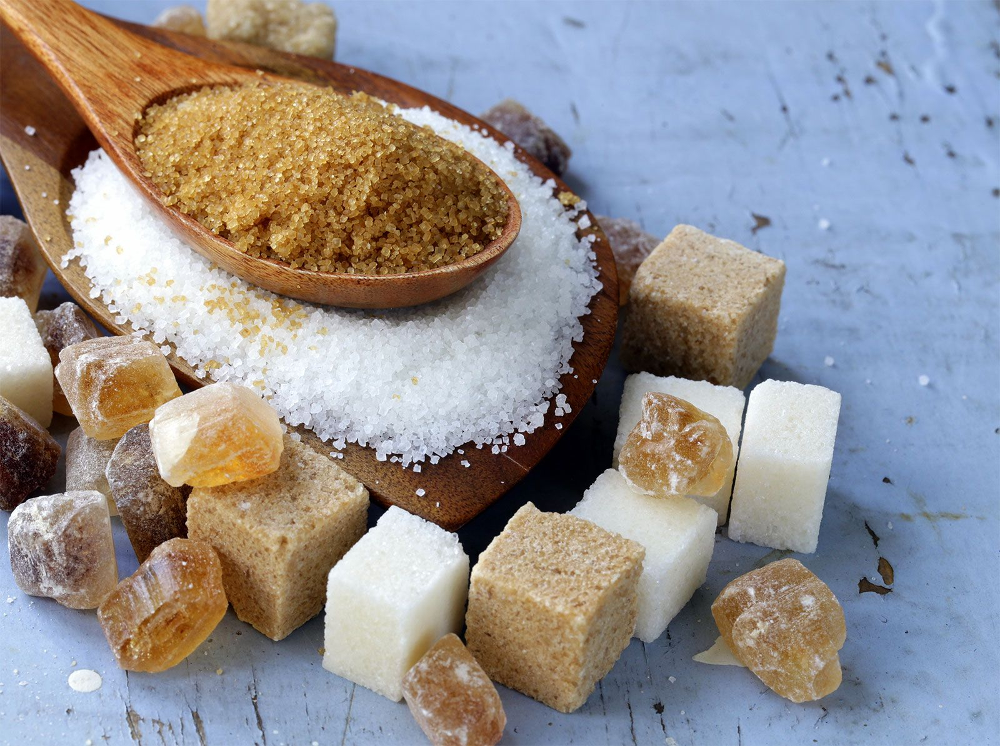

# Sugar Work & Confectionery Course

*Sugar cooked in a pan does different things at different temperatures. 113 C makes fudge; 132 C makes caramel; 154 C makes brittle; 165 C makes pulled sugar. This course is about reading those temperatures and turning them into confectionery.*

## Overview
Sugar work is the most physical, most thermodynamic of all confectionery disciplines. Plain white sugar plus water plus heat passes through a sequence of predictable stages, thread, soft ball, firm ball, hard ball, soft crack, hard crack, caramel, each defined by a temperature window and each suited to a specific product. Fudge needs soft ball; toffee needs hard crack; caramel sauce needs the caramelisation that begins around 170 C; pulled sugar needs the crystal-suppression techniques.

This is a course about temperature precision and crystallisation control. A good digital thermometer is the single piece of equipment you cannot work around. Once you have one, the rest is following recipes and watching the temperature.

A note on safety: hot sugar is dangerous in a way other cooking ingredients are not. At 160 C it is 60 C hotter than boiling water; a splash on skin sticks (sugar does not run off) and causes serious burns. Long sleeves, closed shoes, hand position away from the pan rim. This is real.

## Course Outline

### 1. Foundations
- [Sugar Stages](sugar-stages.md): the temperature reference. The seven main stages of cooked sugar, thread (110 C), soft ball (113-115 C), firm ball (118-120 C), hard ball (121-127 C), soft crack (132-143 C), hard crack (149-154 C), caramel (160 C+). With cold-water test fallback if your thermometer breaks.
- [Crystallisation](crystallisation.md): the central technical question. How to keep cooked sugar from crystallising prematurely; how to encourage crystallisation when you want it (fudge); the role of invert sugar, glucose, butter and acid in controlling the structure.

### 2. The Major Confections
- [Caramel](caramel.md): wet caramel (water + sugar) and dry caramel (sugar alone in a hot pan). Caramel sauce, caramel for dipping apples, caramel for filling chocolates. The same chemistry; different end-products.
- [Toffee and Brittle](toffee-and-brittle.md): the hard-crack confections. Butter toffee, peanut brittle, sesame brittle, English butter brittle. Glassy texture, snaps when broken.
- [Fudge](fudge.md): the soft-ball confection where controlled crystallisation creates a smooth-fine-grained texture. Vanilla fudge, chocolate fudge, Russian fudge, brown sugar fudge.

### 3. Candies
- [Candy](candy.md): hard candy (lollipops, butterscotch drops), soft candy (caramels, taffy), gummy candy and marshmallow as primer to gelatin-set confectionery.

## The Three Things That Matter

Most of the course collapses into three principles.

1. **Temperature is everything.** A 5 C difference between fudge and caramel; a 5 C difference between caramel and burnt. Use a digital thermometer with a thin probe and accurate to 1 C; calibrate it in boiling water at sea level (should read 100 C) before relying on it for critical work.

2. **Crystallisation control is the whole game.** Sucrose wants to crystallise. Confectionery is the art of stopping it (clear hard candies, glassy brittles), encouraging it under control (fudge, fondant), or shaping the resulting structure (taffy, pulled sugar). Glucose syrup, invert sugar, acid, butter, and stirring discipline are the levers.

3. **Sugar burns in seconds.** Once a syrup reaches 160 C, it caramelises rapidly. At 175 C it is approaching the danger zone of bitter, smoking, ruined. The window between perfect caramel and burnt is small. Pull the pan off the heat before you think you should; the residual heat continues the cook for another 30-60 seconds.

## Where to Start

- New to sugar work: [Sugar Stages](sugar-stages.md). Memorise the table; read the temperatures into your fingers. Then [Caramel](caramel.md) as the most useful first project.
- Want a quick win: [Caramel](caramel.md): wet caramel sauce is a 15-minute project with a year of dessert applications.
- Want toffee: [Toffee and Brittle](toffee-and-brittle.md). Butter toffee is the easiest hard-crack product.
- Curious about why fudge is grainy sometimes: [Crystallisation](crystallisation.md). The science is small but explains everything.

## Where Next
- [Chocolate](../chocolate/chocolate.md): chocolate and sugar work meet in moulded bonbons, caramel-filled chocolates, and the chocolate side of brittle.
- [Patisserie](../patisserie/patisserie.md): caramel and pulled sugar are part of the patisserie toolkit; the croquembouche, the spun sugar nest, the tuile.
- [Eggs / Custards](../eggs/custards.md): caramel features in flan, creme caramel, creme brulee.

## A Note on Equipment

Minimum:
- A heavy-bottomed saucepan (heavy bottom distributes heat; thin pan = hot spots = scorched sugar)
- A digital thermometer with a thin probe, instant-read, accurate to 1 C
- A silicone or wooden spatula (metal spoons get hot)
- A bowl of ice water (for the cold-water test, fallback for the thermometer)
- A clean dry pastry brush + small bowl of water (to wash sugar crystals off the pan walls during the cook)
- A baking sheet lined with greaseproof paper (for setting hot sugar)
- Heatproof silicone moulds (for shaping caramels, lollipops, etc.)

Nice-to-haves:
- A copper pan (the classic confectionery pan; conducts heat evenly)
- A marble slab (for setting thin sheets of sugar that need to cool fast)
- A candy thermometer (a glass thermometer specifically calibrated for sugar work; useful but a good digital instant-read works fine)
- Silicone candy moulds in various shapes

For a starter project (a batch of caramel or toffee), the minimum equipment is enough.
