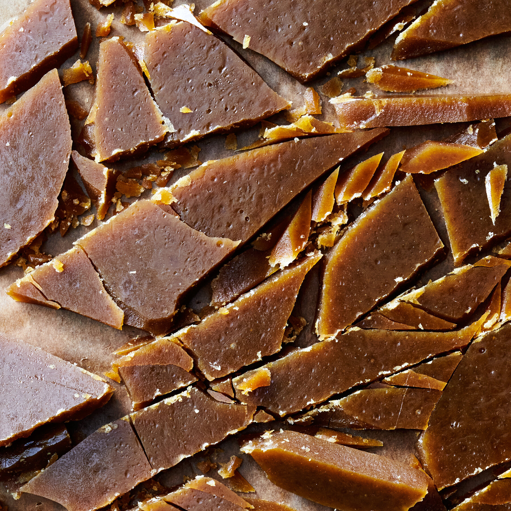

# Toffee and Brittle

*The hard-crack confections. Sugar cooked to 149-154 C, mixed with butter (toffee) or nuts (brittle), then poured thin and cooled. Glassy, snaps when broken, keeps for weeks. Probably the easiest impressive home confectionery.*

## Overview
Toffee and brittle are the hard-crack family. They differ in what gets mixed in:

- **Toffee** has butter incorporated. Lots of it. The result is a buttery, deeply flavoured slab that snaps but melts in the mouth. English butter toffee, butterscotch toffee, Heath bar.
- **Brittle** has nuts (or seeds) suspended in the cooked sugar. The result is a thin sheet of glassy sugar with nuts embedded throughout. Peanut brittle (American), sesame brittle (Greek/Middle Eastern pasteli), almond brittle (Italian croccante).

Both are quick projects - 20-30 minutes from start to set. Both keep well in airtight tins. Both make excellent gifts and accompaniments to coffee, ice cream, or just a sweet bite at the end of a meal.

## Butter Toffee

The English butter toffee tradition, often topped with melted chocolate.

### Recipe

- 250 g caster sugar
- 250 g unsalted butter (yes, equal weight to the sugar)
- 60 ml water
- 1 tbsp golden syrup (or light corn syrup) - anti-crystallisation insurance
- 1 tsp vanilla extract
- 1/2 tsp salt
- 150 g dark chocolate, chopped (for the topping)
- 100 g toasted chopped nuts (almonds traditional)

### Method

1. **Prepare a baking sheet.** Line with greaseproof paper or a silicone mat. Have ready a heatproof spatula and the chocolate and nuts within reach.
2. **Combine sugar, butter, water and golden syrup** in a heavy saucepan. Heat over medium heat, stirring occasionally to dissolve the sugar and melt the butter.
3. **Once dissolved, stop stirring.** Bring to a boil.
4. **Insert thermometer.** Cook to 149-154 C (hard crack). This takes 10-15 minutes for this size batch.
5. **Watch the colour change.** As the toffee cooks, it goes from pale to amber. The colour change is the visual marker that you are approaching hard crack.
6. **At hard crack, immediately remove from heat.** Stir in vanilla and salt.
7. **Pour onto the prepared sheet.** The toffee should spread to about 5-7 mm thick. Tilt the sheet to help it spread; do not work it with a spatula - that introduces crystals.
8. **Topping step.** Sprinkle the chopped chocolate over the still-hot toffee. The residual heat melts the chocolate within 2-3 minutes. Once melted, spread the chocolate evenly with an offset palette knife.
9. **Sprinkle the nuts** over the chocolate while it is still wet, pressing them in lightly.
10. **Cool completely.** Room temperature 2 hours; or refrigerate 30 minutes to speed.
11. **Break into shards** with the back of a knife or by hand.

Store in an airtight tin between layers of greaseproof paper. Keeps at room temperature 2-3 weeks; humidity is the enemy (humid storage softens the toffee over time).

### Variations

- **English butter toffee (plain):** Skip the chocolate and nuts.
- **Salted caramel toffee:** Use brown sugar instead of caster sugar; double the salt.
- **Coffee toffee:** Add 2 tbsp instant espresso powder when adding the vanilla.
- **Almond toffee:** Use whole roasted almonds instead of chopped. Press into the soft toffee before it cools.

## Peanut Brittle

The American classic.

### Recipe

- 300 g caster sugar
- 100 g light corn syrup (or golden syrup)
- 60 ml water
- 1/2 tsp salt
- 200 g roasted unsalted peanuts
- 30 g unsalted butter
- 1 tsp baking soda
- 1 tsp vanilla extract

### Method

1. Line a baking sheet with greaseproof paper or a silicone mat. Have a heatproof spatula ready.
2. Combine sugar, syrup, water and salt in a heavy saucepan. Heat slowly to dissolve. Stop stirring once dissolved.
3. Cook to 121 C (firm ball stage).
4. **Add the peanuts.** Stir to coat them. Continue cooking.
5. **Cook to 149-154 C** (hard crack). The mixture should be deep amber.
6. **Remove from heat.** Quickly stir in the butter, baking soda and vanilla. The baking soda causes the mixture to foam up - this is the brittle texture (the foam creates a slightly porous structure that gives brittle its characteristic snap and crunch).
7. **Pour immediately** onto the prepared sheet. Tilt to spread thin, about 3-5 mm thick.
8. **Cool completely.** 30-45 minutes at room temperature.
9. **Break into shards.**

The baking soda step is what makes brittle "brittle" rather than just hard candy with nuts. The carbon dioxide bubbles produced give the structure a slight openness that snaps rather than just shatters.

### Variations

- **Cashew brittle:** Substitute cashews for peanuts. The fattier cashew gives a richer brittle.
- **Sesame brittle (pasteli, Greek/Middle Eastern):** Use 250 g sesame seeds (toasted) instead of peanuts. Often made with honey instead of corn syrup - replace the corn syrup with 100 g honey for a more aromatic version.
- **Mixed nut brittle:** Almonds, hazelnuts, pecans, walnuts. About 200 g total.
- **Pumpkin seed brittle:** 200 g pumpkin seeds. The seeds toast more fully in the hot sugar.

## Honeycomb / Hokey Pokey

A British/Australian variation. Same hard-crack technique with extra baking soda for a heavily foamed, light-and-airy result. The classic Crunchie bar centre.

### Recipe

- 200 g caster sugar
- 100 g golden syrup (UK) or 100 g light corn syrup (US)
- 60 ml water
- 1.5 tsp baking soda (yes, more than for brittle)

### Method

1. Line a deep baking tin with greaseproof paper. The honeycomb expands dramatically; use a 20cm square tin or larger.
2. Sift the baking soda - lumps create uneven foaming.
3. Combine sugar, syrup and water in a heavy saucepan. Dissolve gently. Stop stirring.
4. Cook to 154-160 C (hard crack to early caramel).
5. Off the heat, immediately whisk in the baking soda - vigorously, with a balloon whisk.
6. The mixture will foam up dramatically - 5-10 times its previous volume.
7. Pour immediately into the tin. Do not spread; do not press.
8. Cool completely - the honeycomb collapses slightly as it sets.
9. Break into chunks.

Honeycomb keeps poorly - it absorbs moisture from the air and softens within days. Eat within 3-4 days, or store in a dry sealed tin with a desiccant sachet.

## Pure Hard Candy (Lollipops)

Sugar at hard crack with no fat. Glossy, hard, glassy. The base for lollipops and the simplest hard candies.

### Recipe

- 250 g caster sugar
- 100 g light corn syrup
- 60 ml water
- 1/2 tsp food colouring (optional)
- 1 tsp flavouring oil (peppermint, cherry, lemon - choose one)

### Method

1. Line lollipop moulds with sticks already in position; OR set up small drops on a greaseproof-paper-lined sheet with sticks.
2. Combine sugar, corn syrup and water. Dissolve gently. Stop stirring.
3. Cook to 154 C (hard crack).
4. Remove from heat. Wait 30 seconds to let the bubbles subside.
5. Stir in colouring and flavouring. Whisk to combine.
6. Pour into moulds, or spoon onto sticks. Work quickly - the sugar sets fast as it cools.
7. Cool completely. Unmould carefully.

Wrap in cellophane individually for storage; otherwise the lollipops stick together.

## Common Failures

| Symptom | Cause | Fix |
|---------|-------|-----|
| Toffee soft and chewy | Undercooked (didn't reach hard crack) | Cook hotter next time; verify thermometer |
| Toffee burnt or bitter | Overcooked past hard crack into caramel | Pull off heat earlier; remember residual heat |
| Sugar crystallised in the pan | Stirred during boil, or wall crystals fell in | Less stirring; wet-brush walls; add cream of tartar |
| Brittle is hard but not snappy | Insufficient baking soda; foam didn't develop | Use fresh baking soda; whisk in vigorously |
| Brittle tastes of soap | Too much baking soda | Use less next time; 1 tsp per 300 g sugar |
| Lollipops have bubbles inside | Air whisked in during the boil | Let the syrup settle 30 sec before pouring |
| Lollipops soft and sticky | Picked up moisture from the air | Wrap in cellophane; store dry |

## Where Next
- [Sugar Stages](sugar-stages.md): the hard-crack stage that defines this family.
- [Crystallisation](crystallisation.md): why the toffee occasionally crystallises into a sandy mass.
- [Caramel](caramel.md): the slightly hotter cousin.
- [Chocolate](../chocolate/chocolate.md): the topping for English butter toffee.
