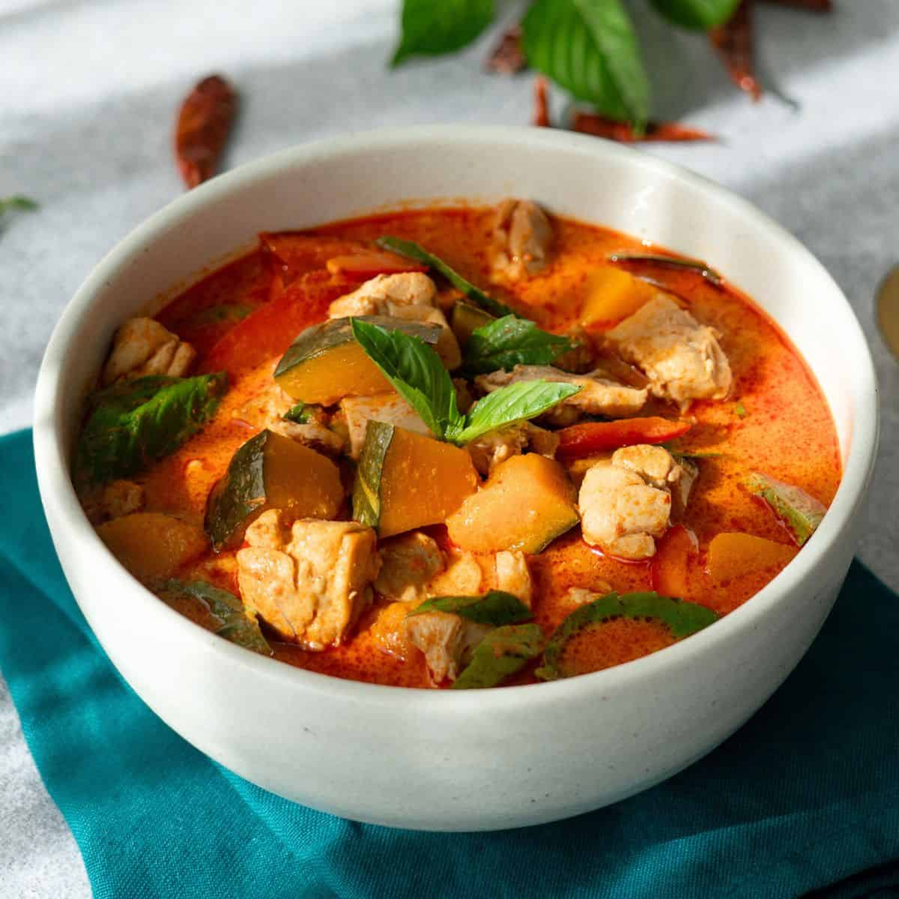

# Building a Thai Curry: Worked Example

*Let's cook one all the way through. We'll do a chicken green curry, because green is the most common, but the same five moves work for any of the five paste curries: only the paste and the herbs at the end change. Once you've done one, the others all feel familiar.*

## Overview
Before you start, you need:
1. A jar of [green curry paste](green.md) (home-made or shop-bought).
2. A tin of full-fat coconut milk.
3. The protein, vegetables and finishing ingredients listed below.

If you have all three, the curry plates in 10-12 minutes. The cooking is fast; the prep matters.

We're cooking for two; scale by number of plates.

## Ingredients (Per Two Portions)

### From the prep
- 2 tablespoons green curry paste (about 30 g)
- 1 x 400 ml tin full-fat coconut milk (good brand)
- 300 g chicken thigh, cut into 3 cm pieces
- 100 g Thai aubergines (or 1 small Western aubergine, cubed) or bamboo shoots

### Aromatics and finish
- 4 kaffir lime leaves (very finely chopped)
- 2 long red chillies (sliced, for colour)
- 1 tablespoon fish sauce
- 1 tablespoon palm sugar (or 1 tablespoon soft brown sugar)
- Small handful Thai basil leaves (the holy-basil "kaprao" type, or sweet basil)
- 1 lime (squeeze at the end)

### To serve
- Steamed jasmine rice
- A wedge of lime per plate
- Fresh coriander to garnish

## Method

### Stage 1 - Set Up the Mise en Place

This is the most important step. The cooking goes too fast to chop or hunt for ingredients.

1. Open the coconut milk tin without shaking. Scoop the solid cream layer into a small jug (about 100 ml). Keep the thinner coconut milk in the tin or another jug (about 300 ml).
2. Cut the chicken into 3 cm pieces; keep in a small bowl.
3. Cube the aubergines.
4. Chop the kaffir lime leaves very finely.
5. Slice the long red chillies into rings.
6. Have the basil leaves, fish sauce, palm sugar, lime all to hand.
7. Have the rice already cooked and warm.

Total prep time: 5 minutes.

### Stage 2 - Crack the Coconut Cream

1. Place a wok or wide pan over medium-high heat. Add the coconut cream (the thick stuff you scooped out).
2. Bring to a simmer. Stir occasionally.
3. After 2-3 minutes, the cream "cracks": fat (oil) separates from the proteins. You'll see clear oil pooling around a slightly grainy white solid.

This is what "crack the coconut milk" means; see [the technique page](coconut-milk.md) for the longer explanation.

### Stage 3 - Fry the Paste

1. Add the 2 tablespoons green curry paste to the cracked cream.
2. Stir hard for 2-3 minutes. The mixture darkens in colour (from bright green to deeper green-brown), becomes intensely fragrant, and visibly thickens.
3. You'll see oil pooling at the edges of the wok. This is the paste's aromatic oils releasing.

### Stage 4 - Add the Chicken

1. Tip in the chicken pieces. Stir to coat each piece in the paste-oil.
2. Cook for 90 seconds. The chicken should be sealed all over and just-coloured but not cooked through.

### Stage 5 - Add the Thin Coconut Milk

1. Pour in the thinner coconut milk (the remaining 300 ml).
2. Stir to combine. Don't worry that the curry looks pale; it darkens as it cooks.
3. Bring to a gentle simmer. Don't boil.

### Stage 6 - Simmer

1. Add the aubergines.
2. Cook on a gentle simmer for 4-5 minutes. The chicken cooks through; the aubergine becomes tender.
3. The sauce thickens slightly as it reduces.

### Stage 7 - Finish

This is the moment that makes the difference. All these go in OFF the heat or with the heat very low.

1. Add the fish sauce. Stir.
2. Add the palm sugar. Stir. It melts into the sauce.
3. Add the chopped kaffir lime leaves.
4. Add the basil leaves. Stir gently; they wilt within 10 seconds.
5. Squeeze in the lime.
6. Taste. The curry should be balanced sweet-sour-salty-spicy. Adjust:
   - Not salty enough: more fish sauce.
   - Not sweet enough: more palm sugar.
   - Too sharp: more palm sugar.
   - Not spicy enough: more paste (but the curry should be balanced; this is the last resort).

### Stage 8 - Plate

1. Spoon over jasmine rice.
2. Scatter the sliced red chillies on top.
3. Add a wedge of lime to the plate.
4. Garnish with a small handful of fresh coriander.
5. Serve immediately.

Total time from oil hits the pan: 10-12 minutes.

## Reading the Curry

A well-built green curry has:

- A bright green-to-olive sauce; not faded yellow-green.
- A glossy surface with a slight oil sheen.
- The aubergine still recognisable but cooked through.
- The chicken juicy, not dry.
- An aroma of fresh herb (basil, kaffir lime), galangal and chilli; nothing should smell burnt.
- A balance of sweet-sour-salty-spicy where you can taste each but no one dominates.

If something tastes wrong, it's usually the balance. Taste the curry; identify which corner of the sweet-sour-salty-spicy square is missing; add the corresponding ingredient.

## Variations: Changing the Curry

The same five-stage assembly works for any of the five paste curries:

### Red Curry
- Swap green paste for [red paste](red.md).
- Aromatics: more emphasis on basil at the finish.

### Yellow Curry
- Swap paste for [yellow paste](yellow.md).
- Add new potatoes with the chicken; they need 15-20 minutes to cook through.

### Panang (Dry Sauce)
- Swap paste for [panang paste](panang.md).
- Use HALF the coconut milk (200 ml total, not 400). The sauce should be thick and coat-the-back-of-a-spoon.
- Use beef sirloin instead of chicken thigh; cook 60-90 seconds only (no simmer).

### Massaman (Slow Stew)
- Different cooking method. See [massaman page](massaman.md). Doesn't fit this 10-minute template.

## Common Mistakes

**The curry tastes raw / under-seasoned.**
Skipped the paste-frying step. The aromatic oils didn't release. Always crack the cream and fry the paste for at least 2-3 minutes BEFORE adding the protein.

**The curry is greasy.**
Too much heat after the thin coconut milk went in. Boiled instead of simmered. Once the milk is in, drop to a gentle simmer.

**The chicken is dry.**
Cooked too long. 90 seconds to seal + 4-5 minutes simmer is plenty. Pull off the heat slightly under-done; carry-over heat finishes it.

**The herbs withered to grey.**
Added too early. Basil, lime leaves go in at the END, off the heat. Hot stems wilt them but heat over 60 C destroys the colour.

**The curry is bland.**
Forgot the fish sauce, or under-seasoned. Thai curry needs more aggressive seasoning than you'd expect. Half a tablespoon of fish sauce extra is usually the fix.

**The sauce is split / curdled.**
Boiled hard. Once the thin coconut milk is in, the maximum heat is a gentle simmer. A rolling boil breaks the emulsion.

## What to Serve With

- **Jasmine rice** (always; the absorbent rice that goes with Thai curry).
- A simple Thai cucumber salad to cut richness.
- A wedge of lime.
- For a Thai-style meal: serve alongside one or two other dishes (a stir-fry, a soup) to round out the table.

## Where Next
- [Coconut Milk Technique](coconut-milk.md): the technique deep-dive.
- [Green Curry Paste](green.md): the paste used in this example.
- [Red Curry Paste](red.md): try the same method with red paste.
- [Massaman](massaman.md): the slow-cooked sibling.
- [Thai Curry Course landing](thai-curry.md): back to the main course.
- [BIR Curry Course / Building a Curry](../bir-curry/building-a-curry.md): the very different BIR worked example for comparison.
