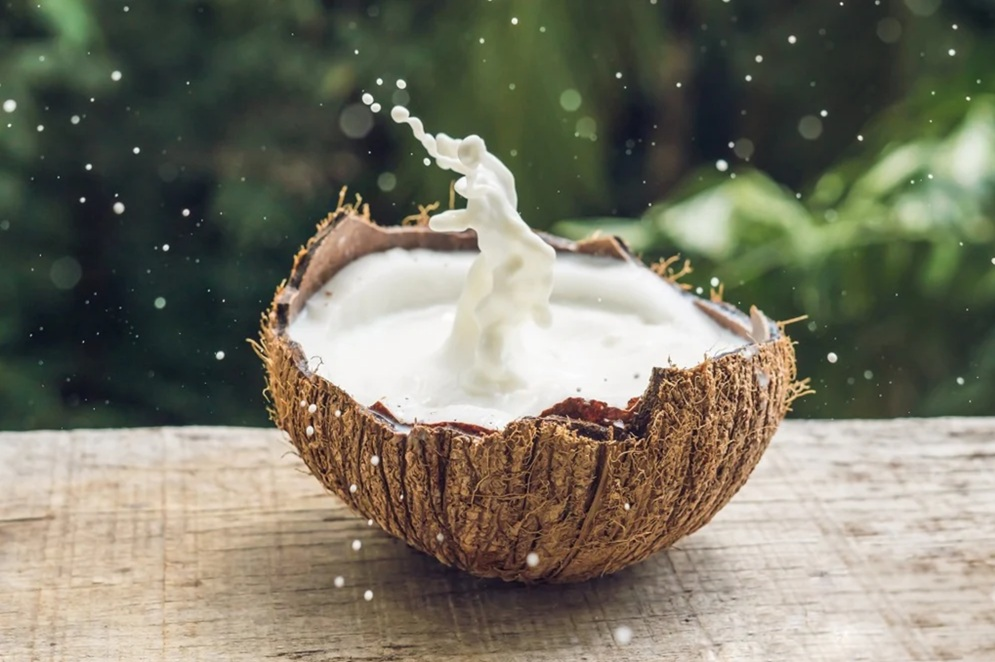

---
allergens:
  - dairy
tags:
  - vegetarian
  - gluten-free
  - coconut
  - curry
---

# Coconut Milk Technique

*If your Thai curry's ever come out tasting a bit flat, this is probably why. The cream from the top of the tin gets fried with the paste first so the aromatic oils have somewhere to go; the thinner coconut milk only goes in afterwards. It's one of those small unobvious steps that makes a real difference.*

## Overview
Most home cooks make Thai curry by pouring coconut milk into a pan, stirring in the paste, and adding the protein. The result is a flat, slightly greasy curry that tastes like the paste mixed with coconut soup. Restaurant-quality curry uses a different approach: the coconut milk is fractionated, the paste is fried in the rich cream layer, and only then does the rest of the coconut go in.

This is "cracking the coconut milk" (taeg gati in Thai). It's the single most important Thai cooking technique, and it's invisible from most recipe books. This page covers it.

## How Coconut Milk Is Made

Coconut milk is the strained liquid from grated coconut flesh mixed with hot water. The fat content varies:

- **Fresh coconut milk** (made the same day): the cream rises to the top within an hour. The thick layer is "coconut cream"; the thinner layer below is "coconut milk".
- **Tinned coconut milk** (the everyday): some brands separate (the cream solidifies on top of the tin); others are homogenised (uniform throughout). Better brands separate.

Look for brands with high fat content (18-24%): Aroy-D, Chaokoh, Mae Ploy, Kara. Avoid brands marketed as "light coconut milk" or "drinking coconut milk"; they have water added and won't crack properly.

## Cracking the Coconut Milk

1. **Don't shake the tin.** You want the cream and water separate.
2. Open the tin without shaking. The cream sits on top as a solid white layer; the water is underneath.
3. Scoop the cream into a measuring jug. You should get about 100-150 ml of solid cream from a 400 ml tin of good coconut milk.
4. The remaining 250-300 ml is the thinner coconut milk/water.

If your coconut milk doesn't separate (modern brands are sometimes homogenised), use a sub-step: place the tin in the fridge for several hours. The cream will solidify on top; you can scoop it out then.

## The Frying Step

This is where the curry develops its proper flavour.

### Method

1. Heat the cream in a wok or wide pan over medium-high heat. Don't add oil; the cream IS the oil.
2. The cream melts and bubbles. After 2-3 minutes, it starts to "crack": the fat (oil) separates from the proteins (solids). You'll see a clear oil layer at the surface and a slightly grainy bottom.
3. Add the curry paste. Stir vigorously.
4. The paste fries in the oil. Cook for 2-4 minutes, stirring constantly. The mixture will:
   - Darken in colour (green pales; red deepens).
   - Become very fragrant (you can smell it across the kitchen).
   - Visibly thicken into a paste-coated cream.
   - "Split" again, with the oil and solids separating around the paste.

The oil pooling at the edge of the pan is the visual cue. When you can see distinct oil, the paste is fried enough.

5. Add the protein NOW, while the paste is hot and oily. The protein takes the paste flavour by direct contact.
6. Cook the protein in the fried paste briefly (1-2 minutes), stirring to coat.

## Adding the Thin Coconut Milk

Once the protein has been coated:

1. Pour in the thinner coconut milk (the water-and-thinner-cream from earlier).
2. Stir to combine.
3. Bring to a gentle simmer. Don't boil; rapid boiling breaks the milk into oily curds.
4. Simmer 3-5 minutes (less for fast-cooking proteins like prawns, more for chicken).

The sauce should thin slightly as the coconut milk loosens the paste. Now you can finish: vegetables, fish sauce, palm sugar, lime leaves, basil.

## Why This Works

The fat in the coconut cream is the carrier for the flavour molecules in the paste. Aromatic compounds (the volatile oils in lemongrass, galangal, coriander root, chillies) dissolve into the fat as they fry. This is the same principle as the BIR "bhuna" step where spices fry in oil.

A curry made by dumping paste into thin coconut milk doesn't fry the paste in fat; it just stews it in liquid. The aromatic oils stay locked in the paste solids and never make it to the food. The result tastes like the components rather than the combination.

## The Visual Cues

A properly-built curry shows:
- An orange/red ring of oil at the edge of the wok during the fry stage.
- Visible darkening of the paste from raw colour to deeper cooked colour.
- A thickening of the sauce that "hugs" the protein.

A poorly-built curry shows:
- Pale paste that never darkens.
- Sauce that pours rather than coats.
- Greasy-looking surface (because the oil never bonded with the food).

## Variations

### When Cream Cracking Doesn't Work
Some tinned coconut milks are too homogenised to crack visibly. In that case:
- Use the whole tin without separating.
- Reduce it harder in the pan; the water evaporates and the oil eventually rises.
- It takes longer (4-5 minutes vs 2-3) but produces the same result.

### Massaman (Long-Cook) Variation
For [massaman](massaman.md), the technique is similar but the cook time is much longer. The cream is cracked; the paste is fried; the meat (chuck/shoulder) goes in; the thin coconut milk plus stock plus whole spices simmer for 60-90 minutes. The fry-the-paste step is the same.

### Panang (Dry-Sauce) Variation
For [panang](panang.md), the cream-crack-fry step is the same but you use HALF the usual coconut milk. The result is a much thicker sauce that clings to the protein.

## Common Mistakes

**The coconut milk wouldn't separate.**
Used "light" or "drinking" coconut milk. Buy proper full-fat (18%+) brands.

**The paste burned during frying.**
Heat too high. Fry on medium, not medium-high. Listen to the pan: aggressive sizzle = too hot; gentle bubbling = right.

**The paste tasted raw despite frying.**
Fried too short. The oil should visibly separate; the paste should darken noticeably. 3-4 minutes minimum.

**The sauce is greasy with oil pooling on top.**
Curdled or split. Too much heat after the thin milk went in. Use a gentle simmer; never a hard boil.

**The curry tastes flat despite proper paste.**
Probably didn't crack the milk. The aromatic compounds never made it to the food.

**The sauce is too thick.**
Too much paste, or not enough thin coconut milk. Add water (1 tablespoon at a time) or chicken stock to loosen.

**The sauce is too thin.**
Used too much thin coconut milk. Reduce harder on the heat for a few minutes; the water evaporates.

## Where Next
- [Building a Curry](building-a-curry.md): the worked example using this technique.
- [Green Curry Paste](green.md): the most popular paste.
- [Red Curry Paste](red.md): the second-most-popular.
- [Massaman](massaman.md): the slow-cooked version of this technique.
- [Thai Curry Course landing](thai-curry.md): back to the main course.
