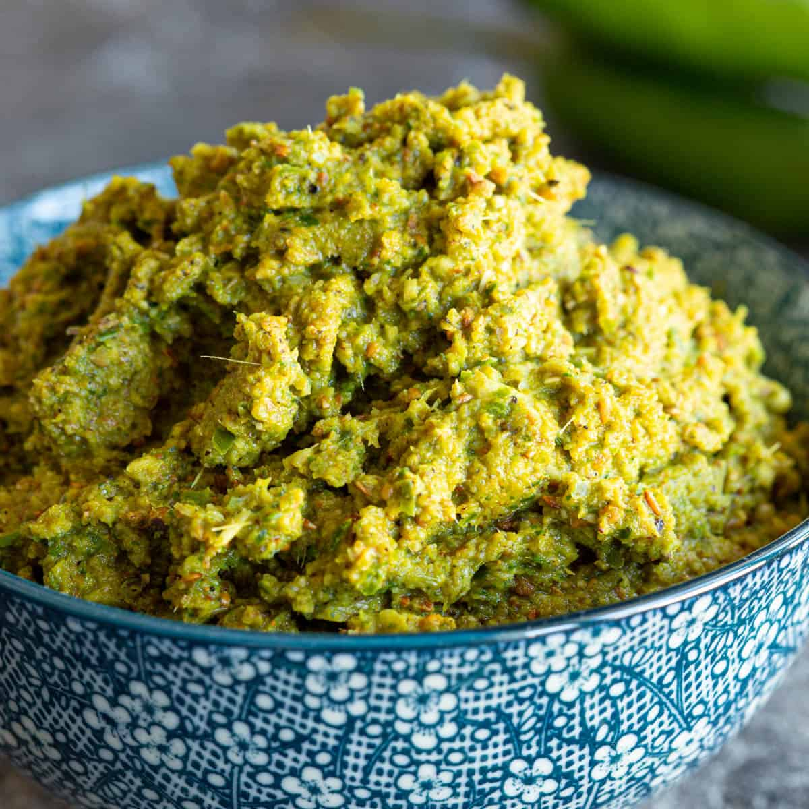

# Green Curry Paste

*Probably the Thai curry you've eaten most often. Fresh green chillies do the heat, lemongrass and kaffir lime do the brightness, coriander roots and galangal do the depth. Pound it to a wet paste, fry it in coconut cream, and ten minutes later you've got a curry with chicken, fish or whatever else is to hand.*

## Overview
Green curry (gaeng keow wan: "sweet green curry") is the Thai curry most foreigners try first and most home cooks attempt to replicate. The colour comes entirely from fresh green chillies; the brightness from coriander roots and kaffir lime; the depth from lemongrass, galangal, garlic and shallots; the umami underpinning from a small amount of fermented shrimp paste.

The defining characteristic is the heat. Green curry uses bird's-eye chillies and runs hotter than red or yellow. A traditional Thai green curry is fiercely hot; the "mild Thai green curry" of UK takeaways is a tamed western adaptation.

## The Recipe

For about 200 g of paste (enough for 4 curries):

### Ingredients

- 30 g fresh green bird's-eye chillies (about 20 small chillies, stems removed)
- 50 g large green chillies (1-2, deseeded if you want less heat)
- 2 stalks lemongrass (tough outer leaves removed; bottom 10 cm only, finely sliced)
- 30 g fresh galangal (peeled, finely sliced; do NOT substitute ginger; the flavour is different)
- 8 garlic cloves
- 4 large shallots (about 100 g)
- 4 kaffir lime leaves (stems removed, very finely chopped)
- Zest of 1 kaffir lime (or 1 regular lime as substitute)
- 1 bunch coriander, with roots (the roots are essential; the leaves go into the curry, not the paste)
- 1 teaspoon white peppercorns
- 1 teaspoon coriander seeds
- 1 teaspoon cumin seeds
- 1 tablespoon shrimp paste (kapi)
- 1 teaspoon salt
- 2 tablespoons water (only if needed; a wet paste is correct)

## Method

### Stage 1 - Toast the Whole Spices

Place the coriander seeds, cumin seeds and white peppercorns in a dry pan over medium heat. Toast for 60-90 seconds, shaking the pan, until fragrant. Tip into a mortar or spice grinder. Grind to a powder. Set aside.

### Stage 2 - Pound the Paste (Traditional)

The classical method is a granite mortar and pestle. Takes 45 minutes; produces the smoothest, most flavour-intense paste.

1. Pound the salt and toughest aromatics first: lemongrass, galangal, kaffir lime leaves. The salt acts as an abrasive that breaks down the fibrous bits.
2. Add the garlic and shallots. Pound to a paste.
3. Add the coriander roots (chopped finely first). Pound.
4. Add both chillies. Pound.
5. Add the toasted ground spices, shrimp paste, lime zest. Pound until smooth.

The end result is a wet, fragrant green paste. The fibres of lemongrass and galangal should be entirely broken down.

### Stage 2 (alternative) - Blender Method

Faster, less smooth, still good. Takes 5 minutes.

1. Combine all ingredients in a small food processor or blender.
2. Add 2 tablespoons water to help it move.
3. Blitz, scraping down the sides, until as smooth as possible (5-10 minutes; longer than you think).
4. The paste won't be quite as smooth as a pounded paste, but it'll be 80% of the way there.

A high-speed blender (Vitamix) gets closer to the pounded result than a regular food processor.

### Stage 3 - Store

The finished paste keeps:
- 2 weeks in a sealed jar in the fridge.
- 3 months in the freezer (portion into ice-cube trays first; each cube is one curry's worth, about 30 g).

## The Curry

To turn the paste into a curry, you need:

- 2-3 tablespoons green curry paste (about 30-50 g)
- 400 ml coconut milk (full-fat, good quality)
- 500 g protein (chicken thigh, prawns, white fish, firm tofu)
- 200 g vegetables (Thai aubergines, bamboo shoots, baby corn, mange tout, pea aubergines)
- 1 tablespoon fish sauce
- 1 tablespoon palm sugar (or brown sugar)
- 1 small handful Thai basil leaves (or sweet basil; not regular basil though it works)
- 4 kaffir lime leaves (torn)
- 2 long red chillies (sliced, for colour and presentation)

See the [building-a-curry worked example](building-a-curry.md) for the full method. Brief version: crack the coconut milk; fry the paste in the cream until oil separates; add protein; add the thinner coconut milk; simmer; finish with fish sauce, sugar, basil, lime leaves.

## What Goes With Green Curry

- Steamed jasmine rice (essential).
- A side of stir-fried morning glory (pak boong) or kai-lan in oyster sauce.
- A simple Thai cucumber salad to cut the richness.

## Common Mistakes

**The paste tastes flat.**
Whole spices weren't toasted, or the aromatics weren't pounded enough. The flavour comes from broken-down cells; if you can still see fibres of lemongrass, the paste isn't done.

**The paste is grainy.**
Galangal not finely sliced before pounding, or shrimp paste in lumps. Slice galangal across the fibres into 1 mm slices; mash shrimp paste smooth before adding.

**The curry is dull green-grey, not bright green.**
Cooked too long, or with too little fresh herb. Add fresh Thai basil right at the end (not during the simmer) for the brightness.

**The curry is broken / oily.**
Too much coconut cream, too aggressively heated. The cream should "crack" (oil separates) once at the paste-frying stage; after that, gentle simmer.

**The flavour is too sharp.**
Not enough palm sugar. Thai cuisine balances four flavours (sweet, sour, salty, spicy); the sweet balances out the sharp. Add half a tablespoon more sugar; taste again.

**The colour is brown, not green.**
Over-cooked. The chlorophyll in the chillies degrades with heat. Cook fast; pull the curry off the heat before the colour shifts.

## Variations

**Chicken Green Curry (the standard).** Use chicken thigh, cubed. 10 minutes' cook from paste-frying.

**Prawn Green Curry.** Use peeled prawns. They go in late, cook in 60 seconds. The curry liquid takes their flavour.

**Vegetable Green Curry.** Replace protein with firm tofu (pan-fried first) and double the vegetables. Add a tablespoon of soy sauce for umami.

**Beef Green Curry.** Thinly sliced sirloin. Don't cook long; medium rare in 30 seconds in the simmering coconut milk.

**Green Fish Curry.** Cubed firm white fish (sea bass, halibut). 90 seconds in the simmering curry.

## Where Next
- [Red Curry Paste](red.md): the second-most-popular Thai curry, with dried chillies.
- [Coconut Milk Technique](coconut-milk.md): the cracking-and-frying technique for any paste curry.
- [Building a Curry](building-a-curry.md): full worked example using green paste.
- [Thai Green Curry Paste recipe](../../base-ingredients/curry-paste/thai-green-paste.md): canonical recipe.
- [Thai Curry Course landing](thai-curry.md): back to the main course.
