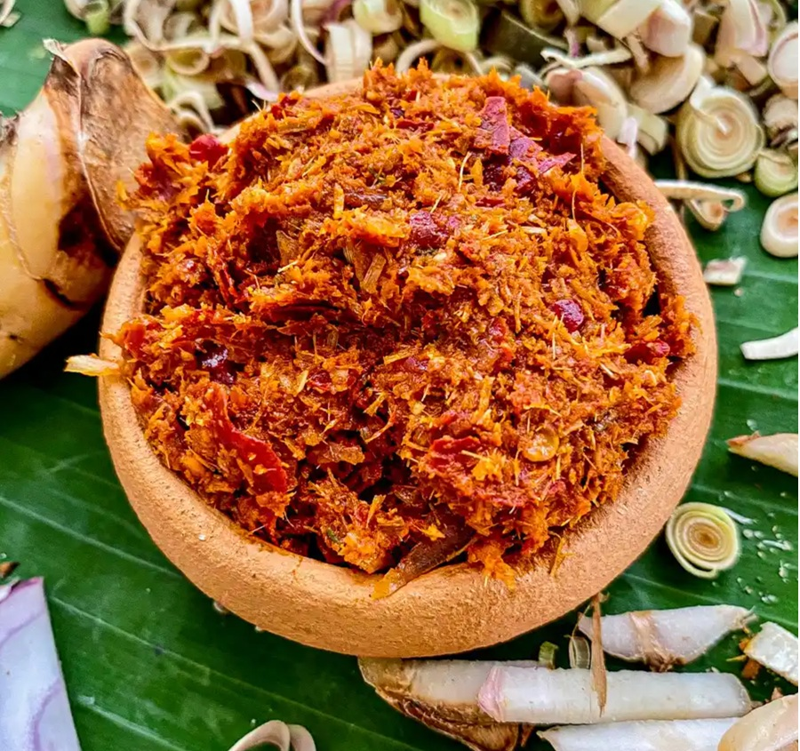

# Panang Curry Paste

*Panang is red curry's richer, thicker, peanut-laced cousin from the Thai-Malaysian border. Less coconut milk, more concentrated paste, a touch sweeter, and crushed peanuts folded through for body. Many Thais consider it the most refined of the curries, and it goes beautifully with beef.*

## Overview
Panang is technically a variation of red curry: most of the same aromatic base (lemongrass, galangal, garlic, shallot, dried red chillies, shrimp paste) plus crushed roasted peanuts and a slightly heavier hand with the dried spices. The differences from red curry are subtle but consistent.

The cooking is different too. Panang uses less coconut milk than red or green; the curry is thicker, drier, more concentrated. The sauce should coat the protein heavily, not pool around it.

Best with: thinly-sliced beef sirloin (the classical pairing), lamb cutlets, duck breast. The richness of these meats pairs with the heavy paste-and-peanut sauce.

## How It Differs From Red Curry

| | Red curry | Panang |
|---|---|---|
| Peanuts | None | 2-3 tablespoons crushed, in the paste |
| Coconut milk | 400 ml | 200 ml (half-quantity) |
| Sauce texture | Pourable | Coats heavily, almost dry |
| Heat | Medium-high | Medium |
| Sweetness | Mild | More pronounced |
| Classical protein | Pork, chicken, duck, beef | Beef sirloin specifically |
| Cook time | 10 min | 10 min |

Some recipes make panang from red paste + peanut additions in the cooking step. The traditional Thai approach builds the peanuts INTO the paste itself. Either works.

## The Recipe

For about 200 g of paste:

### Ingredients

- 10-15 dried red chillies (mild large type; about 40 g)
- 4 fresh red chillies
- 2 stalks lemongrass (sliced)
- 30 g fresh galangal
- 8 garlic cloves
- 4 large shallots
- 4 kaffir lime leaves
- 4 coriander roots
- 60 g roasted peanuts (unsalted)
- 1 tablespoon coriander seeds
- 1 teaspoon cumin seeds
- 1 teaspoon white peppercorns
- 1 tablespoon shrimp paste
- 1 teaspoon salt

### Method

1. Rehydrate the dried chillies in just-boiled water, 20 minutes. Drain.
2. Toast the whole spices (coriander, cumin, peppercorns), 60-90 seconds in a dry pan. Grind to powder.
3. Toast the peanuts briefly if not already roasted: 60 seconds in the dry pan, shaking. Cool. Grind to a coarse meal (pulses, not a paste, you want some texture).
4. Pound the paste:
   - Salt, lemongrass, galangal, kaffir lime first.
   - Shallots and garlic.
   - Coriander roots and fresh chillies.
   - Rehydrated dried chillies.
   - Toasted ground spices and shrimp paste.
   - Finally fold in the crushed peanuts. Don't pound them further; they should add texture.

Store: 2 weeks fridge, 3 months freezer.

## The Curry (Panang Beef)

The signature panang dish.

### Ingredients (Serves 4)
- 3 tablespoons panang paste
- 200 ml coconut milk (half the usual quantity)
- 500 g beef sirloin (thinly sliced against the grain)
- 6 kaffir lime leaves (very finely chopped)
- 2 long red chillies (sliced)
- 1 tablespoon fish sauce
- 1 tablespoon palm sugar
- 1 small handful Thai basil

### Method

1. Place the coconut milk in a wok or wide pan over medium heat. Bring to a simmer.
2. As the milk reduces and cream rises, add the panang paste. Stir vigorously.
3. The paste fries in the cream. Cook 3-4 minutes, stirring constantly, until the sauce is thick, glossy, and the oil has separated from the cream visibly.
4. Add the beef. Stir. Cook 60-90 seconds; the beef should be cooked but still rare-to-medium.
5. Add fish sauce and palm sugar. Stir.
6. Off heat, stir in kaffir lime leaves and Thai basil.
7. Garnish with sliced red chillies. Serve immediately.

The finished curry should be thick enough that the sauce coats the back of a spoon and hugs the beef. If it's thin, you used too much coconut milk.

## Variations

### Panang Lamb (Beef Panang)
See [beef-panang.md](../../cuisine/thai/beef-panang.md). The classical Thai restaurant dish.

### Panang Chicken
Chicken thigh, cubed. Slightly longer simmer (3-4 minutes) than beef.

### Panang Duck
Pre-roasted duck (the Chinese-style shop-bought, sliced) added in the last minute. The duck fat enriches the sauce.

### Panang Vegetable
Replace meat with deep-fried firm tofu pieces and a handful of sliced courgette. The tofu absorbs the sauce.

## What Makes Panang Special

- **Almost no liquid.** Panang is a sauce that clings, not a curry you eat with rice and a spoon. The food itself is heavier-seasoned.
- **Peanut richness.** Even just visually different; the sauce has a slight beige tinge from the peanuts.
- **Beef-friendly.** Where green curry tends toward chicken and prawns, panang is the beef-and-lamb curry.
- **Sweet-spice balance.** More palm sugar than red curry; the sweetness balances the rich peanut-and-coconut.

## Common Mistakes

**The sauce is thin.**
Too much coconut milk. Use half (200 ml not 400). Or reduce the sauce harder before adding the protein.

**The sauce broke / separated.**
The cream cracked too aggressively. Reduce heat once the paste is fried; gentle simmer for the rest.

**Peanuts are gritty.**
Ground too fine or in too coarse pieces (full peanut chunks). Aim for a coarse meal: bigger than ground but smaller than a peanut.

**The colour is duller than red curry.**
Normal. The peanuts dim the red. Panang is supposed to be a brick-tan colour, not bright red.

**Beef is tough.**
Cooked too long, or cut with the grain instead of against. Slice thinly across the grain; cook briefly.

## Where Next
- [Red Curry Paste](red.md): the close cousin.
- [Massaman](massaman.md): the slow-cooked variant.
- [Coconut Milk Technique](coconut-milk.md): the cooking method.
- [Beef Panang](../../cuisine/thai/beef-panang.md): the traditional Thai-restaurant dish.
- [Panang Curry Paste recipe](../../cuisine/thai/pastes/panang-curry-paste.md): traditional paste.
- [Thai Curry Course landing](thai-curry.md): back to the main course.

## Storage
- Finished curries keep 2-3 days refrigerated; flavour develops overnight as the spices meld
- Freeze portion-sized lots up to 2 months; thaw fully before reheating
- Reheat gently on low; never boil hard or the coconut milk will split
- Curry pastes keep 2 weeks refrigerated with a thin film of oil on top, or freeze in ice-cube trays for 3 months
