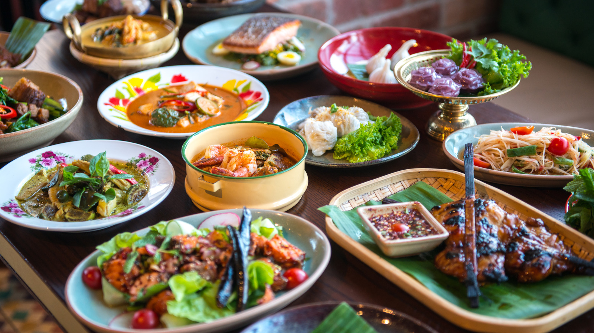

# Thai Curry Course

*Five pastes (green, red, yellow, massaman, panang) cover most of the Thai curry world. Pound each one once, keep it in the fridge for a few weeks, and you can plate a finished curry in ten minutes by combining the paste with coconut milk and whatever protein's in the fridge. Different system from BIR, same comforting principle: prep once, cook fast.*

## Overview
Thai curry runs on pastes the way BIR curry runs on base gravy. A curry paste is a pounded blend of fresh aromatics (lemongrass, galangal, kaffir lime, garlic, shallot) plus dried spices (coriander, cumin, white pepper) plus chillies (fresh for green; dried for red, yellow, massaman). Each paste has its own signature; together they cover almost every named Thai curry on a restaurant menu.

The cooking is fast once the paste is ready. The classical sequence:
1. Crack the coconut milk (separate the cream from the thinner liquid).
2. Fry the paste in the cream until aromatic and the oil splits out.
3. Add protein, then thin coconut milk to make a sauce.
4. Add vegetables, palm sugar, fish sauce, fresh herbs.
5. Plate over rice.

Total cook time: 10-15 minutes once the paste is made and the ingredients are prepped.

## Course Outline

### The Five Pastes
- [Green Curry Paste](green.md): fresh green chillies, the most popular Thai curry. Bright, fierce, herbaceous.
- [Red Curry Paste](red.md): dried red chillies, the second classic. Deeper, less green-herb, more spice-forward.
- [Yellow Curry Paste](yellow.md): turmeric, Indian influence, mild. The introduction Thai curry for the unaccustomed.
- [Massaman Curry Paste](massaman.md): Persian-Muslim influence, with cardamom, cinnamon, cloves. The "stew curry", slow-cooked.
- [Panang Curry Paste](panang.md): a richer, drier variant on red. Peanuts, kaffir lime leaves.

### The Cooking Technique
- [Coconut Milk Technique](coconut-milk.md): cracking the cream, frying the paste, building the curry. The single non-obvious step that separates good Thai curry from sad Thai curry.

### A Worked Example
- [Building a Curry](building-a-curry.md): a full chicken green curry from start to plate. Shows how the paste + technique + ingredients combine.

## Master Recipes
The course refers back to these:

- [Thai Green Curry Paste](../../base-ingredients/curry-paste/thai-green-paste.md)
- [Thai Red Curry Paste](../../base-ingredients/curry-paste/thai-red-paste.md)
- [Massaman Curry Paste](../../base-ingredients/curry-paste/masaman-paste.md)
- [Panang Curry Paste](../../cuisine/thai/pastes/panang-curry-paste.md)
- [Thai Yellow Curry Paste](../../cuisine/thai/pastes/thai-yellow-curry-paste.md)

## The Finished Curries

With the five pastes in hand:

### Green Curry
- [Beef Panang](../../cuisine/thai/beef-panang.md): with the panang variant.
- Green chicken curry: see the [worked example](building-a-curry.md).

### Other Curries
- [Jungle Curry](../../cuisine/thai/jungle-curry.md): an unusual paste-less curry, water-based with herbs.
- [Pad Pak Ruam](../../cuisine/thai/pad-pak-ruam.md): a vegetable stir-fry that uses curry paste for flavour rather than as a base.

## The Paste-Versus-Jar Question

Shop-bought Thai curry pastes vary wildly. The best (Mae Ploy, Maesri, Aroy-D from Asian grocers) are 80% as good as home-made for 10% of the effort. The worst (supermarket-brand jars at twice the price) are watery, salt-heavy and bear little resemblance to the real thing.

For weeknight cooking: buy a decent Asian-grocer paste (£3-5 a tub, lasts 3 months refrigerated). Use 2-3 tablespoons per curry.

For the real flavour: make your own. The labour is in the pounding (45-60 minutes the first time, faster after). The result is dramatically more aromatic.

This course shows you both.

## Why Pastes, Not Powders

Thai cuisine doesn't use ground spice powders for curries. The fresh aromatics (lemongrass, galangal, kaffir lime, coriander roots) cannot be dried without losing their character. Only a paste captures them properly.

Indian curries can be built from dry-ground spice mixes (see the [BIR curry course](../bir-curry/bir-curry.md)) because the spices are mostly seeds (cumin, coriander, fenugreek) that hold their flavour dried. Thai curries need the fresh aromatic kick that only a paste provides.

## Where to Start

- New to Thai curry: [Green Curry Paste](green.md) first; most popular, brightest flavour, easiest paste to make.
- Want a stew: [Massaman](massaman.md). Long, slow-cooked, the introductory curry for people who don't like fierce heat.
- Want to understand the cooking: [Coconut Milk Technique](coconut-milk.md). The 10-minute technique deep-dive.
- Want to cook one tonight: [Building a Curry](building-a-curry.md) is the worked example.

## Where Next
- [BIR Curry course](../bir-curry/bir-curry.md): the very different curry system. Both worth knowing.
- [Rice course / Absorption Method](../rice/absorption-method.md): the jasmine rice that goes under a Thai curry needs the absorption method.
- [Stir-Fry course](../stir-fry/stir-fry.md): Thai stir-fry technique. Pad Thai, pad see ew, the curry-paste-led stir-fries.
- [Stocks-Sauces / Stocks](../stocks-sauces/stocks.md): some Thai pastes are extended with chicken stock; the stock matters.
