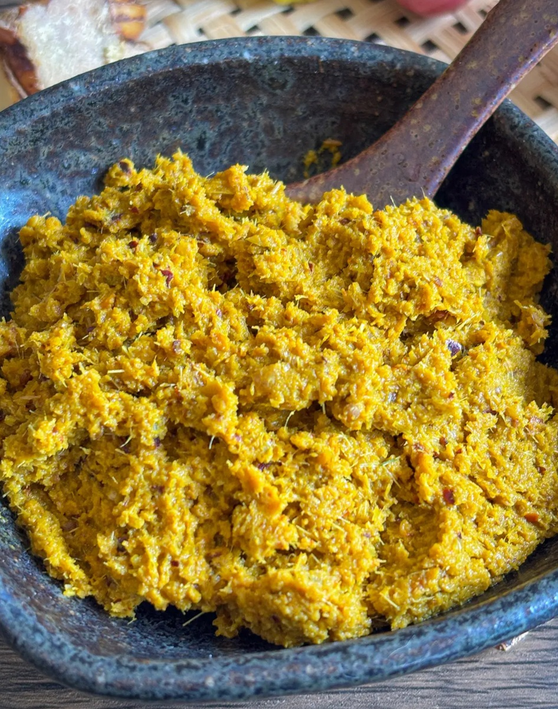

# Yellow Curry Paste

*Yellow is the mildest of the bunch and the one that shows the Indian influence on Thai cooking. Turmeric drives the colour and the flavour; cumin and coriander seeds give it a warm spice profile closer to a mild curry than the other Thai ones. Usually has potato or sweet potato in it, which the others don't, and it's the right curry to start someone off on if they're new to Thai food.*

## Overview
Yellow curry (gaeng karee or kaeng kari) shows the Indian influence on Thai cuisine. The southern Thai provinces near the Malay border picked up turmeric, cumin and coriander from Indian traders centuries ago and folded them into a Thai paste structure. The result is sweeter, milder, and more spice-warm than green or red.

The colour is striking yellow-gold. The flavour is more curry-powder-like than green or red, with the same coconut-milk-and-fish-sauce balance underneath.

## The Recipe

For about 200 g of paste:

### Ingredients

- 4-6 dried red chillies (mild; about 20 g)
- 2 stalks lemongrass (bottom 10 cm, finely sliced)
- 30 g fresh galangal
- 8 garlic cloves
- 4 large shallots
- 4 kaffir lime leaves (finely chopped)
- 1 tablespoon fresh turmeric, grated (or 2 teaspoons ground turmeric)
- 2 teaspoons ground cumin
- 2 teaspoons ground coriander
- 1 teaspoon ground white pepper
- 1 teaspoon ground cardamom
- 1/2 teaspoon ground cinnamon
- 1 tablespoon shrimp paste
- 1 teaspoon salt

### Method

1. Soak the dried chillies in just-boiled water for 20 minutes. Drain.
2. Pound or blend all ingredients to a smooth paste, as for [green curry paste](green.md). 
3. Store as for green: 2 weeks fridge, 3 months freezer.

## The Curry

Yellow curry is the curry that goes with starchy vegetables. The classical pairing:

- 2-3 tablespoons yellow curry paste
- 400 ml coconut milk
- 500 g chicken thigh (cubed)
- 300 g new potatoes (halved) OR sweet potato (cubed)
- 1 large onion (chunky cut)
- 1 tablespoon fish sauce
- 1 tablespoon palm sugar
- Juice of 1/2 lime
- Fresh coriander to garnish

Method: as for green curry (see [coconut milk technique](coconut-milk.md) and [building a curry](building-a-curry.md)). The potatoes need 15-20 minutes of simmering to cook through; add them with the protein, not at the end.

## Variations

### Massaman (Closely Related)
Yellow curry was the original; massaman developed alongside it with even more Indian/Persian influence (cardamom, cinnamon, cloves, often peanuts). See [Massaman](massaman.md) for the full course page.

### Chicken Yellow Curry (the standard)
The everyday yellow curry. Cubed chicken thigh, new potatoes, onion chunks. Comfort-curry rather than restaurant.

### Vegetable Yellow Curry
Replace chicken with cubed firm tofu, double the potato/sweet potato, add a generous handful of green beans at the end.

### Fish Yellow Curry
Cubed white fish, but the curry needs to be made first; the fish goes in only at the very end for 60-90 seconds.

## What Makes Yellow Curry Different

- **Turmeric front and centre.** Yellow curry tastes of turmeric the way green tastes of green chilli. If you don't like turmeric, you won't like yellow curry.
- **Starchy vegetable always.** The classical yellow has potato; this is rare in green and red.
- **Less heat.** A traditional yellow is medium where a traditional green is fierce.
- **Indian-curry-adjacent.** Yellow curry tastes more like a mild Indian curry than other Thai curries do. If a guest doesn't like Thai food but likes Indian, start them on yellow.

## Common Mistakes

**The colour is faded yellow-orange.**
Old turmeric. Turmeric loses colour over months on the shelf. Use fresh grated turmeric for the deepest gold; replace ground turmeric every 6-12 months.

**The curry tastes flat.**
Toasted spices skipped, or used pre-ground spices that have lost their volatile oils. Toast and grind whole seeds where possible (cumin, coriander).

**The potatoes are still hard at the end.**
Cut smaller, or pre-parboil for 5 minutes before adding to the curry. New potatoes cut in half take 15-20 minutes to simmer through.

**The curry is bland.**
Yellow curry needs more aggressive fish sauce and palm sugar than green or red because it's milder. Don't be shy with the seasoning at the end.

## Where Next
- [Massaman Curry Paste](massaman.md): the closely related "stew curry".
- [Green Curry Paste](green.md): the bright fresh-chilli sibling.
- [Building a Curry](building-a-curry.md): the worked example (uses green; technique applies to yellow).
- [Thai Yellow Curry Paste recipe](../../cuisine/thai/pastes/thai-yellow-curry-paste.md): canonical recipe.
- [Thai Curry Course landing](thai-curry.md): back to the main course.
