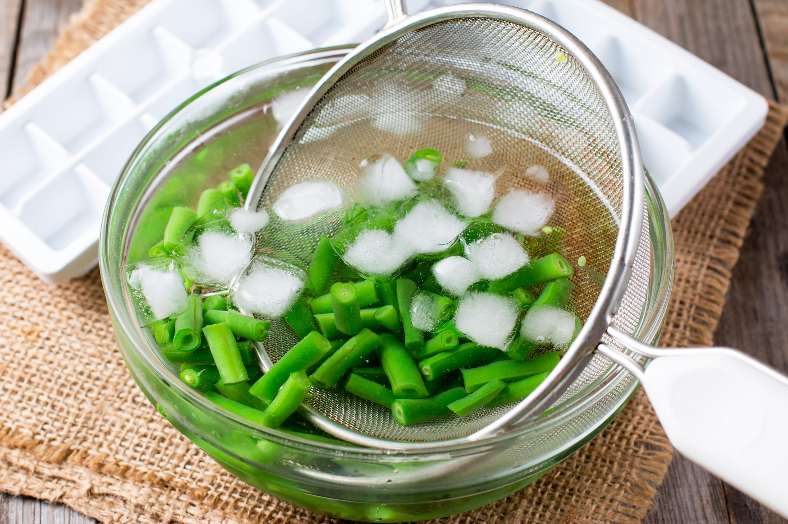

# Blanching

*Brief immersion in heavily-salted boiling water, then a refresh in iced water. The technique that produces bright-green tender vegetables without overcooking, and the foundation of French and Italian vegetable preparations.*

## Overview
Blanching is the most elegant vegetable technique. A large pot of boiling water, heavily salted (the water should taste like seawater), takes the raw bitter edge off a vegetable in 30 seconds to 3 minutes. Immediate plunge into iced water stops the cooking exactly; the vegetable retains its colour, snap, and most of its nutrition.

The blanched vegetable can be eaten as-is (steamed, dressed in butter or olive oil, salt, lemon), set aside for later assembly (the make-ahead trick of restaurant kitchens), or used as a stepping stone in another dish (a quickly-blanched then sauteed green; a blanched-then-frozen batch for the freezer).

The salt-and-ice technique sounds fussy; once you have done it twice it becomes instinctive. The salt level matters, undersalted blanching water produces dull vegetables; oversalted is hardly possible. The ice bath also matters, skipping it and just draining produces vegetables that continue cooking from residual heat, going soft and grey.

## The Universal Method

1. **Bring a very large pot of water to a rolling boil.** 4-5 litres minimum, even for 500 g of vegetables. The large volume of water recovers quickly when the cold vegetables go in, and dilutes the natural acids the vegetables release (acids dull the colour).
2. **Salt heavily.** 4-5 tablespoons of sea salt per 4 litres of water - aim for water that tastes salty as a well-seasoned broth (about 1.5-2%, slightly under true seawater). The salt seasons the vegetable, stops chlorophyll degradation (keeps the green), and reduces nutrient loss to the water.
3. **Prepare an ice bath.** A large bowl half-filled with ice cubes, topped up with cold water. Have a slotted spoon or strainer ready.
4. **Drop in the vegetable.** No need to wait between additions, drop everything at once if it is delicate (peas, beans, asparagus), or in batches if it is denser (broccoli, cauliflower, root vegetables sliced thin).
5. **Time precisely.** Use a timer; under-blanched is undercooked, over-blanched is mushy. Pinpoint timing is the difference between a great blanched green and a mediocre one.
6. **Lift out into the ice bath.** Use a slotted spoon or spider straight from the pot into the ice (faster). Or pour the pot through a colander in the sink, then transfer the drained vegetables into the ice bath - don't pour boiling water through the colander into the ice bath itself, it warms the ice and defeats the shock. The cold shock stops the cooking instantly.
7. **Drain when cool.** 30-60 seconds in the ice is enough; the vegetable should be cool to the touch but not waterlogged.

## Timings

| Vegetable | Blanch time | Notes |
|-----------|-------------|-------|
| Asparagus (slim) | 90 seconds | Should be bright green; tender but with a bite |
| Asparagus (thick) | 2-3 minutes | The same level of doneness |
| Broccoli florets | 90 seconds | Plus 30 sec for the stems if cooking together |
| Cauliflower florets | 2 minutes | Slightly firmer than broccoli at the right point |
| Green beans (thin) | 90 seconds | Snap when bent |
| Green beans (thick / runner) | 2-3 minutes | Same test |
| Peas (fresh) | 60 seconds | Bright green, sweet, still slightly chewy |
| Mangetout / sugar snap | 30-45 seconds | Just enough to brighten the colour |
| Spinach (leaves) | 15 seconds | Drop in, swirl, lift out immediately |
| Kale (chopped) | 60-90 seconds | Softens but stays bright |
| Chard | 30-60 seconds for stems, 15 seconds for leaves | Separate them; stems first |
| Cabbage (leaves for rolling) | 60-90 seconds | Pliable but not torn |
| Cabbage (chopped) | 45-60 seconds | Just to soften |
| Brussels sprouts (halved) | 3-4 minutes | Tender to the centre |
| Carrots (sliced thin) | 60-90 seconds | Stays slightly firm |
| Beetroot (small whole) | 25-35 minutes | Skin slips off when cool |
| Beetroot (cut to chunks) | 8-12 minutes | Test with a knife, should slide in |
| New potatoes (small whole) | 12-18 minutes | Salt the water heavily; the salt penetrates |
| Tomatoes (for peeling) | 15-30 seconds | Until the skin splits |

## Worked Recipes

### Classic Blanched Green Beans (French Style)

Serves 4 as a side.

- 500 g green beans, tops trimmed
- 4 tbsp salt for the water
- 30 g unsalted butter
- 1 lemon, zested
- 2 tbsp finely chopped parsley
- Sea salt, black pepper

Method:
1. Bring 4 litres water to a boil. Add the 4 tbsp salt.
2. Add the beans; cook 90 seconds.
3. Lift into the ice bath; cool 30 seconds; drain.
4. Heat the butter in a large pan over medium heat.
5. Add the drained beans; toss gently for 1-2 minutes to warm through.
6. Add lemon zest, parsley, sea salt, black pepper. Toss; serve.

The blanching is done; the pan finish is just to warm and dress. The beans stay bright green and slightly crisp.

### Steamed Broccoli with Anchovy Butter

Same technique, different finish.

- 1 head broccoli, cut into florets (stems trimmed and sliced)
- 4 tbsp salt for the water
- 60 g unsalted butter
- 4 anchovy fillets, finely chopped
- 2 cloves garlic, finely chopped
- A pinch of chilli flakes
- 1 lemon, juice only

Method:
1. Blanch the broccoli florets 90 seconds; ice bath; drain.
2. In the same pan you'd use for the beans above, melt the butter over medium-low heat.
3. Add the anchovy and garlic; stir until anchovy dissolves and garlic is fragrant (90 seconds; do not brown the garlic).
4. Add chilli flakes and broccoli; toss for 1-2 minutes.
5. Finish with lemon juice and serve.

The anchovy dissolves into the butter, providing umami without identifying itself. The broccoli stays bright; the dressing is intensely flavoured.

### Brussels Sprouts with Bacon and Mustard

A different finishing approach.

- 500 g Brussels sprouts, halved
- 4 tbsp salt for the water
- 100 g pancetta or bacon, cubed
- 30 g unsalted butter
- 1 tbsp Dijon mustard
- 1 tbsp cider vinegar
- 1 tbsp honey
- Black pepper

Method:
1. Blanch the sprouts 3-4 minutes; ice bath; drain.
2. Fry the pancetta in a dry pan until crisp; remove with a slotted spoon, keep the fat.
3. Add the butter to the pan; melt.
4. Whisk in the mustard, vinegar and honey. Stir briefly to combine.
5. Add the drained sprouts; toss until coated and warmed (2 minutes).
6. Return the pancetta to the pan; toss; serve.

## Refreshing and Holding

A useful restaurant trick: blanch a large batch of vegetables in the morning, refresh in ice, drain, store in the fridge in a covered container. Heat to serve, either in a small amount of butter (the French pan-finish above) or directly into a stir-fry.

This works for almost all blanched vegetables for 24-48 hours. The colour stays bright; the texture stays intact; the cook time at service is just 1-2 minutes to warm through.

## Freezing Blanched Vegetables

Blanched and frozen vegetables keep dramatically better than raw-frozen. The blanching deactivates the enzymes that would otherwise cause the frozen vegetable to lose colour and flavour over weeks of freezing.

Method:
1. Blanch as above, but slightly under-cook (30 seconds less than the table).
2. Refresh in ice; drain thoroughly.
3. Pat dry with a clean tea towel.
4. Spread on a baking sheet; freeze 1 hour until rock solid (this stops them clumping together).
5. Transfer to a freezer bag; squeeze out air; seal; freeze up to 6 months.

To use: drop frozen straight into a hot pan or directly into a soup. Do not defrost first.

This is how commercial frozen peas, beans and broccoli are processed.

## Common Failures

| Symptom | Cause | Fix |
|---------|-------|-----|
| Vegetables dull / grey | Insufficient salt; or too long in the boiling water | Use 1 tbsp salt per litre; time precisely |
| Vegetables mushy | Over-blanched | Time precisely; pull at the right moment |
| Vegetables tough | Under-blanched | Increase time by 30-60 seconds; some vegetables need longer |
| Colour leaches into water | Not enough water for the vegetable quantity | 4 litres minimum even for 500g vegetables; cook in batches |
| Vegetables wilt during ice bath | Ice bath too warm; not cold enough | Add more ice; smaller bowl |

## Where Next
- [Roasting](roasting.md): the alternative heat method for many of these same vegetables.
- [Braising](braising.md): the longer-cook technique for tougher cuts.
- [Pickling](pickling.md): the cold technique that combines well with blanched vegetables.
