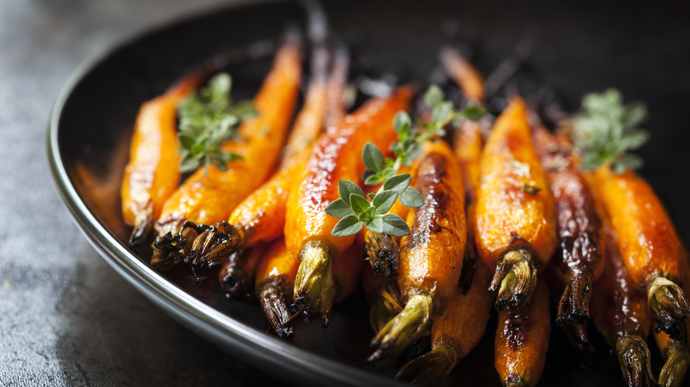

# Braising

*The slow-cook in liquid. Greens softened with garlic and stock; whole vegetables in tomato and olive oil; the Provence and southern Italian traditions of melting-tender vegetables that have absorbed the flavour of everything they cooked in.*

## Overview
Braising is the third heat method - distinct from roasting (dry high heat) and blanching (brief immersion). Braising cooks vegetables in a small amount of liquid over a long time at moderate heat. The vegetable softens completely; the liquid concentrates; the two flavours marry into something neither would be on its own.

The technique is what produces the vegetable dishes of the Mediterranean. Slow-braised aubergine with tomato. Whole leeks cooked in olive oil and stock until silky. Cabbage cooked down with butter and stock until almost a puree. The North African and Persian traditions also use the technique heavily (tagines, korma vegetables, slow-cooked chard).

Braised vegetables keep well, reheat better than most cooked vegetables, and are often improved by an overnight rest in the fridge. They are good with grilled meat, alongside crusty bread, on top of polenta or pasta, or as a substantial vegetable main with cheese and bread.

## The Universal Method

The basic structure of every braise:

1. **Brown the base.** Aromatic vegetables (onions, leeks, fennel, garlic) and sometimes a meat element (pancetta, anchovy) are softened or browned in olive oil at the start. This builds the flavour foundation.
2. **Add the main vegetable.** Stir to coat in the aromatics and oil.
3. **Add liquid.** Stock, wine, water, tomato. Just enough to come about halfway up the vegetables - the braise is not a stew (where vegetables are fully submerged) but a slow cook that uses the liquid as a moist heat carrier.
4. **Cook covered or partially covered at low heat.** Stovetop on a low setting, or oven at 130-160 C. Time varies from 30 minutes (for delicate greens) to 90+ minutes (for whole onions or fennel bulbs).
5. **Finish.** Often a squeeze of lemon, a drizzle of olive oil, fresh herbs, sometimes cheese.

## Worked Recipes

### Whole Braised Leeks

Long, slow, silky.

- 6 medium leeks
- 4 tbsp olive oil
- 4 cloves garlic, smashed
- 200 ml white wine
- 300 ml chicken or vegetable stock
- 1 tsp salt
- 1 lemon, juice and zest
- 30 g butter (optional, to finish)
- Fresh thyme

Method:
1. Trim the leeks: cut off the root just enough to keep them held together; halve lengthways; rinse thoroughly under cold running water (leeks hide grit between the layers).
2. Heat the olive oil in a wide ovenproof pan over medium heat.
3. Place the leeks cut-side down. Salt them. Cook 5-7 minutes without disturbing - the cut side caramelises slightly.
4. Flip; add the garlic and thyme.
5. Add the wine; let it bubble and reduce for 2-3 minutes.
6. Add the stock; cover the pan (with a lid or with foil); transfer to a 140 C oven.
7. Braise 45-60 minutes - the leeks should be tender enough to cut with a spoon.
8. Lift out; reduce the cooking liquid on the hob if needed (it should be like a glaze, not a puddle); whisk in butter; pour back over the leeks.
9. Finish with lemon juice and zest.

Serve as a starter with crusty bread or under a piece of grilled fish.

### Cavolo Nero / Kale Braised with Pancetta

A Tuscan tradition. The kale collapses into a deep-flavoured silky mass.

- 500 g cavolo nero (or kale), tough stems removed, leaves roughly chopped
- 4 tbsp olive oil
- 100 g pancetta, cubed (optional - skip for vegetarian)
- 4 cloves garlic, sliced
- 1 tsp chilli flakes
- 300 ml chicken or vegetable stock
- 1 tsp salt
- 1 lemon, juiced
- Optional: 50 g parmesan, finely grated for serving

Method:
1. Heat the olive oil in a large heavy pan. Add the pancetta; cook over medium heat until crisp and the fat is rendered.
2. Add the garlic and chilli; cook 1 minute until fragrant.
3. Add the kale in batches, stirring each batch in as it wilts.
4. Add the stock and salt. Bring to a simmer.
5. Cover; cook 20-30 minutes over low heat until the kale is silky and the liquid has reduced to a tablespoon or two.
6. Finish with lemon juice and parmesan.

Serve with crusty bread, on bruschetta, or alongside roast chicken.

### Whole Braised Fennel

A side or a vegetarian main. The fennel develops a deep sweetness through the slow cook.

- 4 fennel bulbs, halved (keep the cores attached)
- 4 tbsp olive oil
- 4 cloves garlic, sliced
- 1 tsp fennel seeds, lightly crushed
- 200 ml white wine
- 400 ml vegetable or chicken stock
- 1 lemon, sliced
- 1 tsp salt
- 30 g butter
- Optional: 100 g parmesan, grated

Method:
1. Heat the olive oil in a wide pan. Add fennel bulbs cut-side down. Cook 5-6 minutes until well-browned. Flip; brown the other side.
2. Add garlic and fennel seeds; cook 1 minute.
3. Add wine; let it bubble and reduce 2 minutes.
4. Add stock; tuck the lemon slices between the fennel bulbs.
5. Cover; transfer to a 140 C oven for 45-60 minutes - the fennel should be tender to the centre.
6. Lift the fennel out; reduce the liquid on the hob to a thick glaze; whisk in butter.
7. Pour the glaze over the fennel; top with parmesan if using; serve.

### Aubergine in Tomato (Caponata-Adjacent)

A Sicilian-style braised aubergine that improves overnight.

- 2 large aubergines, cut into 3 cm cubes
- 6 tbsp olive oil (split across stages)
- 2 onions, finely chopped
- 4 cloves garlic, sliced
- 2 sticks celery, finely chopped
- 1 red pepper, chopped (optional)
- 400 g chopped tomatoes (tinned)
- 2 tbsp tomato paste
- 50 g raisins (traditional; soaked in warm water)
- 30 g pine nuts (traditional)
- 30 ml red wine vinegar
- 1 tbsp brown sugar
- 1 tbsp capers
- 1 tsp salt
- 1 tsp dried oregano
- Fresh basil

Method:
1. Salt the cubed aubergine; rest in a colander 30 minutes; pat dry.
2. Heat 4 tbsp olive oil in a large pan over medium-high heat. Fry the aubergine in batches until deeply golden on all sides. Set aside on paper.
3. In the same pan with the remaining olive oil, soften the onions for 8-10 minutes. Add the garlic, celery and pepper; cook 5 minutes.
4. Add the tomato paste; cook 2 minutes until it darkens.
5. Add the tomatoes, raisins (drained), pine nuts, vinegar, sugar, capers, salt and oregano. Stir.
6. Return the aubergine to the pan; stir to coat.
7. Cover; simmer over low heat 40-50 minutes - the aubergine should be very soft; the sauce thickened.
8. Cool to room temperature. Refrigerate overnight.
9. Serve at room temperature, drizzled with fresh olive oil and torn fresh basil.

This is at its peak the next day. Eaten with bread, over polenta, alongside ricotta or burrata. Keeps refrigerated 1 week.

### Borlotti or White Beans Braised with Tomato

A southern Italian-Mediterranean staple. Bean braise that doubles as a vegetarian main, a pasta sauce, a soup base.

- 400 g cooked borlotti or cannellini beans (or 1 tin, drained and rinsed)
- 4 tbsp olive oil
- 1 onion, finely chopped
- 4 cloves garlic, sliced
- 2 sprigs rosemary
- 400 g chopped tomatoes
- 200 ml chicken or vegetable stock
- 1 tsp salt
- Black pepper
- Optional: 50 g pancetta or 1 tsp chilli flakes

Method:
1. Heat olive oil; soften onion 8-10 minutes.
2. Add garlic and rosemary; cook 1 minute.
3. Add tomatoes; cook 5-10 minutes until the sauce has darkened slightly.
4. Add beans, stock, salt and pepper. Simmer 25-35 minutes; the beans absorb flavour and the sauce thickens.
5. Mash some of the beans with the back of a spoon for thickness.
6. Drizzle with fresh olive oil to serve.

## When to Roast and When to Braise

The right technique depends on the vegetable and what you want from it:

| Vegetable | Roasting | Braising |
|-----------|----------|----------|
| Carrots, parsnips | Best for caramelisation and dryness | OK for soup or stew, less interesting alone |
| Brassicas (sprouts, broccoli, cauliflower) | Best for char and snap | Mushy unless very brief |
| Kale, cavolo nero, collards | Crisps in roast (kale chips); but braise is the proper traditional treatment | Yes - the silky braise is the classic |
| Aubergine | Yes, especially when whole-roasted then mashed | Yes (caponata, parmigiana) |
| Fennel | Roast or braise both work | Yes - deep flavour development |
| Leeks | Roast for char; braise for silkiness | Yes - the slow braise is the elegant move |
| Cabbage | Yes (roasted wedges) | Yes (slow-cooked cabbage with butter) |
| Onions | Yes (caramelisation) | Yes (long-cooked onion compote) |
| Tomatoes | Yes (blistered, slow-roasted) | Yes (basis of almost every braise) |
| Beans (dried, soaked) | Not really | Yes - the technique for beans |
| Greens (spinach, chard) | Not really | Yes |
| Asparagus | Yes (roast or blanch) | Not really |

## Common Failures

| Symptom | Cause | Fix |
|---------|-------|-----|
| Vegetables turned to mush | Cooked too long | Less time; or higher heat with less time |
| Bland flavour | Insufficient salt; insufficient initial browning | Salt early; brown the aromatics well |
| Watery sauce | Too much liquid; not enough reduction | Less stock; or uncover for the last 10-15 minutes to reduce |
| Burnt bottom | Not enough liquid; or heat too high | Stir; lower heat; add a splash of stock |
| Vegetables undercooked | Heat too low; or insufficient time | Increase oven to 150 C; or extend cook by 15-30 min |

## Where Next
- [Roasting](roasting.md): the contrasting dry-heat technique.
- [Blanching](blanching.md): the brief-immersion alternative for vegetables that should stay bright.
- [Pickling](pickling.md): the cold preservation technique that pairs with braised dishes.
