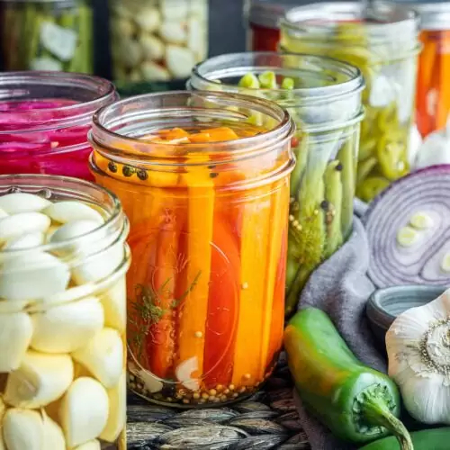

# Pickling

*The cold preservation method that adds a sharp acidic element to every meal. Quick refrigerator pickles for everyday use; traditional fermented pickles for the long game; the Korean and Japanese pickle traditions that are an entire course of their own. One jar in the fridge transforms what you eat.*

## Overview
A pickled vegetable is the easiest culinary upgrade in this entire course. A quick refrigerator pickle takes 15 minutes of work and delivers a bright sharp counterpoint to every meal for 2-3 weeks. The technique is simple: salt or salt-and-vinegar applied to a vegetable, time for the flavour to develop. The variations span every cuisine.

This lesson covers three pickle traditions:

- **Quick refrigerator pickles** (vinegar brine, no fermentation, kept cold). Western tradition; useful for everyday cooking.
- **Lacto-fermented pickles** (salt brine, room-temperature fermentation, then cold storage). Traditional in many cuisines; produces complex tangy flavours from bacterial fermentation.
- **Asian-style pickles** (kimchi as the Korean centrepiece; nukazuke and tsukemono as the Japanese tradition). A different vocabulary, more complex, more central to the cuisine.

## Quick Refrigerator Pickles

The everyday pickle. No fermentation, no canning, no special equipment. A clean jar; a brine; a vegetable. Refrigerate 1-3 days for the pickle to mature; eat over 2-3 weeks.

### The Universal Brine

The 3-2-1 ratio:

- 3 parts water
- 2 parts vinegar (cider vinegar, white wine vinegar, distilled white vinegar)
- 1 part sugar
- Plus salt (about 2% of the total liquid weight)

For a 500 ml jar of pickle:
- 300 ml water
- 200 ml vinegar
- 100 g sugar
- 1.5 tbsp sea salt

Heat to dissolve sugar and salt. Pour over vegetables in the jar. Add spices to the jar (mustard seed, black peppercorns, coriander seed, garlic cloves, dried chilli, bay leaf). Refrigerate.

### Worked Recipes

**Pickled red cabbage.**
- 1 small red cabbage, finely shredded
- The universal brine (above)
- 2 tbsp mustard seeds
- 1 tsp black peppercorns
- 2 bay leaves
- 1 cinnamon stick

Method: pack the cabbage tightly into a 1-litre jar (it shrinks under brine). Add the spices. Pour over hot brine to cover. Cool to room temperature. Refrigerate. Ready in 24 hours; best between 3 and 14 days.

**Pickled cucumber.**
- 1 large cucumber, sliced into 5 mm rounds
- The universal brine
- 1 tbsp dill seed (or fresh dill)
- 1 tsp black peppercorns
- 3 cloves garlic, smashed
- 1 tsp chilli flakes

Pack the cucumber into a jar with the aromatics. Pour over hot brine. Cool; refrigerate. Best within 1 week (cucumber loses crunch over time).

**Pickled carrot ribbons.**
- 4 large carrots, peeled into ribbons with a vegetable peeler
- The universal brine
- 1 tsp coriander seed
- 1 tsp cumin seed
- 1 tbsp grated fresh ginger
- 1 tsp chilli flakes

Pack carrot ribbons. Pour brine. Refrigerate 24 hours; eat over 2-3 weeks.

**Pickled red onion.**
- 2 medium red onions, finely sliced
- 200 ml red wine vinegar (no water, no extra sugar; use brown sugar if desired)
- 2 tbsp brown sugar
- 1 tsp salt
- 1 tsp black peppercorns

Pour over sliced onion in a jar. Press down to submerge. Refrigerate 30 minutes, ready to use as a garnish for tacos, salads, sandwiches.

**Bread-and-butter pickles (American sweet).**
- 6 small cucumbers (or 2 large), sliced
- 1 onion, sliced
- 2 tbsp salt
- 250 ml cider vinegar
- 200 g sugar
- 1 tsp mustard seed
- 1 tsp celery seed
- 1 tsp turmeric
- 1/2 tsp ground ginger

Salt the cucumber and onion; rest 1 hour in a colander; rinse and drain. Combine vinegar, sugar, spices in a pan; simmer briefly. Pack vegetables in a jar. Pour over hot brine. Cool; refrigerate. Best in 2-3 days; eat over 2 weeks.

## Lacto-Fermented Pickles

The traditional method. Vegetables submerged in a salt brine; left at room temperature for days; the natural lactobacillus bacteria on the vegetables ferment the sugars into lactic acid; the brine turns sour; the vegetables develop a complex tangy flavour that no vinegar pickle achieves.

The basic principle: salt + time + cool + no oxygen.

### Universal Lacto-Ferment Recipe

For 1 kg of vegetables:
- 1 kg vegetables, washed (skin-on)
- 20-25 g salt per litre of water (2-2.5% brine)
- Enough water to submerge

Method:
1. Pack vegetables tightly into a clean jar, tight enough that they support each other.
2. Make the brine: dissolve 22 g salt per litre of water. Pour over the vegetables until fully covered.
3. Weight the vegetables down so they stay submerged. A small clean plate, a glass weight, or a freezer bag filled with brine pressed on top all work. The vegetables MUST stay under the brine; anything above develops mould.
4. Cover loosely (to allow CO2 to escape): a cloth secured with a rubber band, or a fermentation airlock lid.
5. Leave at room temperature (18-22 C) for 5-14 days. Day 2-3 the brine turns cloudy and tiny bubbles appear. Day 5-7 the brine tastes sour. By day 10-14 the ferment is fully developed.
6. Taste daily after day 5. When you like the flavour, transfer to the fridge. Cold storage slows fermentation; keeps the pickle 3-6 months.

### Classic Lacto-Ferments

**Sauerkraut (German).**
- 1 kg white cabbage, finely shredded
- 20 g salt (2% by weight of cabbage)
- 1 tsp caraway seed (traditional)
- 1 bay leaf

Method: massage salt into the cabbage in a large bowl for 5-10 minutes. The cabbage releases water and softens. Pack into a jar with the spices; pour the released water over to cover. Press to submerge. Cover loosely. Ferment 7-14 days. Refrigerate.

Sauerkraut is the simplest fermented vegetable, cabbage makes its own brine.

**Cortido (Salvadoran fermented slaw).** Same as sauerkraut but with shredded carrot, sliced onion, oregano and chilli. Bright, sharp, eaten with pupusas.

**Dill pickles (American Jewish-deli style).** Whole or halved cucumbers in 2.5% brine with dill, garlic and pickling spice. 7-14 days room temperature.

**Kimchi (basic version).** Salted cabbage with gochugaru (Korean red pepper flakes), garlic, ginger, fish sauce and other regional aromatics. Ferment 3-7 days at room temperature, then refrigerate. The Korean tradition has dozens of regional and seasonal variants; the napa cabbage version is the introduction.

## Asian Pickling Traditions in Brief

The major Asian pickling traditions are vast; this section is a pointer.

**Korean kimchi.** Salt-fermented vegetable preparations, often heavily spiced with gochugaru, garlic, ginger, fish sauce. Napa cabbage kimchi is the famous one; daikon (kkakdugi), cucumber (oi sobagi), and cubed water kimchi (nabak kimchi) are all standard. Eaten with every meal; turned into stews and pancakes as it ages.

**Japanese tsukemono.** A spectrum of pickling: shio-zuke (salt pickles), nuka-zuke (rice-bran-paste pickles), su-zuke (vinegar pickles), miso-zuke (miso-paste pickles), shoyu-zuke (soy-sauce pickles). The flavour profile is more subtle than Korean, less garlic, less heat, more umami from soy and miso.

**Chinese pickled vegetables.** Suan cai (sour cabbage), pao cai (Sichuan-style brined vegetables), preserved vegetables of every kind. The Sichuan paocai tradition uses a clay pot with a water-seal lid for indefinite-duration fermentation.

**Vietnamese do chua.** Quick-pickled carrot and daikon. Vinegar brine with sugar; ready in 1 hour. The pickled garnish in banh mi.

**Indian achar.** Oil-pickled vegetables with spices, salt, sometimes vinegar. Mango achar, lime achar, mixed vegetable achar. The oil and salt do the preservation; the spices give the dramatic flavour.

These each warrant their own dedicated treatment; the [Spices](../spices/spices.md) and cuisine landing pages link out to specific recipes.

## Food Safety Notes

**Lacto-fermentation safety.** The acidic environment created by lactobacillus fermentation kills most pathogens. The risk: at the start, before the brine has acidified, pathogens could grow if the salt level is too low. The 2-2.5% brine is the safety threshold; below it, fermentation can fail. Stick to the salt percentage and you are safe.

**Mould vs film.** During fermentation, a white film (kahm yeast) sometimes forms on the brine surface. Harmless; skim off. Black, blue, green mould is bad, the batch should be discarded.

**Vinegar pickle safety.** Quick pickles in vinegar are safe because vinegar's pH (around 2.4-3.4) kills most pathogens. But they are not shelf-stable like canned pickles, refrigerate.

**Canning for long storage.** Both vinegar and lacto pickles can be canned (water-bath processed) for shelf-stable storage. The canning process is its own technique not covered here; refer to a canning-specific guide if you want pickles that keep at room temperature for years.

## Where Next
- [Roasting](roasting.md), [Blanching](blanching.md), [Braising](braising.md): the heat-method counterparts to this cold-preservation technique.
- [Raw](raw.md): the related cold technique that doesn't involve preservation.
- [Spices](../spices/spices.md): the spice blends that drive pickling traditions worldwide.
