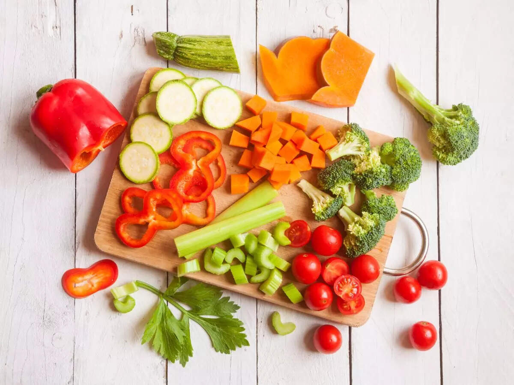

# Raw

*Salads, slaws, ceviche-style preparations, and the salt-massage move that transforms raw vegetables without heat. The technique for when you want bright vegetable flavour with snap intact.*

## Overview
Some vegetables are at their best raw. Tomatoes in peak summer, cucumbers, lettuces, herbs, certain root vegetables thinly shaved, and a long list of fruits-treated-as-vegetables (avocado, peppers, citrus). The technique question shifts from "how to cook it" to "how to dress it" - because raw vegetable is mostly waiting for an acid, a fat, salt, and the time to balance flavours.

This lesson covers four approaches to raw vegetable preparation:

- **Salads.** Greens, herbs, raw vegetable, dressed with acid and oil.
- **Slaws.** Shredded raw vegetables (cabbage primarily), dressed with vinegar-and-mayonnaise or vinegar-only.
- **Salt-massage.** The technique of softening tough greens (kale, chicory) with salt rubbed into the leaves.
- **Citrus-cure preparations.** Ceviche-style for fish; same principle works for raw vegetables (fennel cured in lemon, beetroot cured in vinegar).

## The Universal Salad Architecture

Every good salad has the same four-part structure:

1. **The base.** Greens, leaves, or a primary raw vegetable. Substantial - lettuce, kale, chicory, raw fennel, shaved radish.
2. **Texture.** A contrasting element with a different mouthfeel - toasted nuts or seeds, crunchy chickpeas or croutons, cheese.
3. **Acid.** Vinegar, lemon, lime. The brightening element. About 1 tbsp per portion of leaves.
4. **Fat.** Olive oil, walnut oil, mayonnaise. The carrier. About 2-3 tbsp per portion of leaves (3:1 fat to acid is the classic vinaigrette ratio).

Add salt and pepper to taste; an aromatic if you want (mustard, garlic, ginger, herbs); a small amount of sweetness if it balances (honey, maple).

The whole architecture takes 5 minutes to assemble and improves dinner immediately.

## Worked Recipes

### Classic Garden Salad

A starting template.

- 200 g mixed leaves (lettuce, rocket, baby spinach)
- A handful of fresh herbs (parsley, dill, basil, chives, picked from the stem)
- 1 cucumber, sliced or shaved
- 200 g cherry tomatoes, halved
- 1/2 red onion, finely sliced
- 50 g toasted seeds or nuts (sunflower, pumpkin, almonds)
- 30 g feta cheese, crumbled (optional)
- For the vinaigrette:
  - 3 tbsp olive oil
  - 1 tbsp red wine vinegar
  - 1 tsp Dijon mustard
  - 1 small clove garlic, minced
  - 1/4 tsp salt
  - Pinch of pepper

Method:
1. Whisk the vinaigrette ingredients in a small bowl or shake in a jar. Taste; adjust salt and acid.
2. Combine all the salad ingredients in a large bowl.
3. Drizzle vinaigrette; toss gently. (Toss just before serving - dressed leaves wilt fast.)
4. Top with toasted seeds and feta.

### Shaved Fennel and Citrus Salad

A bright winter salad.

- 2 medium fennel bulbs, shaved paper-thin on a mandoline
- 2 oranges, segmented (cut off pith and membrane; release segments over a bowl to catch juice)
- 1 grapefruit, segmented (optional, alongside or instead of orange)
- A handful of fresh mint or parsley
- 50 g toasted almonds or pistachios
- For the dressing:
  - 3 tbsp olive oil
  - 1 tbsp reserved citrus juice
  - 1 tsp white wine vinegar
  - 1/4 tsp salt
  - Pinch of chilli flakes

Method:
1. Shave fennel onto a serving platter.
2. Top with citrus segments, herbs, nuts.
3. Whisk dressing; drizzle over.
4. Toss gently or leave as a composed salad.

The fennel's anise note pairs naturally with citrus; the colours are dramatic. Good as a starter or alongside fish.

### Kale Salad with Salt-Massage

The technique that converts kale skeptics. Massaging salt into raw kale leaves softens the tough fibres and tenderises the leaf. The salt-massaged kale stays bright and crunchy but is no longer chewy.

- 1 large bunch curly or cavolo nero kale (about 300 g), tough stems removed, torn into pieces
- 1 tsp sea salt
- 1 tbsp olive oil
- For the dressing:
  - 3 tbsp olive oil
  - 1 tbsp lemon juice
  - 1 tbsp Dijon mustard
  - 1 tsp honey
  - 1 tsp grated parmesan
  - Black pepper
- Toppings:
  - 50 g toasted walnuts, chopped
  - 30 g shaved parmesan
  - 50 g dried cranberries or raisins
  - Optional: 100 g cooked grains (farro, quinoa)

Method:
1. Place kale in a large bowl. Sprinkle with the salt and the 1 tbsp olive oil.
2. **Massage** the kale with your hands for 2-3 minutes. The leaves darken and shrink visibly; the bowl's contents reduce by about half in volume.
3. Whisk the dressing in a small bowl.
4. Pour over the massaged kale; toss thoroughly.
5. Let rest 10-15 minutes so the dressing penetrates the leaves.
6. Top with nuts, cheese, cranberries.

The salt-massage technique works on kale, cavolo nero, hard chicory, and even thinly-sliced cabbage. The mechanical action plus the salt breaks down the cell walls and tenderises the leaves dramatically.

### Classic Coleslaw

The most common slaw. The dressing is vinegar-mayonnaise; the cabbage is finely shredded.

- 1/2 large white cabbage (or a mix of white and red), shredded
- 2 medium carrots, grated
- 1/2 red onion, finely sliced
- For the dressing:
  - 100 g mayonnaise
  - 2 tbsp cider vinegar
  - 1 tbsp Dijon mustard
  - 1 tbsp honey or sugar
  - 1 tsp celery seed
  - 1/2 tsp salt
  - Black pepper

Method:
1. Combine shredded cabbage, grated carrot and sliced onion in a large bowl.
2. Whisk the dressing.
3. Pour over; toss thoroughly.
4. Salt heavily; taste; adjust.
5. Refrigerate at least 30 minutes (1-2 hours is better) for the cabbage to soften and the flavours to meld.

The slaw improves over 24 hours as the cabbage releases water and the dressing penetrates. Eat within 3 days.

### Vinegar-Based Slaw (For BBQ)

A no-mayonnaise version, paired with American BBQ pulled pork.

- 1/2 head cabbage, shredded
- 1 carrot, grated
- 1/4 red onion, finely sliced
- For the dressing:
  - 100 ml cider vinegar
  - 50 ml vegetable oil
  - 2 tbsp sugar
  - 1 tsp salt
  - 1 tsp celery seed
  - Black pepper

Method as above. Lasts longer (mayonnaise-free, less perishable). Pairs with [Pulled Pork](../bbq/pulled-pork.md).

### Cucumber-Tomato Salad (Greek-Style)

The simplest summer salad.

- 4 large ripe tomatoes, cut into chunks
- 1 large cucumber, halved lengthways and sliced
- 1/2 red onion, finely sliced
- 200 g feta cheese, cubed or crumbled
- 100 g Kalamata olives
- For the dressing:
  - 4 tbsp olive oil
  - 1 tbsp red wine vinegar
  - 1 tsp dried oregano
  - 1/2 tsp salt
  - Black pepper

Method: combine all in a serving bowl. Drizzle; toss; rest 10 minutes; serve. The tomato and cucumber release juice into the dressing - all of it is good with bread for soaking up.

## Citrus-Cured Raw Preparations

A separate technique. Citrus juice (lemon, lime) "cooks" thinly-sliced raw vegetables (or fish) chemically - the acid denatures the proteins similarly to heat. The texture changes from snappy raw to slightly firmer, slightly cooked-feeling.

### Citrus-Cured Fennel

- 2 fennel bulbs, shaved paper-thin on a mandoline
- Juice of 2 lemons
- 2 tbsp olive oil
- 1 tsp sea salt
- Black pepper
- Fresh herbs (parsley, dill, fennel fronds)

Method: combine all; toss; rest 20-30 minutes. The fennel softens slightly but stays bright. Excellent under fish or alongside cured meats.

### Citrus-Cured Beetroot

- 2 medium raw beetroots, peeled and shaved paper-thin
- Juice of 1 lemon
- 1 tbsp white wine vinegar
- 1 tsp salt
- 1 tsp sugar
- 1 tbsp olive oil

Toss; rest 30-60 minutes. The beetroot keeps its colour and develops a slightly tangy, slightly softened texture. Eat in salads or alongside goat cheese.

### Carpaccio of Courgette

- 2 small young courgettes, sliced paper-thin (mandoline)
- Juice of 1 lemon
- 3 tbsp olive oil
- 1 tsp sea salt
- 30 g parmesan, shaved
- A handful of basil

Toss the courgette with lemon and salt; rest 10 minutes; the slices soften and curl. Drizzle olive oil; top with parmesan and basil.

## The Salt-Massage Move

Worth highlighting separately. The salt-and-massage technique applied for 2-3 minutes does to a tough raw leaf what cooking does to a tender one - breaks down cell walls, softens fibres, releases moisture - without heat.

What it works on:
- Kale (any variety)
- Cavolo nero / lacinato kale
- Hard chicory (radicchio, treviso, endive)
- Thinly sliced cabbage
- Brussels sprouts (raw, shredded)
- Mustard greens

The technique:
1. Tear or finely slice the leaves.
2. Sprinkle with salt (about 1 tsp per 300 g of leaves) and a small amount of olive oil.
3. Massage with your hands - press, rub, squeeze - for 2-3 minutes. The leaves visibly soften, darken, and shrink to about half their original volume.
4. Use immediately, or rest 15-30 minutes before dressing.

The result is a leaf that holds up to vinaigrette without wilting (the cell walls have already given up their water), with a slightly silky-tender texture rather than the raw chewy texture.

## Where Next
- [Pickling](pickling.md): the alternative cold-treatment for vegetables.
- [Seasonal Calendar](seasonal.md): raw vegetable dishes shine when the produce is at peak.
- [Roasting](roasting.md), [Blanching](blanching.md): the heat techniques to alternate with raw preparations across the year.
