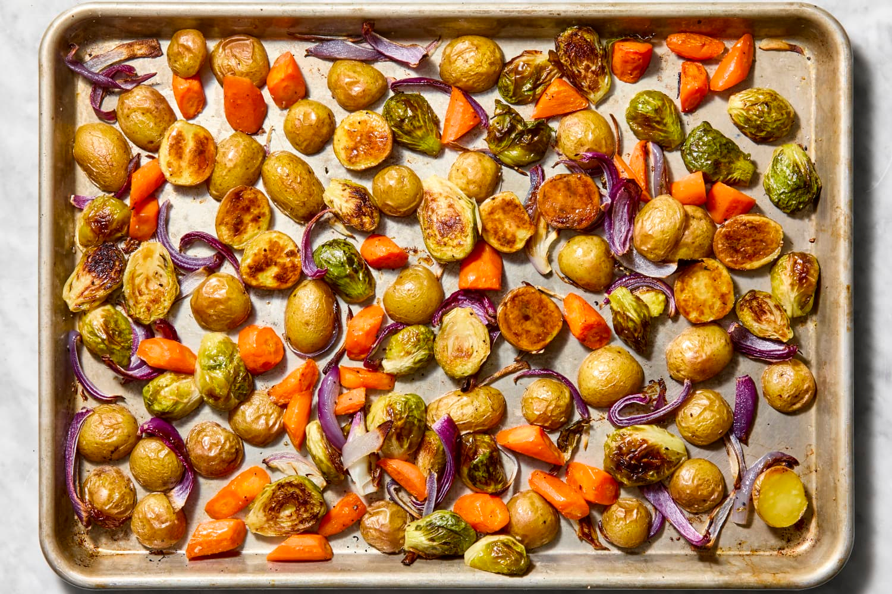

# Roasting

*The single most rewarding vegetable technique. High oven, plenty of fat, plenty of salt, plenty of time. Roasted carrots, charred sprouts, blistered peppers, whole-roasted leeks. The technique that turns vegetables from a side dish into the centrepiece of the plate.*

## Overview
Roasting concentrates flavour. The dry heat of a hot oven drives off surface moisture, allowing the vegetable's natural sugars to caramelise on contact with the hot pan and the surrounding hot air. The Maillard browning, the same reaction that browns a steak or a bread crust, happens on the vegetable surface. The interior steams in its own moisture, soft and bright; the exterior crisps and darkens.

The result is, for most vegetables, dramatically better than any other technique. The only requirement is enough fat, enough salt, enough heat, and enough time.

## The Universal Method

Five steps, the same for almost every vegetable.

1. **Heat the oven hot.** 220-240 C (425-475 F). The high temperature drives the Maillard browning; below 200 C the vegetables go soft and pale rather than browning crisply.
2. **Cut to even sizes.** Pieces should be similar in size so they cook at the same rate. The size depends on the vegetable, large pieces for root vegetables (chunks 3-4 cm), small for delicate vegetables (florets 2 cm, slices 1 cm thick).
3. **Toss with fat.** Olive oil, neutral vegetable oil, duck fat, beef dripping. About 2-3 tablespoons per kg of vegetable, more than most recipes suggest. The fat carries flavour, conducts heat, and lets the surface dry without burning.
4. **Salt and season heavily.** Half a teaspoon of flaky sea salt per kg of vegetable, then any aromatics (rosemary, thyme, chilli, garlic, cumin seed). Tossed thoroughly so every piece is coated.
5. **Spread in a single layer on a heavy tray.** Crowding causes steam to build up; the vegetables boil in their own moisture rather than roasting. Use two trays if you have a lot.
6. **Roast.** 25-50 minutes depending on the vegetable. Most root vegetables: 35-45 minutes. Brassicas: 20-30 minutes. Tomatoes: 20-25 minutes.
7. **Toss halfway through** for even browning. Each piece needs both sides to develop colour.

## Worked Recipes

### Roasted Root Vegetables (the foundation)

Serves 4-6 as a side or 2-3 as a main with rice and yoghurt.

- 1 kg mixed root vegetables (carrots, parsnips, sweet potatoes, beetroots, swede, celeriac)
- 3 tbsp olive oil
- 1 tsp flaky sea salt
- 1 tsp black pepper
- 2 sprigs rosemary, leaves only
- 2-3 cloves garlic, smashed but unpeeled
- 1 tsp cumin seed (optional, for warmth)

Method:
1. Heat oven to 220 C.
2. Cut vegetables to similar-sized chunks (about 4 cm).
3. Toss with all ingredients on a heavy roasting tray.
4. Roast 35-45 minutes, tossing once at the halfway point.
5. Done when the edges are caramelised and a knife slides in easily.

Serve with a dollop of Greek yoghurt and a squeeze of lemon for a vegetarian main; or alongside a roast chicken; or in a grain bowl with quinoa and herbs.

### Charred Brussels Sprouts

The dish that converts people who think they hate sprouts.

- 500 g Brussels sprouts, halved (large) or whole (small)
- 3 tbsp olive oil
- 1 tsp sea salt
- 1 tbsp balsamic vinegar (or pomegranate molasses)
- 2 cloves garlic, sliced
- Optional: 50 g cubed bacon or pancetta

Method:
1. Heat oven to 230 C.
2. Trim the sprouts; halve if large, leave whole if small.
3. Toss with olive oil, salt, garlic. If using bacon, sprinkle alongside.
4. Spread cut-side down on a heavy roasting tray.
5. Roast 20-25 minutes, the cut side should be deeply charred when ready.
6. Drizzle with balsamic on serving.

The dark almost-burnt edges are the point. Brussels sprouts roasted lightly are bitter; roasted hard they are sweet and nutty.

### Roasted Cauliflower (Whole Head)

A dramatic presentation. The whole head browns on the outside while the interior steams to tender.

- 1 medium cauliflower (about 800 g)
- 4 tbsp olive oil
- 1 tsp sea salt
- 1 tsp ground cumin
- 1 tsp smoked paprika
- 1 tsp turmeric (optional, for colour)
- 4 cloves garlic, minced
- 1 lemon, zested

Method:
1. Heat oven to 220 C.
2. Trim the cauliflower base flat; remove the outer leaves but keep the head intact.
3. Mix the spices, garlic, lemon zest, salt and olive oil into a paste.
4. Rub the paste into every crevice of the cauliflower.
5. Place on a roasting tray.
6. Roast 45-55 minutes, basting once mid-cook with the pan drippings.
7. Done when a knife slides through the centre with no resistance.

Cut into wedges to serve. Tahini sauce or yoghurt makes a good accompaniment.

### Blistered Cherry Tomatoes

A quick base for pasta, bruschetta, or eaten as a side.

- 500 g cherry tomatoes
- 3 tbsp olive oil
- 1 tsp sea salt
- 4 cloves garlic, sliced
- Few sprigs of thyme

Method:
1. Heat oven to 230 C.
2. Toss tomatoes with all ingredients in a roasting tray.
3. Roast 18-25 minutes, tomatoes should be splitting and slightly charred.
4. Mash gently with the back of a spoon to release juice.

Pour over pasta with parmesan; serve on toast; use as a base for chicken thighs in their next roast.

### Whole Roasted Leeks

Unexpectedly good. The leek surface chars while the interior steams to silky tenderness.

- 4 leeks (medium-large), washed thoroughly
- 4 tbsp olive oil
- 1 tsp sea salt
- 1 lemon, halved
- A few sprigs of thyme

Method:
1. Heat oven to 220 C.
2. Trim leeks to fit in your roasting tray; halve lengthways or quartered.
3. Brush with olive oil and sprinkle with salt; nestle the lemon halves and thyme between them.
4. Roast 30-40 minutes, basting with the pan oil halfway through.
5. The leeks should be deeply golden and tender all the way through.

Serve with the lemon squeezed over plus the pan oil drizzled on top.

## Common Vegetables - Quick Reference

| Vegetable | Cut size | Temperature | Time | Notes |
|-----------|----------|-------------|------|-------|
| Carrots, parsnips, sweet potato | 4 cm chunks | 220 C | 35-45 min | Toss halfway |
| Beetroots | Halves or 4 cm chunks | 220 C | 45-60 min | Wrap in foil if you want soft; spread bare if you want caramelised |
| Brussels sprouts | Halved | 230 C | 20-25 min | Cut-side down for char |
| Cauliflower/broccoli florets | 3-4 cm florets | 220 C | 18-25 min | Spread well; do not crowd |
| Whole cauliflower head | Whole | 220 C | 45-55 min | Massage spice paste in deeply |
| Aubergine | Halves or 3 cm chunks | 230 C | 25-35 min | Salt and rest for 20 min before roasting to draw moisture |
| Bell peppers | Halves | 230 C | 20-25 min | Until skin blackens, then steam in a bowl to peel |
| Cherry tomatoes | Whole | 230 C | 18-25 min | Until splitting |
| Whole tomatoes | Halves | 200 C | 60-90 min | Slow-roasted, sweet and condensed |
| Asparagus | Whole | 230 C | 10-15 min | Faster than most, watch carefully |
| Squash (butternut, kabocha) | Wedges or 4 cm chunks | 220 C | 35-45 min | Skin can stay on for kabocha; remove for butternut |
| Whole onions | Quartered | 220 C | 30-40 min | Until the outer layers char and the inside softens |
| Whole leeks | Halved lengthways | 220 C | 30-40 min | Brush thoroughly |
| Potatoes | 3 cm chunks | 220 C | 40-50 min | Par-boil first for the crispiest result |

## The Pre-Boil Step (Roast Potatoes)

The single technique that produces ideal British roast potatoes:

1. Peel potatoes and cut to large chunks.
2. Boil in well-salted water until just past the point where a knife slides in (about 8-10 minutes).
3. Drain. Return to the pan; shake gently to rough up the surface (the rough edges are what crisp).
4. Toss with goose fat or beef dripping (4-5 tbsp per kg).
5. Spread on a heavy roasting tray.
6. Roast at 220 C for 40-50 minutes, turning twice for even browning.

The pre-boil gelatinises the surface starch; the shake roughs up that gelatinised layer; the high-fat roast turns it into a glassy crisp shell. The interior stays fluffy.

This technique works for sweet potato roast too, with brown sugar or maple in place of the dripping.

## Common Failures

| Symptom | Cause | Fix |
|---------|-------|-----|
| Vegetables steamed not roasted | Tray crowded; vegetables touching | Use two trays; spread further apart |
| Vegetables not browning | Oven not hot enough; not enough fat | 220-240 C minimum; double the oil |
| Burnt edges, raw centres | Cut too large for the heat | Smaller chunks; or lower oven and longer time |
| Soggy bottoms | Tray too cool; or insufficient fat | Preheat the tray empty; use enough oil to coat the pan bottom |
| Bland flavour | Insufficient salt | Half a teaspoon flaky salt per kg vegetable |

## Where Next
- [Blanching](blanching.md): the alternative technique for greens.
- [Braising](braising.md): the slow-cook for tougher vegetables.
- [Seasonal Calendar](seasonal.md): which vegetables are at their best for roasting at which time of year.
