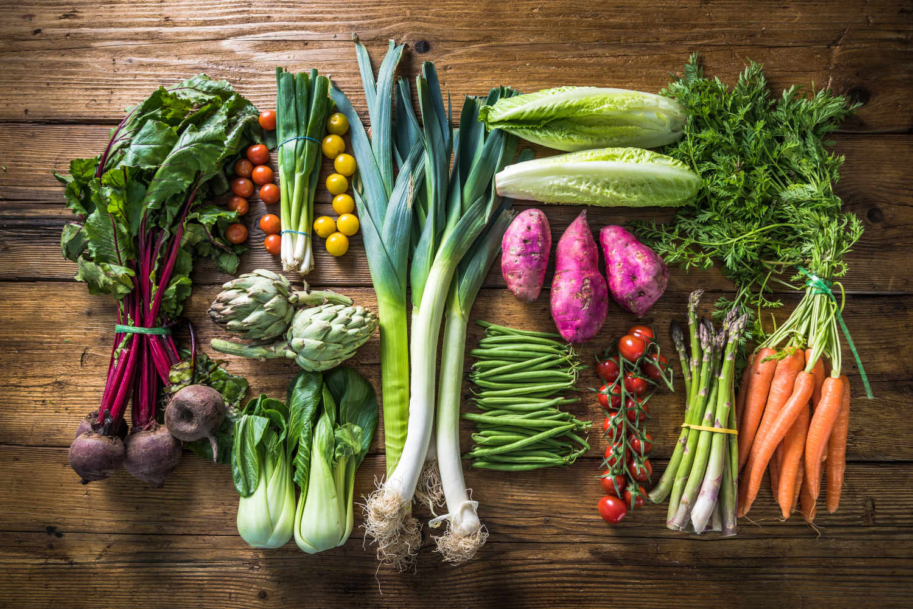

# Seasonal Calendar

*Which vegetables are at their peak when. The British-temperate calendar, with notes on importing seasons and the year-round greenhouse economics. Cook with what is in season; the technique work is half done before you start.*

## Overview
Vegetables in season cook better with less work. The carrot pulled from cold storage in March was grown the previous autumn and is half what a fresh autumn carrot would be. The tomato sold in supermarkets in November is genetically engineered to ship well, picked unripe, and tastes like wet cardboard. Cooking these out-of-season vegetables is a project against the ingredient; cooking in-season vegetables is a project with it.

This lesson maps the British and Northern European seasonal calendar. The dates shift slightly for Northern Europe (a few weeks earlier in Mediterranean climates, a few weeks later in Scandinavia). For the American Northeast or Northern Mid-Atlantic, the calendar is essentially the same; for California, push everything 4-6 weeks earlier and extend the summer season 2-3 months later.

A note: most supermarkets sell most vegetables year-round, sourced globally. The seasonality below is for vegetables grown locally; imported versions are available outside their natural season but at lower quality and higher carbon cost.

## The British/Northern European Calendar

### January
- **Peak:** Brussels sprouts, kale, cavolo nero, cabbage (red, white, savoy), leeks, parsnips, swede, celeriac, jerusalem artichoke, beetroot (stored), winter chicory (radicchio, treviso), forced rhubarb.
- **OK from storage:** Carrots, onions, potatoes (held in cold storage since autumn).
- **Avoid:** Tomatoes, peppers, courgettes, asparagus, beans, peas, salad greens (greenhouse-only).

### February
- Similar to January. Forced rhubarb is at its peak. Wild garlic begins in late February in the south.

### March
- **New season:** Wild garlic in full flow. Purple sprouting broccoli arrives, a brief but exceptional season.
- **Still strong:** Leeks, kale, parsnips, cabbage.
- **Beginning to lose quality:** Stored carrots and roots from the previous autumn are starting to taste tired.

### April
- **New season:** First English asparagus appears (late April in the south, mid-May elsewhere). Purple sprouting broccoli continues. Spring greens (loose-leaf cabbage). Spring onions. First salad greens from polytunnels.
- **Peak:** Wild garlic.
- **Ending:** Winter brassicas (sprouts, kale) finishing.

### May
- **Peak:** English asparagus (mid-May to mid-June is the British asparagus season, cook it heavily during these six weeks). Wild garlic ending. Peas and broad beans starting. Spring greens.
- **New season:** First English strawberries (treated as a fruit).

### June
- **Peak:** Peas, broad beans, asparagus (last weeks), new potatoes (Jersey royals are spectacular), summer salads, courgettes start, first beetroot, first lettuces.
- **New season:** Currants, first ripe stone fruit.

### July
- **Peak:** Courgettes (multiple varieties), summer salads, lettuces, French beans, runner beans, broad beans ending, peas ending. Tomatoes start (the first British tomatoes are mid-July; peak is August-September).
- **New season:** Sweet corn (early varieties).

### August
- **Peak:** Tomatoes (the entire month is peak British tomato season), courgettes, peppers (greenhouse-grown but at peak), aubergines, sweet corn, beans of every kind, all salads, fresh herbs.
- The point of the year when local growing is at its peak.

### September
- **Peak:** Tomatoes still at peak (until mid-September), aubergines, peppers, sweet corn, courgettes ending, first squash (butternut, kabocha, hokkaido), first apples (treated as fruit).
- **New season:** Squash season begins.

### October
- **Peak:** All squashes (butternut, kabocha, kuri, delicata, acorn), pumpkins, leeks (returning), first parsnips, first kale, mushrooms (wild and cultivated), brussels sprouts beginning.
- **Ending:** Tomatoes (last of the season).

### November
- **Peak:** Brussels sprouts, kale (its season picks up after the first frost, the frost converts starches to sugars, making the leaves sweeter), cavolo nero, all root vegetables (parsnip, swede, celeriac at full flavour), squashes, leeks, beetroot.
- The deep autumn cooking season is in full effect.

### December
- Same as November plus: forced rhubarb starts in heated sheds (delivered as the "Yorkshire forced rhubarb"). The Christmas dinner ingredients are all in season, sprouts, parsnips, carrots, leeks, red cabbage.

## How to Use the Calendar

A few practical applications:

### Buy What's in Season at the Market

Local markets follow the seasons; supermarkets do not. A weekly market visit in spring shows you the wild garlic, the first peas, the spring greens. The cook is then "what do I have this week" rather than "what does the recipe call for."

### Cook the Seasonal Hero Dish

Each season has its own peak dish:

- **Late spring (May-June):** Roasted asparagus with butter, salt, lemon. Pure asparagus.
- **Early summer (June-July):** Pea soup, peas with mint and bacon, fresh broad beans on toast with ricotta.
- **Late summer (August-September):** Tomato salad, the world's simplest dish, only good when the tomatoes are.
- **Early autumn (September-October):** Squash soup, roasted pumpkin with sage and brown butter.
- **Late autumn (October-November):** Roasted root vegetables, braised kale, brussels sprouts hard-charred.
- **Winter (December-February):** Red cabbage braised slowly, jerusalem artichoke soup, leek and potato gratin, kale and cavolo nero in deep braises.
- **Early spring (March-April):** Wild garlic pesto, purple sprouting broccoli with anchovy and chilli, the first asparagus.

### Plan a Year Ahead

A useful exercise: write out the 12 months and for each, list 5 dishes you want to cook that month. Refer back when you are planning meals; you have already done the thinking.

## The Year-Round Greenhouse and Import Question

Several vegetables are year-round in supermarkets because they are grown globally:

- **Tomatoes** are imported from Spain, Morocco, the Netherlands for winter UK supply. The Spanish ones are warm-grown; Dutch are greenhouse-grown. Both are noticeably worse than August UK tomatoes.
- **Peppers** are imported from Spain and Holland year-round; greenhouse-grown ones travel well.
- **Cucumbers** are mostly UK-greenhouse-grown year-round; quality is more consistent.
- **Avocados** are Latin American, year-round.
- **Asparagus** is Peruvian or Mexican from December-March; quality is well below UK May-June.
- **Strawberries** are Spanish or Moroccan in winter; quality is acceptable but not great.

For the vegetables where imports are noticeably worse (tomatoes, peppers, asparagus), avoiding them out of season is rewarding. For the vegetables where imports are decent (cucumbers, citrus, avocados), they are fine to cook with year-round.

## A Note on Frozen

Frozen vegetables are often better than out-of-season fresh imports. Peas, broad beans, sweetcorn and spinach all freeze well; the freezing process happens within hours of harvest (so the vegetable is captured at peak), and the nutrition is largely preserved. Frozen peas in February are dramatically better than the imported "fresh" peas at the supermarket.

The exceptions where frozen is poor: anything that depends on texture (cucumber, lettuce, fresh herbs, never freeze) or shape (asparagus tips, courgette).

## A Note on Foraging

Wild garlic (ramsons) is the easiest foraged green for beginners, identifiable, abundant, in season from late February to early May in woodlands across the UK and Northern Europe. The leaves are the prize; the flowers are also edible (delicious in salads). Pesto, soup, baked into focaccia.

Beyond wild garlic, foraging gets more complex (mushroom identification is serious; many edible plants have toxic look-alikes). The course does not cover foraging in depth, but worth knowing that even one foraged ingredient per year, wild garlic in April or sloes in autumn, connects you to the seasons in a way the supermarket cannot.

## Where Next
- [Roasting](roasting.md), [Blanching](blanching.md), [Braising](braising.md), [Pickling](pickling.md), [Raw](raw.md): the techniques that the seasonal ingredients want.
- [Spices](../spices/spices.md): the spice pairings for each season's vegetables (warm spices for autumn roots; lighter aromatics for spring greens).
- [Cuisine landing pages](../../cuisine/): the regional cuisines have their own seasonal traditions.
