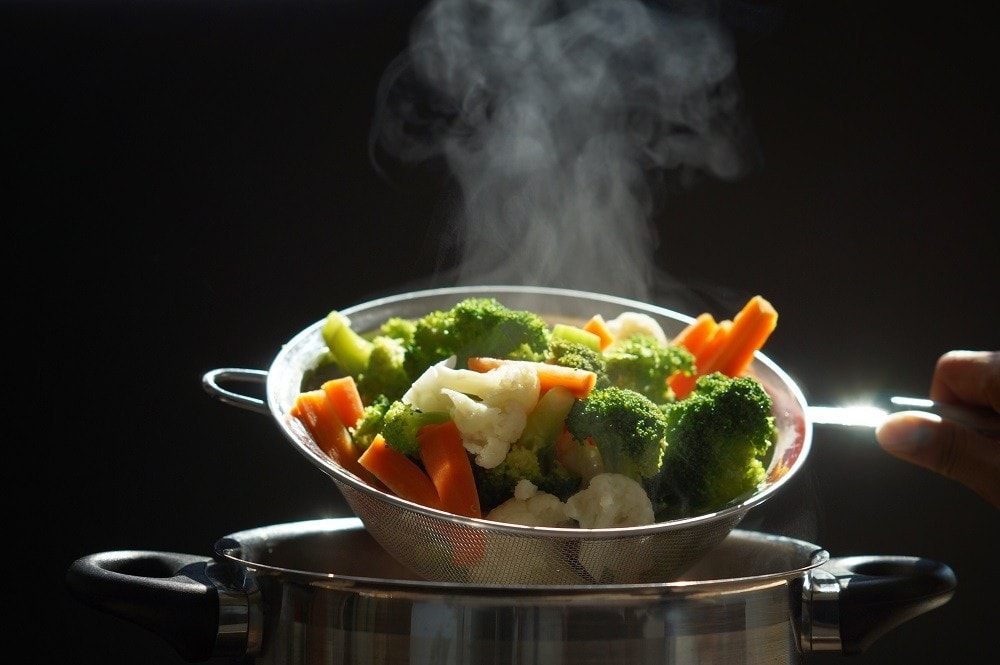

# Vegetable Cookery Course

*A course on cooking vegetables properly. The technique decisions that determine whether a carrot is the best thing on the plate or the part nobody finishes; the seasonal calendar that tells you when to cook what; the four main heat methods and the cold pickling tradition that round out the kitchen's vegetable repertoire.*

## Overview
Vegetables get short shrift in most home kitchens. The meat is the centerpiece; the vegetable is whatever was steamed or boiled or sometimes roasted alongside, as an obligation rather than a project. This course pushes the other way: vegetable as primary, the dish around which the meal is built.

The shift is mostly technique. A boiled carrot is bland; a roasted carrot is intense, sweet, browned, with an interior that has steamed in its own moisture while the surface caramelised. Same vegetable, different technique, different food. Most vegetables benefit from being cooked harder, with more salt, and with more confidence than home cooks usually apply.

This course covers the five main approaches, roasting, blanching, braising, pickling and raw, plus a seasonal calendar that determines which vegetables are good to cook with at which time of year. The major cuisines all have vegetable traditions; some are referenced here but the course aims at technique rather than ethnic specificity.

## Course Outline

### 1. Heat Methods
- [Roasting](roasting.md): the most rewarding vegetable technique. High oven, plenty of fat, plenty of salt, plenty of time. Roasted root vegetables, charred brassicas, blistered peppers and tomatoes, whole-roasted leeks and onions. The major shift home cooks need to make.
- [Blanching](blanching.md): brief immersion in heavily-salted boiling water, then a refresh in iced water. The technique that produces bright-green tender vegetables without overcooking, the foundation of French vegetable preparations.
- [Braising](braising.md): the slow-cook in liquid. Greens cooked with garlic and stock; whole vegetables in a tomato-and-herb braise; the long-cooked tradition of southern Italian and Provence vegetable cookery.

### 2. The Cold Tradition
- [Pickling](pickling.md): quick refrigerator pickles, traditional fermented pickles, sweet-pickled vegetables, the Korean and Japanese pickle traditions. The cold-preservation method that adds a sharp acidic element to every meal.
- [Raw](raw.md): salads, slaws, ceviche-style preparations, the salt-and-acid technique that softens raw vegetables without heat. Includes the salt-massage move that transforms kale, cabbage and chicory.

### 3. Knowing What to Cook
- [Seasonal Calendar](seasonal.md): which vegetables are at their peak when. The British-temperate calendar (most of Northern Europe applies) with notes on importing seasons, January cabbage, June peas, September squash. Plus an honest note on year-round greenhouse and import economics.

## The Three Things That Matter

Most of the course collapses into three principles.

1. **Use enough fat and enough salt.** Most home-cooked vegetables suffer from being under-fatted and under-salted. A tablespoon of olive oil to a bunch of asparagus is barely enough; 3-4 tablespoons is the right amount. A pinch of salt is rarely enough; half a teaspoon to a portion of vegetable is the right scale. The fat is the carrier; the salt is the lift.

2. **Heat hard or cook slow; not in between.** A medium-heat vegetable is the wrong vegetable. Either roast at 220-240 C until the surface caramelises (high), or braise at 90-110 C for 45-90 minutes until the vegetable melts into the sauce (slow). The middle, a 30-minute simmer in a covered pot, produces grey watery vegetables.

3. **Buy in season; cook simply.** A January carrot at supermarket prices in the UK was grown in Spain in early autumn and held in cold storage; the flavour is half what a fresh autumn carrot would be. A summer tomato in November is a flavourless commodity. Vegetables in season cook better with less work; out-of-season vegetables need help that no technique fully provides.

## Where to Start

- New to vegetables as a primary: [Roasting](roasting.md). One Saturday cook of a tray of mixed root vegetables, carrots, parsnips, beetroots, onions, at 220 C with olive oil and rosemary, will demonstrate the entire premise of this course.
- Want to learn the French move: [Blanching](blanching.md). The water-and-ice technique that produces the brightest possible greens. Foundation of every French vegetable side dish.
- Want to use pickled vegetables: [Pickling](pickling.md). A jar of quick pickles in the fridge transforms every meal.
- Curious about what is good this week: [Seasonal Calendar](seasonal.md).

## Where Next
- [Stocks and Sauces](../stocks-sauces/stocks-sauces.md): vegetable stock is the base of vegetable cookery; vegetable peelings should never be thrown out.
- [Cuisine: Italian](../../cuisine/italian/) and [Mediterranean cooking generally](../../cuisine/spanish/): the cuisines where vegetables are most consistently the centre of the plate.
- [Knife Skills](../knife-skills/knife-skills.md): cutting vegetables to even sizes is what allows them to cook evenly.
- [Spices](../spices/spices.md): vegetable cookery is the application where spice pairing matters most, root vegetables want warm spices; brassicas want sharper notes.

## A Note on Equipment

Minimum:
- A heavy roasting tray (or two): thin trays warp at high oven temperatures
- A large saucepan for blanching - 4-5 litre minimum so the vegetables don't crowd
- A bowl + iced water for refreshing
- A sharp knife, the [Knife Skills](../knife-skills/knife-skills.md) course covers this
- A vegetable peeler
- Tongs

Nice-to-haves:
- A mandoline for thin uniform slicing (also useful for slaws and ceviche-style preparations)
- A cast iron pan for charring and blistering
- A salad spinner (the difference between a dry salad and a wet salad is texture and dressing economy)
- Pickling jars - 500 ml mason jars work well

For a starter project (a tray of roasted root vegetables), the minimum equipment is enough.
