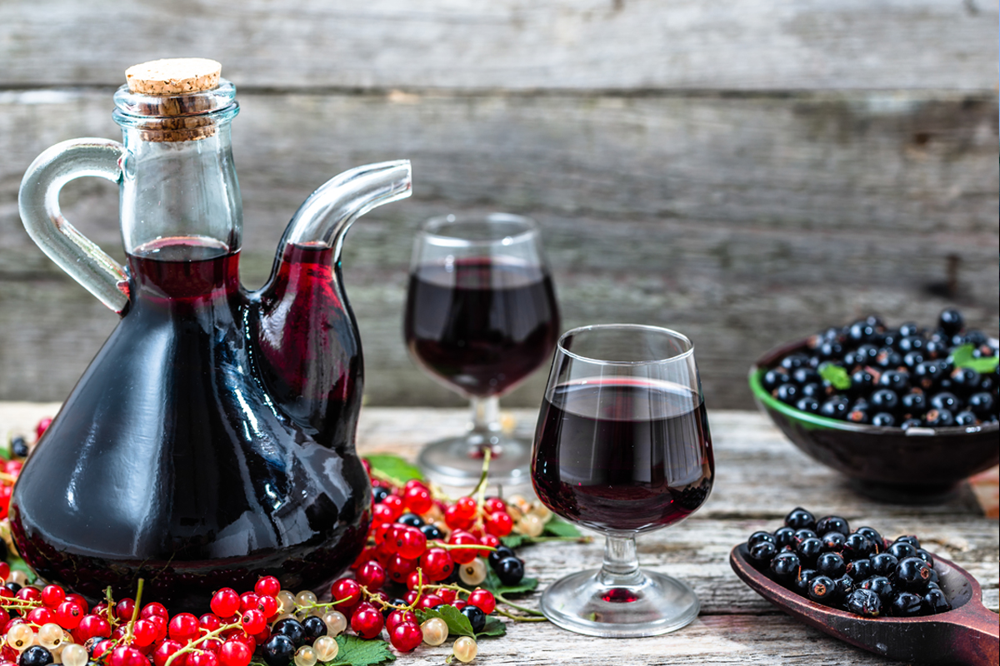

# Country Wine: Elderflower

*The classic British home winemakers' first project: a few hundred elderflower heads picked in early summer, sugar, water, lemon juice and yeast, fermented for a few weeks and bottled. Light, floral, faintly grape-like, properly tasty. The recipe that introduces every technique you'll use for any subsequent country wine.*

**Makes:** 5 litres (about 6 bottles)

**Active time:** 1 hour (across the whole process)

**Total time:** 3 to 4 months from picking to drinking

## Overview
Country wine is wine made from anything that isn't grapes: fruit, flowers, vegetables, root crops, even tree sap. The technique is always the same - extract the flavour into a sugar-water solution, add yeast, let it ferment, age it. Elderflower (the cream-white flower heads of the sambucus nigra tree, found across hedgerows and parks in the UK from late May to early July) is the gold-standard first wine because it's free if you can identify the tree, the technique is forgiving, and the result is genuinely delicious - light, floral, slightly grapey, sitting well as a dry summer drink chilled.

This recipe walks through every step in detail. It assumes you've read the [Equipment](equipment.md) page and have your gear ready.

## Ingredients

### For the must (the unfermented liquid)
- 30 to 40 fresh elderflower heads (picked when fully open, ideally on a dry sunny day so the pollen is fresh)
- 4 litres of cold water (filtered or spring water; chlorinated tap water will inhibit yeast)
- 1 kg granulated white sugar
- 2 lemons (the juice and the pared zest of one)
- 1 sachet of wine yeast (Lalvin EC-1118 or Lalvin K1-V1116 are common; £1-£2 per sachet, available at any home-brew shop)
- 1 teaspoon yeast nutrient (optional but recommended)
- 1 crushed campden tablet (to sterilise the must before adding yeast)

### For bottling (4 months later)
- 6 sanitised 75cl wine bottles
- 6 corks
- 1 crushed campden tablet (for stabilising before bottling, optional)

## Equipment
- See the [Equipment](equipment.md) page for the full list. You'll need: a 10-litre food-grade plastic bucket with lid, a 5-litre demijohn, an airlock and bung, a hydrometer + trial jar, a siphon tube, a long-handled stirrer, a sieve and muslin, 6 wine bottles, 6 corks.

## Method

### Stage 1 - Pick and prepare the elderflowers (Day 1 morning)
1. Pick elderflower heads on a dry sunny morning. Choose heads that are fully open with all flowers bloomed (the cream-white tiny flowers, not the green unopened buds, which can taste bitter). Avoid heads with brown spots or insects.
1. Don't wash the elderflowers - washing removes the natural yeasts and most of the flavour. Just pick off any obvious insects.
1. Cut the small green stems off each flower head with scissors, keeping only the cream-white blossoms. Stems contain bitter alkaloids.
1. Aim for about 30-40 prepared flower heads (a litre or two of loosely-packed blossoms by volume).

### Stage 2 - Make the syrup (Day 1 afternoon)
1. Sanitise the plastic bucket, the stirrer, and any other equipment that will touch the must. Use the campden or Star San method from the [Equipment](equipment.md) page.
1. In the sanitised bucket, dissolve the 1 kg of sugar in 1 litre of just-boiled water. Stir until completely clear.
1. Add the remaining 3 litres of cold water.
1. Stir in the juice of 2 lemons and the pared zest of 1 lemon. The acid is essential - without it, the wine will taste flabby.
1. Crush 1 campden tablet and stir into the must. The campden releases sulphur dioxide which kills any wild yeasts; you'll add your own selected yeast tomorrow once the campden has dissipated.
1. Let the mixture cool to room temperature (about 1 hour).

### Stage 3 - Add the flowers (Day 1 evening)
1. Drop the prepared elderflower heads into the sanitised bucket of must.
1. Cover the bucket loosely with the lid (or a clean muslin cloth secured with an elastic band) so air can move in and out but insects can't.
1. Leave the bucket somewhere warm (18-22°C) for 24 hours. The flowers slowly release their flavour into the sugar water.

### Stage 4 - Take a hydrometer reading (Day 2)
1. Stir the must gently with the sanitised stirrer.
1. Take a sample with the sanitised trial jar and float the hydrometer in it.
1. Read the specific gravity from the hydrometer. For a wine of around 11-12% ABV, the starting gravity (SG) should be between 1.085 and 1.095. If too low (less than 1.080), stir in a bit more sugar; if too high (above 1.100), stir in a splash more water.
1. Write down the reading. You'll compare it to the final reading to know when fermentation is complete.

### Stage 5 - Pitch the yeast (Day 2)
1. Sprinkle the wine yeast directly over the surface of the must. Don't stir it in immediately; let it sit on the surface for 10 minutes to rehydrate.
1. After 10 minutes, stir gently with the sanitised stirrer to disperse the yeast through the must.
1. If using yeast nutrient, stir in 1 teaspoon now.
1. Re-cover the bucket loosely.
1. Within 24-48 hours you should see active fermentation: small bubbles rising, a faint hissing or fizzing sound, possibly some foam on the surface.

### Stage 6 - Primary fermentation (Days 2 to 14)
1. Stir the must gently once a day to prevent the floating flowers from drying out and developing mould.
1. Watch for activity. The vigorous bubbling phase typically lasts 7-10 days.
1. Toward the end of week 2, take another hydrometer reading. When the SG has dropped to about 1.010 or lower, primary fermentation is winding down.

### Stage 7 - Rack into the demijohn (Day 14)
1. Sanitise the demijohn, airlock, bung, siphon tube, and muslin cloth.
1. Place the demijohn on the floor and the bucket on a table or chair, so gravity pulls the wine downward through the siphon.
1. Strain the must through the muslin cloth into the demijohn, leaving the spent elderflowers and any heavy sediment behind. Squeeze the muslin gently to extract every drop.
1. The demijohn should be filled to within 5 cm of the bung. If short, top up with a splash of cooled boiled water.
1. Fit the bung and airlock. Add a drop of water to the airlock so it can bubble. Place the demijohn somewhere cool (15-20°C) and dark.

### Stage 8 - Secondary fermentation (Weeks 2 to 8)
1. Watch the airlock. Bubbles will slow over 4-8 weeks from frequent to a few per minute to once an hour to almost stopped.
1. Don't disturb the demijohn. Don't taste-test. Don't open it.
1. At week 6, take another hydrometer reading by carefully drawing a sample with a sanitised pipette. If the SG is around 0.990 to 0.995 and no longer changing day to day, fermentation is complete.
1. The wine will gradually clear from cloudy to translucent over these weeks; sediment falls to the bottom as a fine yellowish-brown layer.

### Stage 9 - Rack off the lees (Week 8)
1. Sanitise a clean demijohn (or thoroughly clean the original one after pouring the wine off).
1. Siphon the clear wine into the sanitised vessel, leaving the sediment behind. This is called "racking off the lees" - the dead yeast and fine particles at the bottom.
1. If using a stabilising campden tablet (recommended for storage), crush it and stir gently into the wine.
1. Refit the airlock and leave 4-6 more weeks for any remaining sediment to drop.

### Stage 10 - Bottle (Week 12 to 16)
1. Sanitise 6 wine bottles, corks, and the siphon tube.
1. Siphon the wine carefully into bottles, leaving any last bit of sediment behind. Fill each bottle to about 2 cm below the cork.
1. Cork the bottles with the corker.
1. Label each with the date.
1. Store horizontally (so the corks stay moist) in a cool dark place.

### Stage 11 - Age and drink (3+ months later)
1. Wait at least 3 months from bottling before drinking, ideally 6 months for the flavour to round out.
1. At the 3-month mark, open one bottle and taste. It should be straw-coloured, clear, with a distinct floral elderflower nose and a clean dry finish.
1. Serve chilled.

## Notes
- **Don't wash the elderflowers.** Natural yeasts on the surface contribute to the flavour; washing removes them and dilutes the flowery aroma.
- **Stir during primary fermentation.** Floating flowers can develop mould on top if they dry out. A daily stir keeps them submerged.
- **Don't skip the campden tablet.** Wild yeasts in the elderflowers can produce off-flavours; the campden kills them so your selected yeast does the work.
- **Patience after bottling.** Young country wine often tastes harsh and yeasty for the first month. After 3 months it mellows out. After 6, it's properly drinkable.

## Variations
- **Blackberry country wine.** Substitute 1.5 kg of fresh blackberries for the elderflower. Same technique. Produces a deep red wine with a sharp fruit character. Picking season: August-September in the UK.
- **Rhubarb country wine.** 1.5 kg chopped rhubarb, same method. Light pink, slightly sharp, with an unusual savoury depth.
- **Dandelion wine.** About 1 litre of dandelion flower petals (yellow only - green parts make it bitter), picked on a sunny April-May morning. Same method.
- **Gooseberry wine.** 1.5 kg crushed gooseberries. Tart, light gold; one of the finest country wines.

## Storage
- Properly bottled, corked and stored country wine keeps 2-5 years. Some country wines (blackberry, blackcurrant, rosehip) improve dramatically with 2-3 years of bottle ageing; elderflower is best drunk within 18 months.

## Next steps
- Once you've made and drunk a batch, try a different fruit (the [Variations](#variations) above are good seasonal entry points).
- For making wine from fresh grapes or from grape juice concentrate kits, the technique is the same with just minor adjustments (more sugar isn't needed because grapes provide their own).
- For high-strength wine (15%+ ABV), use a champagne yeast and add sugar in stages over the first 2 weeks of fermentation.

For troubleshooting any of the above, head to the [Yeast and Fermentation](yeast-and-fermentation.md) page.
