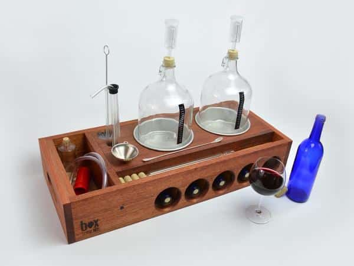

# Winemaking Equipment and Hygiene

*The gear you actually need (and what you can skip), how to sanitise properly, and the single rule that prevents most winemaking failures.*

## Overview
Home winemaking does not need expensive equipment. A starter kit suitable for making 5-litre batches costs around £30 to £40 if you buy new, or close to nothing if you scavenge bottles and find an old demijohn at a charity shop. What matters far more than the brand or the price is the hygiene: every container, every spoon, every airlock that touches your wine must be properly sanitised before it does. Wild yeasts and acetobacter (the bacteria that turn wine into vinegar) live in the air everywhere; a sanitised process keeps them out long enough for your chosen wine yeast to do its work.

## The starter kit

For making 5-litre batches, you'll need:

### Fermentation vessels
- **1 × food-grade plastic bucket with lid (10-litre capacity)** - for the initial "primary fermentation" stage where you need wide-mouth access for stirring. Look for ones marked HDPE or food-grade, around £8.
- **1 × glass demijohn (5-litre capacity)** - the iconic narrow-neck glass jar for the "secondary fermentation" stage. About £10 new; widely found in charity shops.
- **1 × airlock + bung** - the small plastic device that lets CO2 escape while preventing air (and oxygen, and bacteria) getting in. £2.
- **1 × bored rubber bung** - fits the demijohn neck, holds the airlock. £1.

### Measuring and transferring
- **1 × hydrometer + trial jar** - measures sugar content of your unfermented "must" so you can calculate the eventual alcohol content. £6 to £10. Genuinely useful; not skippable.
- **1 × siphon tube (3 metres of food-grade clear tubing, 8 mm internal diameter)** - for transferring wine between vessels without disturbing the sediment. £3.
- **1 × long-handled plastic spoon or stirrer** - for the bucket. £2.
- **1 × thermometer** (a basic stick thermometer or a brewers' adhesive strip thermometer) - to confirm fermentation temperature. £3.

### Bottling
- **6 × glass wine bottles (75 cl)** - re-used from drunk-empty wines, or bought new from brewing shops. Free if you save them.
- **6 × corks + a corking tool** - natural cork or plastic plugs both work. £8 for the corking tool, £4 for a pack of corks. A hand corker is the cheapest option; a floor corker is faster if you make wine often.

### Hygiene
- **Sodium metabisulphite (campden tablets) OR Star San (no-rinse sanitiser)** - the chemical of choice for sanitising. £5 will last you years.

**Total kit cost: £30 to £45 starting from scratch.** Charity shops, Facebook Marketplace and gumtree often have second-hand bundles for £15-£20 - perfectly serviceable once thoroughly sanitised.

## The one rule

Sanitise everything that touches your wine. Every spoon, every funnel, every bottle, every airlock, every demijohn. Sanitise before you start, sanitise between transfers, sanitise after you finish. This is the single most important thing in winemaking; everything else is secondary.

## How to sanitise

### Method 1 - Sodium metabisulphite (campden) solution
1. Dissolve 1 crushed campden tablet (or 1 g of sodium metabisulphite powder) in 500 ml of cold water.
1. Pour into a clean spray bottle.
1. Spray every surface, vessel, tool and bottle until visibly wet. Let stand 5 minutes.
1. Rinse briefly with cold water before use (only briefly - heavy rinsing reintroduces wild yeasts from the tap).

### Method 2 - Star San (no-rinse sanitiser)
1. Mix 1.5 ml of Star San per 1 litre of cold water in a spray bottle.
1. Spray everything. Let stand 30 seconds. Use immediately (no rinse needed - the foam dissipates harmlessly).

### Method 3 - Boiling water
1. For things that can withstand boiling (the demijohn, the bucket, glass bottles), pour boiling water in, swirl, leave for 2 minutes, drain.
1. Risks cracking glass if the temperature shift is too quick; let glass come to room temperature with warm water first.

Most home winemakers use campden or Star San. Boiling water alone is OK for the initial deep clean but isn't reliable for ongoing batch sanitation.

## What you don't need (yet)

- **A wine yeast nutrient pack** - useful but not essential for fruit-based wines (the fruit provides most of what the yeast needs). Add it later when you start making grape wines.
- **A pH meter** - accurate but expensive. Not needed for country wines.
- **A vacuum pump or auto-siphon** - a luxury. The basic 3-metre tube works fine.
- **A wine press** - only relevant if you're making grape wine from whole grapes. Country wines use fruit/flower infusions, not pressed juice.
- **Oak chips or barrel-staves** - only relevant for grape wines aged long-term, like a Cabernet.

## Where to buy

- **The Range / Wilko / Amazon** - basic kits, decent prices.
- **The Malt Miller, Brewstore, Hopt** - specialist UK homebrew/winemaking shops; better prices and quality.
- **Charity shops, gumtree, Facebook Marketplace** - second-hand demijohns, bottles, airlocks. Always sanitise hard before first use.

## The first wine principle

> Spend more on hygiene than equipment. A £40 sanitised setup makes far better wine than a £400 dirty one.

Once you have your kit clean and ready, head to the [Country Wine](country-wine.md) page for your first batch.
