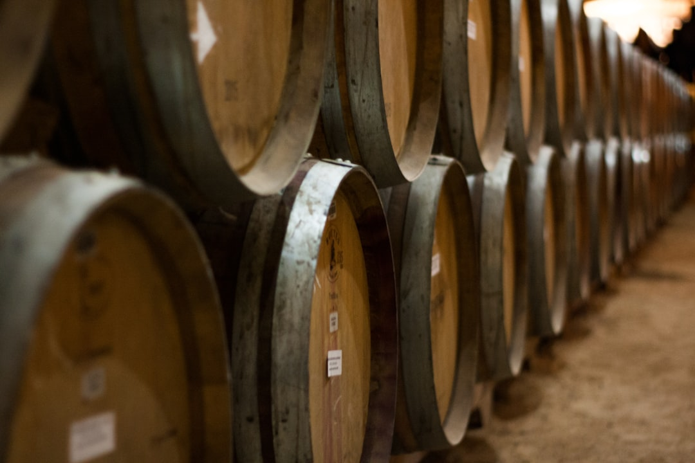

# Winemaking Course

*Home winemaking is one of the oldest and most rewarding kitchen hobbies. Give yeast sugar, water and time, and you'll have a glass of something you made. This course walks through every step from gear to glass, with stops at every place a home winemaker tends to come unstuck.*

## Overview
Wine is the simplest fermented drink: sugar (from fruit, grape juice or honey) plus yeast plus time. The yeast converts sugar to alcohol and carbon dioxide; the carbon dioxide bubbles off; what's left is wine. Everything else (clarity, body, fruit balance, alcohol level, tannin) is fine-tuning of that simple process. UK home winemaking is legal without a licence for personal use up to any quantity, which is partly why the hobby has been popular since the medieval period and across every region of the country.

This course is structured for the absolute beginner. The first lesson is gear and hygiene (the single most important thing in winemaking); the second is the foundational practical recipe (elderflower country wine, the British classic); the third is the science of yeast and fermentation so you can troubleshoot when things don't go as planned.

Country wine (made from fruit, flowers or vegetables other than grapes) is the easiest entry point because the ingredients are inexpensive, seasonal and widely available. Grape wine from fresh grapes or kits comes once you have the basics down. Honey wine (mead) and rice wine (sake-style) extend the same techniques further once you know your way around a demijohn.

## Course Outline

### 1. Foundations
- [Equipment and Hygiene](equipment.md): the gear you actually need (and what you can skip), sanitising properly, the single rule that prevents most failures.
- [Yeast and Fermentation](yeast-and-fermentation.md): what yeast actually does, why temperature matters, primary versus secondary fermentation, when to rack, when to bottle.

### 2. Practical Recipes
- [Country Wine: Elderflower](country-wine.md): the foundational British country wine, made from a few hundred elderflower heads picked in early summer. Light, floral, properly tasty, and the easiest first wine to make.

### 3. Reference
- The same techniques in [Country Wine](country-wine.md) extend to any fruit or flower with sugar in it. Blackberry, blackcurrant, rosehip, gooseberry, rhubarb, dandelion, gorse, and grape itself all work the same way: extract flavour into water, add sugar, add yeast, give it time.

## How long until you have wine?

| Stage | Time |
|---|---|
| Primary fermentation (active bubbling) | 7 to 14 days |
| Secondary fermentation (slow clearing) | 4 to 8 weeks |
| Bottling | 1 day |
| Bottle ageing (improves but ready to drink) | 3 months minimum, 6 months ideal, 1 year better |

So from picking elderflowers to drinking your first decent glass: about 4 months.

## What you need to know going in
- **Hygiene is everything.** Wild yeasts and bacteria are everywhere in the air; a clean process makes wine, a dirty process makes vinegar. Every page of this course will mention sanitisation; don't skip it.
- **Sugar in, alcohol out, predictably.** With a hydrometer (cheap, essential) you can measure the sugar in your unfermented "must", calculate the alcohol the finished wine will have, and aim for any strength between 8% and 14% reliably. Sounds technical; it's two readings, ten seconds each.
- **Patience.** Wine doesn't tell you when it's done. You have to commit to leaving it alone for weeks at a time, even though nothing visible is happening. Resist the urge to taste-test daily.
- **Failures happen.** Your first batch may go wrong. Your second probably won't. Your third will be the first one you're proud of.

## Equipment summary

A starter kit for under £40 will make ~5 litres at a time. Detailed list on the [Equipment](equipment.md) page.

## Legal note (UK)
Home winemaking for personal use is legal in the UK at any quantity, without a licence. Sale of homemade wine is not legal without an HMRC licence and is outside the scope of this course. Many home winemakers gift bottles freely to friends and family; this remains a legal grey area but is the longstanding practice.
