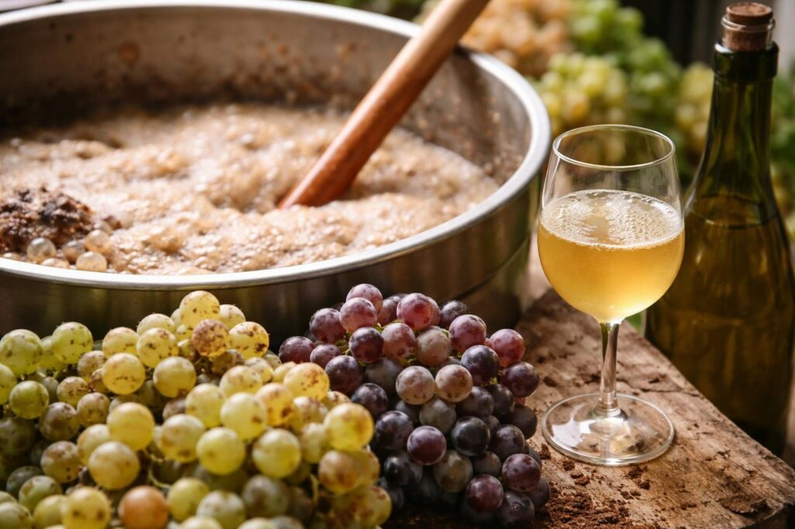

# Yeast and Fermentation

*What yeast actually does, why temperature matters, primary versus secondary fermentation, when to rack, when to bottle. The science you need just enough of to troubleshoot when something looks wrong.*

## Overview
Yeast is a microscopic single-celled fungus. The species used for winemaking is mostly Saccharomyces cerevisiae (also the species used for bread, beer and most spirits). When yeast is added to a sugary solution and given the right conditions, it eats the sugar and produces two things: ethanol (alcohol) and carbon dioxide (the bubbles). It also produces hundreds of other compounds in tiny quantities - these are what give a wine its character (the fruit notes, the spice undertones, the warmth on the finish). The point of winemaking is to give your chosen yeast the conditions it wants while keeping wild yeasts and bacteria out.

## What yeast eats and produces

The simple equation:

**1 g of sugar → 0.51 g of alcohol + 0.49 g of CO2**

That's why winemaking works the way it does. If you know how much sugar is in your must, you can predict how much alcohol you'll end up with. A hydrometer measures specific gravity (essentially sugar concentration), and you use the difference between starting and ending readings to calculate alcohol by volume (ABV) like this:

**(Starting SG - Final SG) × 131 = ABV %**

So a wine that started at SG 1.090 and ended at SG 0.990 gives:
(1.090 - 0.990) × 131 = 13.1% ABV

This means you can target a specific strength by adjusting the starting sugar. More sugar = more alcohol; less sugar = lower alcohol. There are limits though - most wine yeasts stop working at around 14-15% ABV (the alcohol itself becomes toxic to the yeast). Champagne yeasts can go to 18%; standard wine yeasts to 13%.

## Temperature: the single biggest factor

Yeast is alive. Like every living thing, it has a temperature range:

- **Below 12°C**: dormant. Yeast won't ferment.
- **12-18°C**: slow but clean fermentation. White wines and lighter country wines do best here.
- **18-22°C**: optimal for most wine yeasts. Active fermentation, good flavour development.
- **22-28°C**: fast but can produce "hot" off-flavours (high alcohols that taste solvent-like).
- **Above 30°C**: yeast struggles, off-flavours dominate, can stall completely.
- **Above 40°C**: yeast dies.

In an unheated UK kitchen in summer, you're probably fine at the lower end of the optimal range. In winter you may need to put the demijohn somewhere warmer - an airing cupboard, near a boiler, or wrapped in a "brew belt" (a heated wrap for £15 that holds 22°C).

**Temperature swings are worse than steady cool temperatures.** If yeast warms up rapidly in the day and cools at night, it produces off-flavours. Find a steady-temperature spot.

## Primary vs secondary fermentation

Winemaking has two phases:

### Primary fermentation (days 1-14)
- Happens in the wide-mouth bucket.
- Active, vigorous bubbling.
- Yeast multiplies rapidly to high cell counts.
- Most of the alcohol is produced in this phase.
- SG drops from starting (about 1.090) to about 1.010.
- Lasts 7-14 days.

### Secondary fermentation (days 14-60)
- Happens in the narrow-neck demijohn under an airlock.
- Slow, intermittent bubbling.
- Remaining sugar is converted slowly.
- Aromatic compounds develop and mature.
- SG drops from 1.010 to about 0.990 or just below.
- The wine slowly clears from cloudy to translucent.
- Lasts 4-8 weeks.

The transition from primary to secondary happens when the vigorous bubbling slows, typically around day 10-14. This is when you "rack" the wine - siphon it carefully from the bucket into the demijohn, leaving the bulk of the sediment behind.

## When to rack

Racking is moving wine from one vessel to another (leaving sediment behind). You'll rack 2-3 times during winemaking:

### Rack 1 (week 2): from bucket to demijohn
- After primary fermentation slows.
- Strain through muslin to remove fruit/flower solids.
- Move into the demijohn under airlock.

### Rack 2 (week 8): off the lees
- After secondary fermentation completes.
- Move from one demijohn to another sanitised one, leaving the layer of dead yeast (lees) behind.
- Add a campden tablet (1 crushed tablet per 5 litres) to stabilise.

### Rack 3 (week 12, optional): final clarity
- If the wine still has any cloudiness, rack once more.
- Most country wines clear naturally by this point; bypass this if the wine is already crystal clear.

## When to bottle

The wine is ready to bottle when ALL of these are true:

1. **Fermentation is complete.** SG is at or just below 0.990, and hasn't changed in 2 readings 1 week apart.
1. **The wine is visually clear.** You can read newsprint through a glass of it.
1. **It's been stabilised.** A campden tablet was added at the previous rack.
1. **It's been racked off any sediment.** No layer of dead yeast at the bottom.

Bottling earlier than this risks bottle bombs (continued fermentation creates pressure that pops corks or explodes bottles). Wait until you're sure fermentation is done.

## Common problems and what to do

### "My fermentation never started"
- **Yeast too old or dead.** Replace with fresh sachet.
- **Must too cold.** Move to 18-22°C location.
- **Must too sterile.** If you used too much campden, wait 24-48 hours before pitching yeast.
- **No yeast nutrient.** Add 1 teaspoon of yeast nutrient.

### "My fermentation has stopped early"
- **Temperature dropped.** Move somewhere warmer.
- **Yeast hit its alcohol tolerance.** Switch to a higher-tolerance yeast (champagne yeast, EC-1118).
- **Sugar too concentrated.** Yeast was overwhelmed. Add a bit more water to dilute and add fresh yeast.

### "My wine smells like rotten eggs / sulphur"
- **Yeast stress.** Often a sign of low nutrient or temperature stress.
- Aerate the wine briefly (pour back and forth between two vessels) and add yeast nutrient.
- Sometimes resolves on its own with another month of ageing.

### "My wine tastes like vinegar"
- **Acetobacter contamination.** Air-borne bacteria got in and converted alcohol to acetic acid.
- Unfortunately, once a wine is sour it usually can't be recovered. Tip it into a salad dressing bottle and use as wine vinegar; start a new batch with stricter hygiene.

### "My wine never clears"
- **Suspended pectin.** Common with fruit wines. Add a pectinase enzyme at the next rack.
- **Yeast in suspension.** Add a "fining agent" (bentonite, kieselsol+chitosan) from a brewing shop.
- **Time.** Some wines take 3-4 months to clear naturally; patience may solve it.

### "My wine tastes thin and watery"
- **Not enough fruit.** Next batch, use 50% more.
- **Too much water.** Reduce dilution next time.
- **Too young.** Country wines often taste thin for the first 2 months; try again at 4 months.

## Yeast varieties: which to choose

The most useful 3 wine yeasts for the home winemaker:

| Yeast | Strength | Best for |
|---|---|---|
| **Lalvin EC-1118 (Prise de Mousse)** | Up to 18% ABV | Champagne, country wines, stuck fermentations |
| **Lalvin K1-V1116** | Up to 14% ABV | White wines, country wines, balanced fermentation |
| **Lalvin D-47** | Up to 14% ABV | White wines, sweet/late-harvest styles, mead |

EC-1118 is the all-purpose workhorse. Start there; expand once you know what you want.

## Next steps
- Back to [Country Wine](country-wine.md) to apply what you've just learned in a practical batch.
- Or jump to [Equipment and Hygiene](equipment.md) if you haven't sorted your kit yet.
