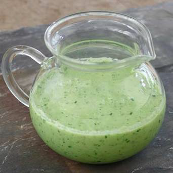

# Cucumber Vinaigrette

*A cucumber vinaigrette: peeled cucumber blended smooth with olive oil, white wine vinegar, mint and a touch of sugar.*

**Prep Time:** 10 minutes

**Yield:** Approximately 350 milliliters (4-5 servings)

## Overview
Cucumber vinaigrette is the building block for summer plates and cold-fish suppers: a herbaceous dressing where finely sliced cucumber takes the place of the usual heavy fat component, so the whole thing tastes cool and fresh without ever feeling rich. The trick is to deal with the cucumber's water before it ruins the dressing. Peel and halve an English cucumber lengthways, scoop out the seeds with a teaspoon, then slice the halves whisper-thin on a mandoline. Salt them lightly in a colander and let them sit for 5 to 10 minutes; they'll weep their excess water out, and a thorough patting with paper towel after that is the difference between a vinaigrette that holds its body and one that turns into a watery puddle in the bowl. Tip the dried cucumber into a bowl with rice wine vinegar (gentle and slightly sweet, which suits cucumber far better than red or white wine vinegar), toss and let it marinate three or four minutes. Now add the finely minced shallots, snipped chives, tarragon and flat-leaf parsley, then drizzle in the extra virgin olive oil and fold the lot together gently to keep the cucumber slices intact. Season with sea salt and a pinch of white pepper, taste, adjust, and let it rest 10 to 15 minutes so the flavours meld. Best chilled or just cool, used within a few hours of mixing (the cucumber softens and the herbs fade fast). Serve over cold green beans, raw mushrooms, poached fish, or any delicate green leaf that would buckle under a heavier dressing.

## Ingredients

### Primary Component
- 250 grams fresh cucumber (English variety for fewer seeds)
- 2 tablespoons rice wine vinegar

### Aromatics & Herbs
- 60 grams shallots (finely minced)
- 1 teaspoon fresh chives (snipped finely)
- 1 teaspoon fresh tarragon (snipped finely)
- 1 teaspoon fresh flat-leaf parsley (snipped finely)

### Oil & Seasoning
- 6 tablespoons extra virgin olive oil
- ¼ teaspoon fine sea salt
- Pinch of freshly ground white pepper

## Method

### Stage 1 - Prepare Cucumber
1. Wash cucumber thoroughly; peel away outer skin using vegetable peeler.
1. Cut lengthwise in half; using small spoon, scoop out seeds and central membrane.
1. Using mandoline, slice seeded cucumber halves very thinly (1-2mm).
1. Place in colander and sprinkle lightly with salt.
1. Allow to sit 5-10 minutes; salt causes cucumber to release excess water.
1. Pat cucumber dry thoroughly with paper towels.

### Stage 2 - Prepare Aromatics
1. Peel shallots and mince very finely.
1. Snip chives, tarragon, and parsley with scissors into small pieces.
1. Set aromatics aside.

### Stage 3 - Combine Cucumber & Vinegar
1. Place dried cucumber slices in bowl.
1. Pour 2 tablespoons rice wine vinegar over cucumber.
1. Toss gently and marinate 3-5 minutes.

### Stage 4 - Add Aromatics & Oil
1. Add minced shallots and snipped herbs to cucumber.
1. Pour 6 tablespoons extra virgin olive oil over everything.
1. Fold gently, preserving delicate cucumber structure.

### Stage 5 - Season & Rest
1. Add salt and white pepper; fold gently to distribute.
1. Taste and adjust seasonings.
1. Allow to rest 10-15 minutes before serving.

## Notes
- **Cucumber Moisture Critical:** Salting and drying step is essential to prevent dilution.
- **Seed Removal Important:** Removes most water; creates better-textured dressing.
- **Fresh Herbs Non-Negotiable:** Dried herbs won't work here.
- **Rice Wine Vinegar Delicate:** This Asian vinegar is gentler; don't substitute without adjustment.
- **Texture Preservation:** Use gentle folding to preserve delicate cucumber.
- **Cool Serving Temperature:** Most refreshing when cold or just chilled.
- **Quick Consumption:** Best used within hours; cucumber softens and herbs fade.

## Variations
- **With Dill:** Replace tarragon with fresh dill.
- **Cold Soup Base:** Puree cucumber for smooth, creamy dressing.
- **Wasabi Heat:** Add ¼ teaspoon fresh wasabi for clean heat.
- **With Lime:** Replace vinegar with fresh lime juice.
- **Extra Shallot:** Increase to 80 grams for more aromatics.

## Serving
- Use with: Cold green beans, raw mushrooms, poached fish, delicate lettuces, chilled vegetables
- Dressing ratio: 2-3 tablespoons per serving
- Temperature: Cold or room temperature
- Timing: Use within 2-4 hours

## Storage
- Refrigerate in sealed glass jar for up to 1-2 days maximum
- Fresh ingredients degrade quickly; best consumed fresh
- Dressing will separate slightly as it sits, normal
- Stir gently before serving if needed
- Do not freeze; delicate texture destroyed
- Best made just before serving

*This fresh, herbaceous dressing captures summer in a bowl: cool cucumber, delicate herbs, and light rice wine vinegar combine to create a bright accompaniment for delicate vegetables.*
