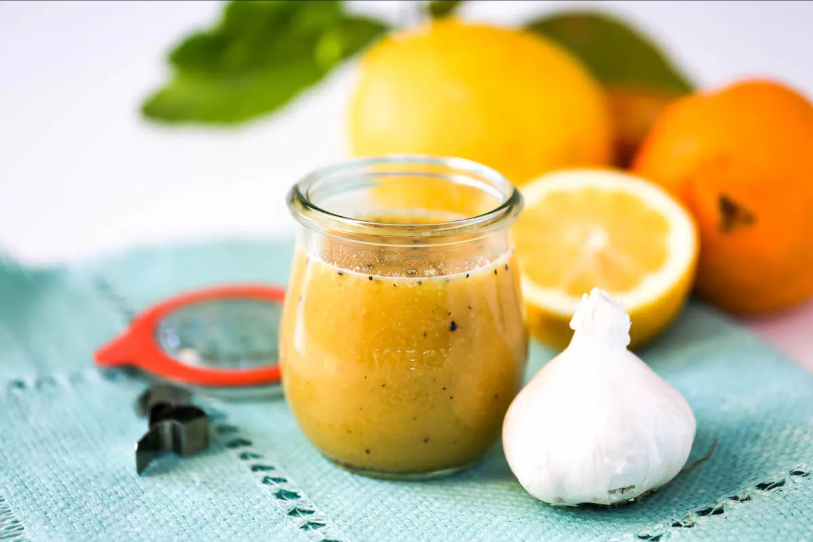

# Lemon and Mint Vinaigrette

*This light, herbaceous vinaigrette balances bright lemon with cool mint. Simple and elegant, it's perfect with watercress and delicate spring greens.*

**Yield:** Approximately 100 milliliters (4-6 servings)

**Prep Time:** 15 minutes

## Overview
Lemon and mint vinaigrette is the building block for delicate spring and summer salads: a bright, almost translucent dressing that uses fresh lemon juice instead of vinegar so the acidity stays clean and citrus-led rather than fermented and sharp. The whole thing comes together in five minutes; the work is in choosing the right ingredients. Use juicy lemons (the kind that give 3 to 4 tablespoons of juice between two of them) and zest them on a microplane before you cut them in half (the oils in the zest carry more lemon character than the juice itself, and you want the visible flecks of yellow on the salad). Tip the juice into a small bowl with a tablespoon of zest, a pinch of salt and a pinch of pepper, whisk for a minute to dissolve, then stream the groundnut oil in slowly while whisking constantly till the dressing emulsifies into a single pale-yellow pour. Taste on a torn lettuce leaf and adjust. Now the mint trick: snip the leaves with scissors only at the moment of serving and scatter them whole over the dressed salad rather than whisking them into the bowl. Whisking bruises mint and turns it dark and grassy; lifted in whole leaves it stays bright and aromatic on top of the dish. Use light, on tender greens like watercress, baby spinach, spring lettuces and young arugula, where a heavier vinaigrette would crush the leaves.

## Ingredients

### Base
- 2 lemons (zest and juice)
- 6 tablespoons groundnut oil
- 6 fresh mint leaves (snipped just before use)
- Fine sea salt and freshly ground black pepper (to taste)

## Method

### Stage 1 - Prepare Lemon
1. Wash lemons and zest using microplane.
1. Squeeze lemons; aim for 3-4 tablespoons fresh juice.
1. Measure about 1 tablespoon lemon zest.

### Stage 2 - Combine Base
1. Pour lemon juice into small bowl.
1. Add 1 tablespoon lemon zest, pinch of salt, and pinch of pepper.
1. Whisk vigorously for 1 minute.

### Stage 3 - Add Oil
1. While whisking continuously, add 6 tablespoons groundnut oil in slow stream.
1. Whisk until all oil is incorporated and vinaigrette emulsifies.

### Stage 4 - Taste & Adjust
1. Taste on a piece of salad green.
1. Adjust salt, pepper, or add additional lemon juice as needed.

### Stage 5 - Add Mint
1. Snip 6 fresh mint leaves with scissors just before serving.
1. Scatter over top of vinaigrette just before dressing salad.
1. Do not whisk in; keep leaves visible.

## Notes
- **Fresh Mint Essential:** Dried mint has no character; use only fresh.
- **Mint Timing:** Add just before serving, whisking damages delicate leaves.
- **Lemon Juice Quality:** Fresh juice is non-negotiable; bottled lacks complexity.
- **Light Dressing:** Use less than traditional (1-2 tablespoons per serving).
- **Zest for Brightness:** Adds visible citrus character and oils that deepen flavor.
- **Delicate Greens Only:** Will be overwhelmed on hearty lettuces.

## Variations
- **With Lime:** Replace lemon with lime.
- **Extra Herbaceous:** Add ½ teaspoon fresh basil or tarragon.
- **With Shallot:** Add 1 finely minced shallot for depth.
- **Extra Lemon:** Increase juice to 4-5 tablespoons.
- **With Honey:** Add ¼ teaspoon honey to balance acidity.

## Serving
- **Use with:** Watercress, spring greens, delicate lettuces, baby spinach, tender arugula
- **Dressing ratio:** 1-2 tablespoons per serving
- **Temperature:** Room temperature
- **Timing:** Dress just before serving

## Storage
- Refrigerate in sealed glass jar for up to 2-3 days
- Mint will fade and darken; discard if stored separately
- Without mint, base keeps 3-4 days
- Add fresh mint just before serving
- Do not freeze; citrus oils degrade
- Best consumed fresh
