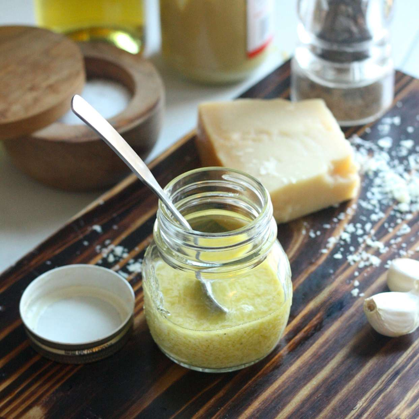

# Parmesan Vinaigrette

*A Parmesan vinaigrette: grated Parmesan whisked into olive oil, white wine vinegar and Dijon, with a touch of garlic.*

**Prep Time:** 10 minutes

**Yield:** Approximately 150 milliliters (6 servings)

## Overview
Parmesan vinaigrette is the building block for winter and autumn salads with character: a creamy, sharp, savoury dressing that crosses the line from vinaigrette into something closer to a sauce, built around freshly grated Parmesan, double cream, English mustard powder and Champagne vinegar. Each of those ingredients is deliberate. Champagne vinegar gives a softer acidity than wine vinegar so it doesn't fight the cheese; English mustard powder is hotter and more pungent than Dijon, which matters when the Parmesan is doing the heavy flavour lifting; Parmigiano-Reggiano grated fresh has the nutty depth that pre-grated powder simply doesn't carry; and the cream goes in cold because it emulsifies more cleanly than at room temperature. Start by whisking the mustard powder into the vinegar with salt and pepper for a minute or two till the powder fully dissolves and the liquid turns smooth. Whisk in the grated Parmesan till it incorporates and the mixture takes on a nutty assertive smell, then pour in the cold cream and whisk until creamy and smooth (just to combine, no further; over-whisking inflates the cream and pushes it toward foam, which you don't want). Fold in snipped chives at the end, and if it's thicker than you'd like, loosen with a tablespoon or two of warm water. Use on raw chicory, tender spinach, sliced mushrooms or warm cooked vegetables. The cream means a short fridge life of two or three days; the dressing may separate as it sits, so whisk gently before each use.

## Ingredients

### Base
- 1 teaspoon English mustard powder
- 2 tablespoons Champagne wine vinegar
- ¼ teaspoon fine sea salt
- Pinch of freshly ground black pepper

### Cream & Cheese
- 6 tablespoons heavy double cream (cold)
- 30 grams Parmesan cheese (finely grated, Parmigiano-Reggiano preferred)
- 1 tablespoon fresh chives (snipped finely)

### Optional
- 1-2 tablespoons warm water (to thin if needed)

## Method

### Stage 1 - Combine Mustard & Vinegar
1. Place 1 teaspoon English mustard powder in a small bowl.
1. Add 2 tablespoons Champagne wine vinegar.
1. Whisk vigorously for 1-2 minutes until mustard fully dissolves and the mixture becomes smooth.
1. Add ¼ teaspoon fine sea salt and pinch of pepper; whisk again.

### Stage 2 - Add Parmesan
1. Add 30 grams finely grated Parmesan cheese to the vinegar-mustard mixture.
1. Whisk thoroughly for 1 minute until cheese fully incorporates.
1. The mixture will smell assertively of Parmesan and mustard.

### Stage 3 - Incorporate Cream
1. Add 6 tablespoons cold heavy double cream to the mixture.
1. Whisk vigorously until all cream is incorporated and the vinaigrette becomes creamy and smooth.
1. The cold cream will partially emulsify with the acidic vinegar mixture.
1. Do not over-whisk; you want a creamy consistency, not aerated foam.

### Stage 4 - Add Chives & Adjust Consistency
1. Snip 1 tablespoon fresh chives finely with scissors.
1. Fold chives gently into the vinaigrette.
1. If the dressing seems too thick, whisk in 1-2 tablespoons warm water to reach desired pourable consistency.
1. Taste and adjust seasoning (salt, pepper, or additional mustard if needed).

## Notes
- **English Mustard Powder Essential:** This is more pungent than Dijon; it's the correct choice for this dressing.
- **Champagne Vinegar Delicate:** Using wine vinegar or rice vinegar changes the character; Champagne vinegar's subtle acidity is important.
- **Parmesan Freshness:** Use freshly grated Parmigiano-Reggiano; pre-grated powder lacks character.
- **Cold Cream Important:** Cold cream emulsifies better than room temperature; this creates better texture.
- **Chives Fresh:** Dried chives have no character; use only fresh.
- **Cream Separated is Normal:** This dressing may separate slightly when refrigerated; whisk gently before serving.

## Variations
- **Roasted Garlic:** Add ½ teaspoon roasted garlic puree for additional depth.
- **With Truffle Oil:** Add ½ teaspoon truffle oil for luxury.
- **Extra Tangy:** Increase mustard powder to 1 ½ teaspoons for more assertive character.
- **Less Creamy:** Reduce cream to 4 tablespoons for lighter consistency.
- **With Shallot:** Add 1 finely minced shallot for aromatic complexity.

## Serving
- **Use with:** Raw chicory, tender spinach, sliced mushrooms, bitter winter greens, warm cooked vegetables
- **Dressing ratio:** 2-3 tablespoons per serving
- **Temperature:** Room temperature
- **Timing:** Dress just before serving

## Storage
- Refrigerate in sealed glass jar for up to 3 days
- Cream content means limited shelf-life; use within 2-3 days
- Emulsion will separate slightly; whisk gently before serving
- Do not freeze; cream breaks upon thawing
- Best consumed fresh for maximum flavor and texture

*This creamy, pungent vinaigrette combines Champagne vinegar's delicate acidity with double cream richness, Parmesan's nutty depth, and sharp mustard powder. It pairs beautifully with raw chicory, tender spinach, or sliced mushrooms.*
