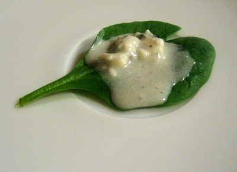

# Roquefort Vinaigrette

*A Roquefort vinaigrette: crumbled blue cheese whisked into olive oil, walnut oil, sherry vinegar and a touch of Dijon.*

**Prep Time:** 10 minutes

**Yield:** Approximately 150 milliliters (6 servings)

## Overview
Roquefort vinaigrette is the building block for bitter winter salads and warm-bean plates: an assertive dressing where pungent blue cheese, walnut oil, tarragon vinegar and a few dashes of Worcestershire combine into something powerful enough to stand up to radicchio, endive, frisée or any leaf with a bitter edge. The Roquefort is doing the structural work; as you whisk it in, the cheese partially dissolves to thicken the dressing into a creamy body, but small crumbles stay visible and give the finished sauce its texture (a milder blue like Gorgonzola will work but tastes timid here; Roquefort's salty, sharp character is the whole point). Pour tarragon vinegar into a small bowl with snipped fresh tarragon leaves and let them infuse for two or three minutes; this short rest releases the herb oil into the vinegar and saves you having to lean on the herbs later. Add the walnut oil and sunflower oil (the walnut brings the earthy nutty undertone that married blue cheese; sunflower softens the intensity so the oil doesn't dominate) and whisk for a minute or two to start the emulsion. Now crumble in the Roquefort and whisk steadily, breaking up the crumbles as you go, till the dressing turns creamy with visible specks of cheese. Two or three dashes of Worcestershire add a quiet fermented depth that lifts everything (more than that is too much). Season, taste, and use straight away. Unlike a basic vinaigrette this never fully emulsifies, and that's correct; some separation is expected, and a quick whisk brings it back together.

## Ingredients

### Oils & Acid
- 3 tablespoons walnut oil
- 3 tablespoons sunflower oil
- 2 tablespoons tarragon vinegar

### Cheese & Seasonings
- 50 grams Roquefort cheese (crumbled)
- 1 teaspoon fresh tarragon leaves (snipped) or ½ teaspoon dried
- 2-3 dashes Worcestershire sauce (to taste)
- Fine sea salt and freshly ground black pepper (to taste)

## Method

### Stage 1 - Combine Vinegar & Tarragon
1. Pour 2 tablespoons tarragon vinegar into a small bowl.
1. Add 1 teaspoon fresh tarragon leaves (snipped) or ½ teaspoon dried.
1. Allow to infuse for 2-3 minutes to develop tarragon character.

### Stage 2 - Combine Oils
1. Add 3 tablespoons walnut oil and 3 tablespoons sunflower oil to the vinegar mixture.
1. Whisk vigorously for 1-2 minutes to emulsify slightly.
1. The oils will begin to incorporate with the acidic vinegar.

### Stage 3 - Add Roquefort
1. Add 50 grams crumbled Roquefort cheese to the oil-vinegar mixture.
1. Whisk thoroughly, breaking up the cheese crumbles as you whisk.
1. The cheese will partially dissolve, creating a creamy texture, while some crumbles may remain visible.
1. Continue whisking for 1-2 minutes until well combined.

### Stage 4 - Season & Taste
1. Add 2-3 dashes Worcestershire sauce; whisk to combine.
1. Add pinch of fine sea salt and pinch of freshly ground black pepper.
1. Whisk once more.
1. Taste on a piece of bitter green or cooked bean.
1. The dressing should taste assertively of blue cheese with herbal notes from tarragon and subtle fermented depth from Worcestershire.
1. Adjust Worcestershire, salt, or pepper as desired.

## Notes
- **Walnut Oil Essential:** This nutty oil pairs beautifully with blue cheese; don't substitute without consideration.
- **Roquefort Character:** This is a pungent, assertive cheese; milder blue cheeses (Gorgonzola) will create different character.
- **Tarragon Vinegar Herbal:** The herbal notes complement the cheese; regular wine vinegar is a poor substitute.
- **Worcestershire Subtle:** Just a few dashes add fermented depth without announcing themselves; adjust carefully.
- **Emulsification Incomplete:** Unlike basic vinaigrettes, this won't fully emulsify due to cheese content; some separation is normal.
- **Robust Greens Only:** This dressing will overwhelm delicate lettuces; use with sturdy, bitter greens.

## Variations
- **Without Worcestershire:** Omit for cleaner blue cheese flavor.
- **Extra Tarragon:** Add ½ teaspoon additional tarragon for herbaceous emphasis.
- **Milder Cheese:** Replace Roquefort with Gorgonzola for slightly less assertive character.
- **With Candied Walnuts:** Serve alongside candied walnuts for sweetness balance.
- **Extra Tangy:** Add 1 additional tablespoon tarragon vinegar for more acidity.

## Serving
- **Use with:** Bitter winter lettuces (radicchio, endive, frisée), warm French beans, watercress, grilled vegetables, roasted beets
- **Dressing ratio:** 2-3 tablespoons per serving
- **Temperature:** Room temperature
- **Timing:** Dress just before serving to prevent lettuces wilting

## Storage
- Refrigerate in sealed glass jar for up to 3-4 days
- Dressing will separate and cheese may settle; shake or whisk before serving
- Best consumed within 1-2 days for maximum cheese character
- Do not freeze; separation becomes permanent
- Fresher is better; flavor clarity decreases after 3-4 days

*This bold, distinctive dressing combines pungent blue cheese with the subtle nuttiness of walnut oil. It's particularly good with bitter winter leaves or crisply cooked warm French beans where its assertive character finds perfect balance.*
