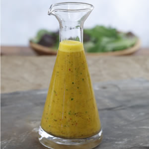

# Thai Vinaigrette

*A Thai-style vinaigrette: fish sauce, lime juice, palm sugar, garlic and chilli whisked together.*

**Prep Time:** 10 minutes

**Yield:** Approximately 300 milliliters (10 servings)

## Overview
Thai vinaigrette is the building block for noodle salads, papaya salads, grilled meats and spring-roll dipping bowls: a bright, savoury dressing that pulls together rice vinegar, fish sauce, lemongrass and fresh herbs in the classic Thai balance of sour, salty, sweet and aromatic. The lemongrass infusion is the slow step that everything else hangs on. Take a 4 cm length of stalk (white and pale green parts only; the dark green ends are tough and stringy and won't infuse), strip off the dry outer layer, and slice it very thinly across the grain so as much surface area as possible meets the vinegar. Drop it into 75 ml of rice wine vinegar in a glass bowl, cover loosely and leave at room temperature for at least two hours, ideally four to six or overnight; the vinegar should turn faintly yellow and smell distinctly of lemongrass when it's ready. Skipping this step gives a thin dressing that tastes of vinegar and fish sauce; doing it properly gives a dressing that tastes of Thailand. Once infused, pour the vinegar with the lemongrass slices into a clean bowl, whisk in 200 ml of sunflower oil in a slow stream till loosely emulsified (this is a thinner dressing than French vinaigrette, so don't expect a creamy thick body), then add two tablespoons of nam pla and a tablespoon of soy sauce. Just before serving, fold in shredded coriander leaf, snipped chives and a teaspoon of fresh lime juice (bottled doesn't cut it here), then taste and finish with salt and pepper. Use straight away over rice noodles, grilled prawns, lettuce wraps or steamed chicken.

## Ingredients

### Lemongrass & Vinegar Base
- 4 centimeters lemongrass stalk (white and pale green parts)
- 75 milliliters rice wine vinegar

### Oils & Umami
- 200 milliliters sunflower oil
- 2 tablespoons fish sauce (nam pla)
- 1 tablespoon soy sauce

### Fresh Herbs
- 15 grams fresh coriander leaf (approximately 2 tablespoons, finely shredded)
- 10 grams fresh chives (approximately 1 tablespoon, finely snipped)

### Seasonings
- Fresh lime juice (1 teaspoon, added just before service)
- salt
- pepper

## Method

### Stage 1 - Prepare & Slice Lemongrass
1. Take a 4-centimeter piece of lemongrass stalk.
1. Remove any dry or damaged outer layers.
1. Slice very thinly (approximately ⅛-inch thickness) across the grain.
1. You should have approximately 1 tablespoon of finely sliced lemongrass.

### Stage 2 - Initial Infusion
1. Pour 75 milliliters rice wine vinegar into a clean glass bowl.
1. Add the sliced lemongrass to the vinegar.
1. Cover loosely with plastic wrap or parchment paper.
1. Let rest at room temperature for a minimum of 2 hours (preferably 4-6 hours, or overnight).
1. This infusion time allows the lemongrass's distinctive flavor to fully permeate the vinegar.
1. The vinegar will turn slightly yellow and develop pronounced lemongrass aromatics.

### Stage 3 - Combine with Oil & Fish Sauce
1. Into a clean bowl, pour the lemongrass-infused vinegar (including the slices; they will not be strained out).
1. Add 200 milliliters sunflower oil.
1. While whisking constantly and vigorously, begin to incorporate the oil.
1. Add 2 tablespoons fish sauce (nam pla) while continuing to whisk.
1. Add 1 tablespoon soy sauce; whisk continuously.
1. The mixture will be assertive, savory, and aromatic at this point.

### Stage 4 - Add Fresh Herbs & Finish
1. Add 15 grams fresh coriander leaf (finely shredded); whisk gently to combine.
1. Add 10 grams fresh chives (finely snipped); whisk once more.
1. Just before serving, add 1 teaspoon fresh lime juice (not bottled).
1. Add salt and freshly ground black pepper to taste.
1. The dressing should taste bright, assertive, and complex with multiple layered flavors.

## Notes
- **Lemongrass Selection:** Use the white and pale green parts only; the darker green is tough and becomes stringy.
- **Lemongrass Slicing:** Slice very thin to maximize surface area for infusion; thick cuts won't fully infuse.
- **Two-Hour Minimum:** Do not skip or rush the infusion period; it's essential for full flavor development.
- **Fish Sauce Quality:** Use authentic Thai nam pla; Vietnamese nuoc mam and other substitutes alter the intended flavor profile significantly.
- **Fresh Herbs Essential:** Both coriander and chives must be fresh and added shortly before serving; dried versions are entirely inadequate.
- **Lime Juice Fresh:** Only fresh lime juice works; bottled versions create a thin, flat result.

## Variations
- **More Assertive Fish Flavor:** Increase fish sauce to 3 tablespoons for deeper umami (ideal for noodle soups and braising).
- **Lighter Version:** Reduce oil to 150 milliliters and increase vinegar to 100 milliliters (for tender greens).
- **With Galangal:** Add ½ teaspoon minced galangal (Asian ginger root variant) alongside the lemongrass.
- **Extra Heat:** Add ½-1 Thai red chilli, minced, with seeds if desired for additional spice.
- **With Mint:** Add 2 tablespoons fresh mint leaves alongside the coriander (Vietnamese approach).

## Serving
- **Use with:** Rice noodle salads, grilled chicken or shellfish, spring roll dipping sauce, tender lettuce wraps, papaya salad, warm vegetable preparations
- **Dressing ratio:** 2-3 tablespoons per serving (this is intensely flavored and assertive)
- **Temperature:** Room temperature
- **Application:** Dress salads immediately before serving; excess soaking time wilts delicate greens and dissipates fresh herb character

## Storage
- The lemongrass-infused vinegar base can be prepared 1-2 days ahead and refrigerated in a sealed jar.
- Combine with oil and fish sauce up to 3 hours before service.
- Fresh herbs must be added within 30 minutes of serving for maximum aromatic effect.
- The complete dressing will keep refrigerated for 1-2 days but deteriorates in flavor quality significantly after 24 hours.
- Do not freeze; oils become cloudy, fish sauce flavor becomes unpleasant, and fresh herb character is lost entirely.
- Best consumed within 2 hours of final preparation (after herbs are added) for maximum freshness and aroma.

*This aromatic Southeast Asian dressing combines lemongrass, fresh coriander, and traditional fish sauce with light rice wine vinegar. Perfect for noodle salads, vegetable preparations, or as a dipping sauce for spring rolls and grilled meats.*
